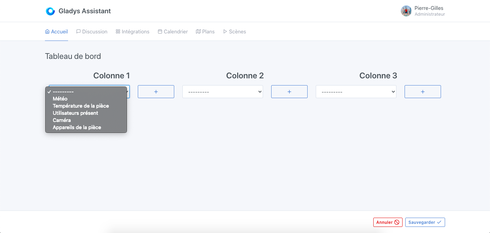
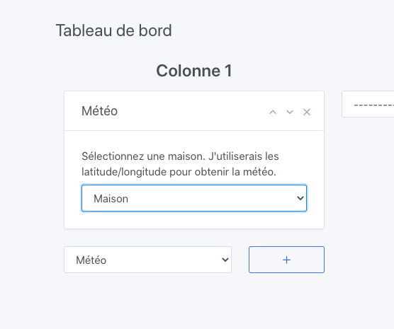

Dans Gladys Assistant, vous pouvez afficher la météo liée à votre localisation sur le tableau de bord.

## Pré-requis

- Vous devez au préalable avoir configuré le service [OpenWeather](/fr/docs/integrations/openweather/) pour afficher la météo dans Gladys Assistant.
- Vous devez avoir configuré votre maison dans les paramètres, et avoir placé votre maison sur la carte, afin qu'OpenWeatherMap ait la latitude/longitude de votre maison.

## Configuration

Rendez-vous sur le dashboard, puis cliquez sur "Editer".

Sélectionnez la box "Météo, puis cliquez sur le bouton +.

Ensuite, sélectionnez votre maison. Cela permettra au service de connnaitre votre latitude/longitude.

Cliquez sur "Sauvegarder".

Vous devriez voir la météo !
