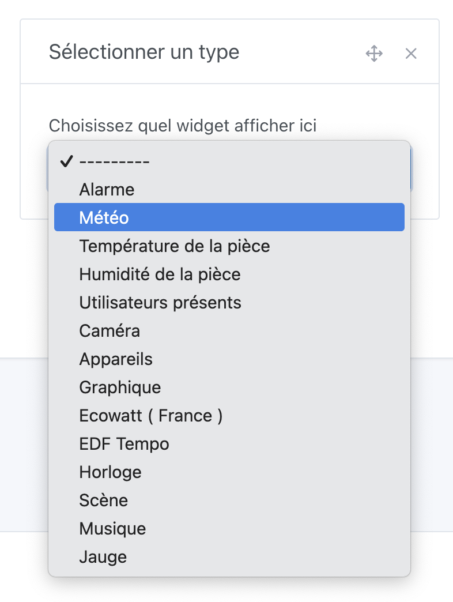
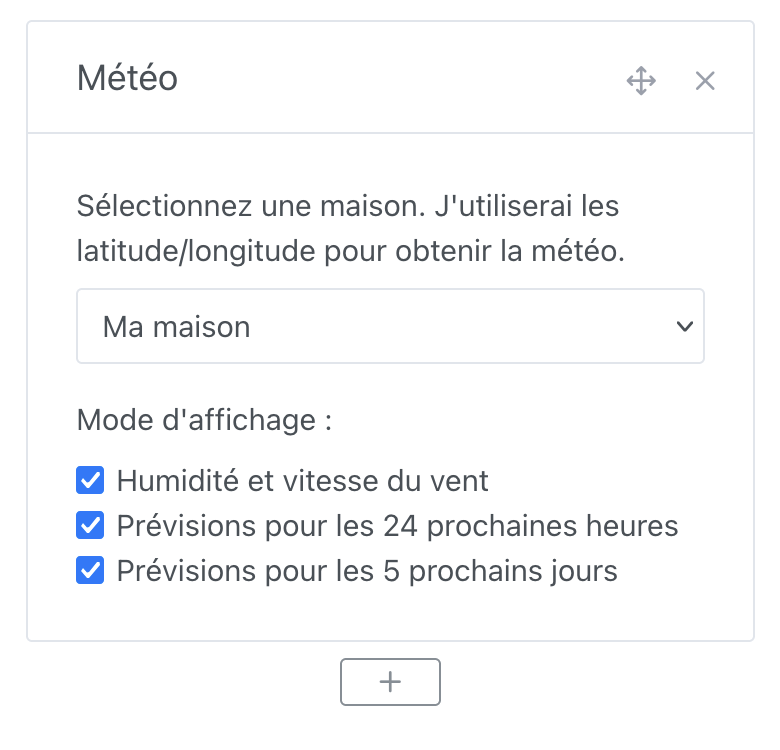
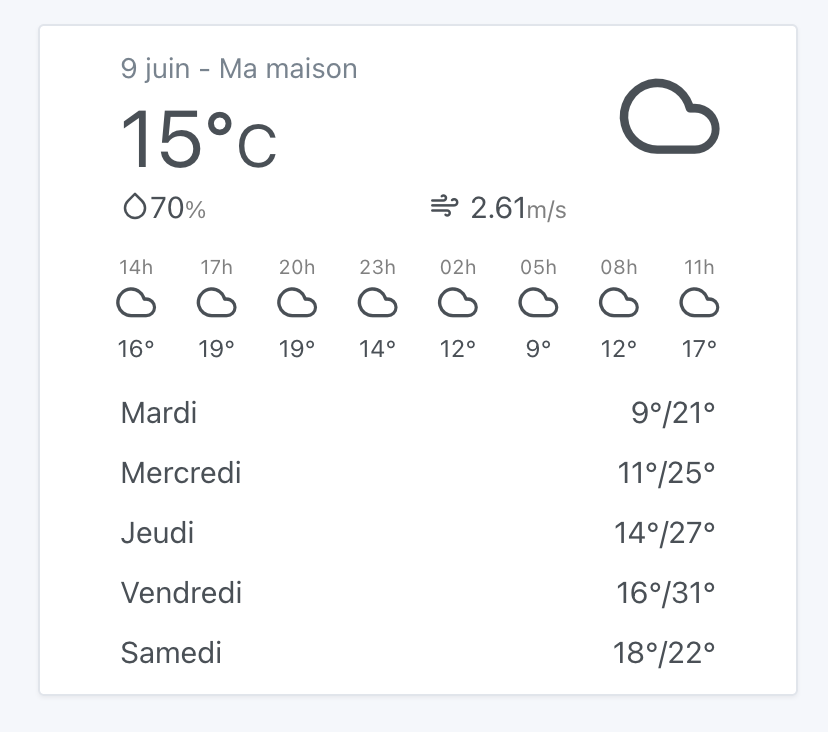

Vous pouvez afficher la météo liée à votre localisation sur le tableau de bord.

## Pré-requis

- Vous devez au préalable avoir configuré le service [OpenWeather](/fr/docs/integrations/openweather/) pour afficher la météo dans Gladys Assistant.
- Vous devez avoir configuré votre maison dans les paramètres, et avoir placé votre maison sur la carte, afin qu'OpenWeatherMap connaisse la latitude et la longitude de votre maison.

## Configuration

Rendez-vous sur le tableau de bord, puis cliquez sur "Éditer".

Ajoutez un widget "Météo" :

Ensuite, sélectionnez votre maison et les options d'affichage :

Cliquez sur "Sauvegarder".

Vous devriez voir la météo !

