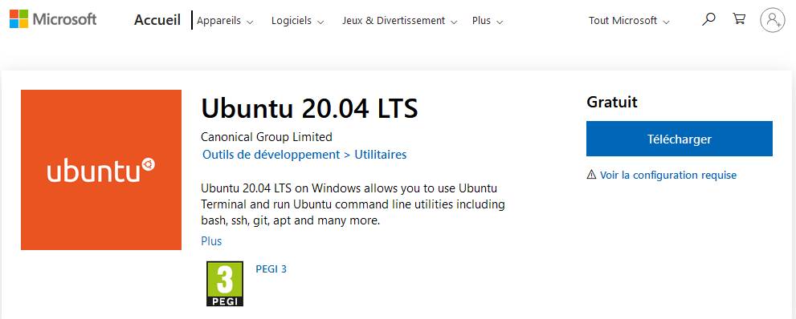

Vous trouverez ici les instructions pour mettre en place un environnement de développemment Gladys 4 sur Windows.

## Pré-requis systèmes

Veuillez suivre les insctuctions de ces sites pour préparer votre système.

- [Windows Subsystem Linux](https://docs.microsoft.com/fr-fr/windows/wsl/install-win10)
- [Docker Desktop pour Windows](https://hub.docker.com/editions/community/docker-ce-desktop-windows)
- [Visual Studio Code](https://code.visualstudio.com/download)

### Configuration WSL

Assurez vous d'utiliser WSL2 en exécutant cette commande

```
wsl.exe --set-default-version 2
```

Depuis le Microsoft Store, recherchez et installez Ubuntu 20.04. Celà peut prendre du temps en fonction de votre connexion.



Maintenant vous pouvez lancer Ubuntu, depuis le menu "Démarrer" exécutez Ubuntu 20.04 LTS.
La première fois Ubuntu vous demandera de créer un utilisateur.

### Dépendences systèmes

La première étape est de mettre à jour la distribution :

```bash
sudo apt update && sudo apt upgrade -y && sudo apt autoremove -y
```

- Installation des outils/librairies :

```bash
sudo apt install sqlite3 make g++ git coreutils tzdata nmap openssl gzip udev -y
```

- Installation de Node.js 22:

```bash
curl -sLO https://deb.nodesource.com/nsolid_setup_deb.sh
sudo bash nsolid_setup_deb.sh 22
sudo apt install nodejs -y
```

Alternative, vous pouvez utilisez [nvm](https://github.com/nvm-sh/nvm) pour installer et gérer les versions de nodejs installées.

## Le backend

Le backend est une serveur Node.js.

### Cloner le repo Gladys

```
git clone https://github.com/GladysAssistant/Gladys gladys && cd gladys
```

### Installer les dépendances NPM serveurs

```
cd server
```

Lorsque vous installez les dépendances serveurs, Gladys va installer toutes les dépendances, y compris celles des intégrations.

Lorsque vous développez sur votre machine, vous n'avez pas forcément besoin d'installer toutes les intégrations, nous vous recommandons de créer un fichier `.env` dans le dossier `server` avec le contenu suivant :

```
INSTALL_SERVICES_SILENT_FAIL=true
```

Pour créer le fichier `.env` avec le contenu précédent :

```bash
echo "INSTALL_SERVICES_SILENT_FAIL=true" > .env
```

Ce qui va indiquer à Gladys que l'installation des intégrations n'est pas obligatoire pour développer.

Ensuite lancez :

```
npm install
```

### Lancer la migration de DB

```
npm run db-migrate:dev
```

### Démarrer le serveur

```
npm start
```

Le serveur devrait être accessible à `http://localhost:1443`.

## Le frontend

A la racine du repo git, faites :

```
cd front
```

### Installer les dépendances

```
npm install
```

### Démarrer le frontend

```
npm start
```

Le frontend devrait être accessible à `http://localhost:1444`.

## Lancer les tests serveurs

Placez vous dans le dossier `server`.

Lancez :

```
npm test
```

Ce qui va lancer les tests mochas.

Pour faire tourner le linter :

```
npm run eslint
```

## Lancer les tests d'un seul service

Pour lancer les tests d'un seul service, placez vous dans le dossier `server`, et lancez la commande :

```
npm run test-service --service=tasmota
```

## Lancer VSCode

Vous pouvez lancer Visual Studio Code depuis ubuntu avec cette commande :

```
code .
```
