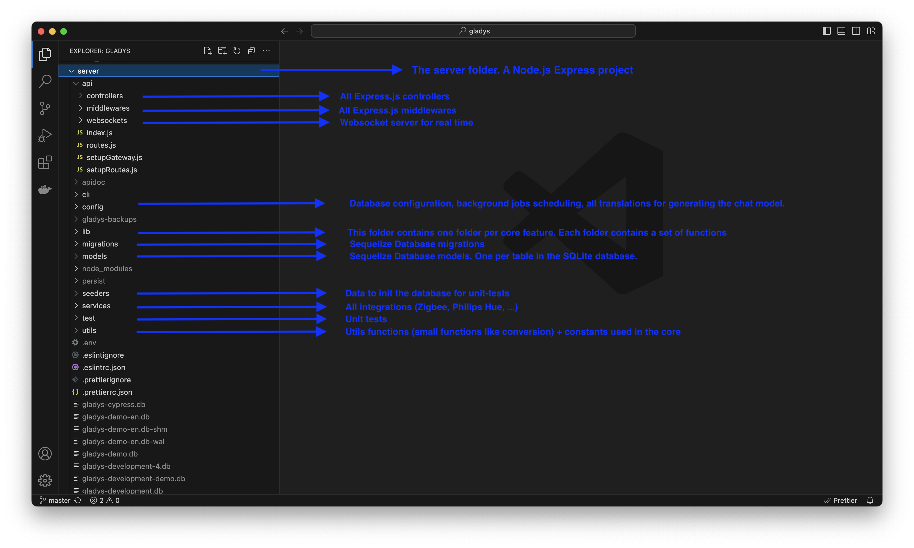
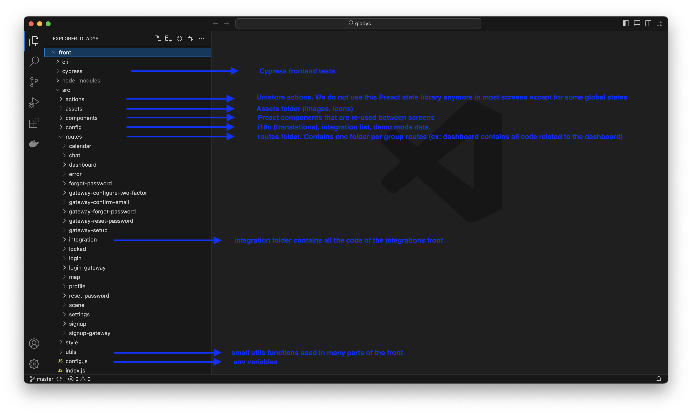

Gladys Assistant est un projet open-source, et tout son code est disponible sur [Github](https://github.com/GladysAssistant/Gladys).

N'importe qui peut lire et modifier ce code pour corriger un bug, ajouter des fonctionnalités au backend ou à l'interface, et améliorer le projet.

:::tip[Vous voulez créer une intégration ? Commencez par les intégrations externes]
La façon la **plus simple et la plus rapide** de créer une intégration, et de la publier à tous les utilisateurs en un clic, est de créer une [**intégration externe**](/fr/docs/dev/external-integrations/). Sans pull request, sans review de code, sans validation du mainteneur : vous l'écrivez dans le langage que vous voulez, vous l'empaquetez dans un conteneur Docker, et vous la publiez sur GitHub.

**Cette page concerne la contribution au cœur de Gladys lui-même** : corriger des bugs, ajouter des fonctionnalités au backend, améliorer l'interface, et, pour les protocoles ouverts qui ont vraiment leur place dans le cœur, ajouter une intégration interne.
:::

## Ce que vous pouvez contribuer

- **Corriger un bug**, n'importe où dans le backend ou le frontend.
- **Ajouter une fonctionnalité au backend** : une nouvelle action de scène, un nouveau point d'API REST, une nouvelle capacité dans l'API Gladys.
- **Améliorer l'interface** : de nouvelles boîtes de tableau de bord, de meilleurs écrans, de l'accessibilité et des traductions.
- **Ajouter ou améliorer une intégration interne** pour un protocole ouvert (Zigbee, MQTT, Z-Wave, etc.). Pour tout le reste, préférez une [intégration externe](/fr/docs/dev/external-integrations/).

## Les technologies utilisées

Gladys est un projet Node.js assez classique qui utilise :

- [Preact.js](https://preactjs.com/) pour le frontend (exactement comme React, mais en plus léger)
- Node.js [Express](https://expressjs.com/) comme framework backend
- [SQLite](https://www.sqlite.org/index.html) pour la base de donnée
- [DuckDB](https://duckdb.org/) pour stocker des données time-séries (les données de capteurs)
- [Sequelize](https://sequelize.org/) comme ORM pour la base de donnée et les migrations
- [Mocha](https://mochajs.org/) pour les tests backend
- [Cypress](https://www.cypress.io/) pour les tests d'intégration frontend

## Mettre en place un environnement de développement

Nous avons 2 tutoriels suivant votre plateforme :

- [Mettre en place un environnement de développement sur MacOS/Linux](/fr/docs/dev/setup-development-environment-mac-linux/)
- [Mettre en place un environnement de développement sur Windows](/fr/docs/dev/setup-development-environment-windows/)

## L'architecture de dossier

### Le serveur Node.js Express

Le backend se trouve dans le dossier **server**. Les dossiers que vous toucherez le plus souvent sont :

- `server/lib` : l'API Gladys, la logique métier du cœur (appareils, utilisateurs, scènes, pièces, etc.). C'est là que la plupart des fonctionnalités backend sont implémentées.
- `server/api` : les contrôleurs et routes REST qui exposent l'API Gladys au frontend.
- `server/services` : les intégrations internes (celles du cœur).
- `server/models` : les modèles Sequelize.
- `server/migrations` : les migrations de base de données.
- `server/utils` : les utilitaires partagés.

Voilà un petit explicatif de tous les dossiers du projet backend se trouvant dans le dossier **server** :



### Le frontend Preact.js

L'application Preact a été générée par [preact-cli](https://github.com/preactjs/preact-cli) :



## Travailler sur le backend

Quand vous ajoutez une fonctionnalité au backend, vous allez généralement :

1. Implémenter la logique dans le module `server/lib` concerné (l'API Gladys). Un module ne doit jamais contacter la base de données avec du SQL brut ; il utilise les modèles et le reste de l'API Gladys. Si une capacité manque, ajoutez une nouvelle fonction à l'API.
2. L'exposer, si nécessaire, via une route REST dans `server/api`.
3. La couvrir par des tests unitaires (voir [Tester vos changements](#tester-vos-changements) plus bas).

Quelques conventions utilisées dans toute la base de code :

- **Les commentaires JSDoc sur les fonctions sont obligatoires.** Ils documentent le code et servent aussi à la vérification des types.
- Gardez les `require()` de modules tiers **à l'intérieur** de la fonction qui les utilise, et non en haut du fichier, pour qu'un module NPM cassé ne puisse jamais faire planter tout le processus.

### Intégrations internes (protocoles ouverts)

Les intégrations internes vivent dans le dossier [server/services](https://github.com/GladysAssistant/Gladys/tree/master/server/services), un dossier par service. Chacune a un `package.json` (avec les champs obligatoires `os` et `cpu`) et un `index.js` qui exporte une factory exposant au minimum une fonction `start()` et une fonction `stop()` :

```js
module.exports = function ExampleService(gladys) {
  async function start() {
    // démarrer le service
  }
  async function stop() {
    // arrêter le service
  }
  return Object.freeze({ start, stop });
};
```

L'argument `gladys` vous donne accès à toute l'API Gladys. Enregistrez votre service en l'ajoutant à [server/services/index.js](https://github.com/GladysAssistant/Gladys/blob/master/server/services/index.js).

Ce chemin ne vaut le coup que pour les protocoles ouverts qui ont leur place dans le cœur. Pour tout le reste, une [intégration externe](/fr/docs/dev/external-integrations/) est plus rapide à créer, ne nécessite aucune review, et s'installe en un clic.

## Travailler sur l'interface

L'interface de Gladys 4 est une application [Preact](https://preactjs.com/) située dans le dossier **front**. Le code est organisé ainsi :

- `front/src/routes` : les pages, un dossier par écran.
- `front/src/components` : les composants d'interface réutilisables.
- `front/src/actions` : l'état de l'application et les actions qui le modifient.
- `front/src/config/i18n` : les traductions (`en.json`, `fr.json`, `de.json`, etc.).
- `front/src/routes/integration/all` : les écrans propres à chaque intégration.

Pour ajouter une fonctionnalité à l'interface, ajoutez ou modifiez une route et ses composants, câblez l'état via `actions`, et ajoutez chaque libellé que vous utilisez dans tous les fichiers `front/src/config/i18n/<lang>.json` pour que l'interface reste entièrement traduite (l'anglais et le français sont les langues de référence).

## Tester vos changements

Un objectif principal de Gladys Assistant est d'être un logiciel ultra-stable et fiable, donc tout le code de Gladys doit être testé.

- **Backend (Mocha) :** les tests se trouvent dans le dossier [server/test](https://github.com/GladysAssistant/Gladys/tree/master/server/test). Pour les lancer, exécutez `npm test` dans le dossier `server`. Pendant le développement, vous pouvez vous concentrer sur un seul test en lui ajoutant `.only` (veillez à le supprimer avant de valider). Vos tests ne doivent jamais appeler des API du monde réel : simulez tous les appels aux modules tiers, par exemple avec [proxyquire](https://github.com/GladysAssistant/Gladys/blob/master/server/test/services/example/index.test.js#L5).
- **Frontend (Cypress) :** voir la page dédiée [Tests Cypress](/fr/docs/dev/cypress-tests/).

## Qualité du code

Nous utilisons une configuration `eslint` assez stricte.

Utilisez `VSCode` pour le développement afin de voir les problèmes de linting en temps réel, ou exécutez `npm run eslint` dans le dossier `server` (et dans `front`) pour voir toutes les erreurs de linting.

## Inspiration : Live Coding sur YouTube

J'ai fait récemment un live YouTube de 7 heures (c'est complet !!) où j'explique comment coder une intégration de A à Z.

Je pars des spécifications fonctionnelles, aux spécifications techniques, au développement du frontend, du backend, des tests, du flow Git, TOUT est dedans !

Vous trouverez ce live coding ici :

<div class="youtubeVideoContainerInBlog">
<iframe src="https://www.youtube.com/embed/M4vOjQXMiZI" frameborder="0" allow="accelerometer; autoplay; encrypted-media; gyroscope; picture-in-picture" allowfullscreen></iframe>
</div>

## Soumettre votre contribution

Une fois votre changement prêt et testé, félicitations ! Vous pouvez ouvrir une pull request sur GitHub.

Lire : [Créer une PR sur Github](https://docs.github.com/en/pull-requests/collaborating-with-pull-requests/proposing-changes-to-your-work-with-pull-requests/creating-a-pull-request)

## Des questions ?

Tu as des questions ? Viens en parler [sur le forum](https://community.gladysassistant.com/) !
