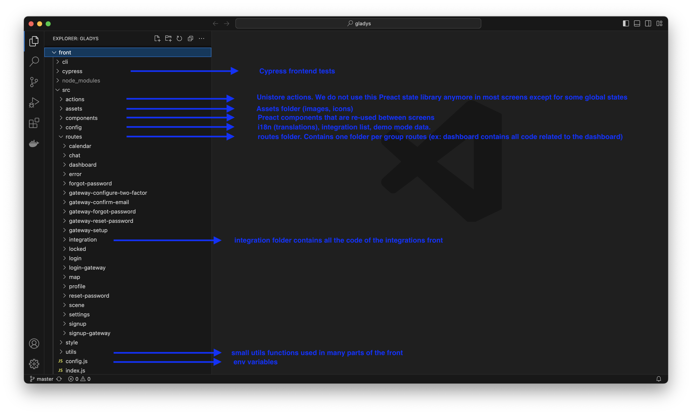

Gladys Assistant est un projet open-source, et tout son code est disponible sur [Github](https://github.com/GladysAssistant/Gladys).

N’importe qui peut lire et modifier ce code pour ajouter des fonctionnalités, des nouvelles intégrations ou corriger un bug.

## Les technologies utilisées

Gladys est un projet Node.js assez classique qui utilise :

- [Preact.js](https://preactjs.com/) pour le frontend (exactement comme React, mais en plus léger)
- Node.js [Express](https://expressjs.com/) comme framework backend
- [SQLite](https://www.sqlite.org/index.html) pour la base de donnée
- [Sequelize](https://sequelize.org/) comme ORM pour la base de donnée et les migrations
- [Mocha](https://mochajs.org/) pour les tests backend
- [Cypress](https://www.cypress.io/) pour les tests d’intégration frontend

## Mettre en place un environnement de développement

Nous avons 2 tutoriels suivant votre plateforme :

- [Mettre en place un environnement de développement sur MacOS/Linux](/fr/docs/dev/setup-development-environment-mac-linux/)
- [Mettre en place un environnement de développement sur Windows](/fr/docs/dev/setup-development-environment-windows/)

## L’architecture de dossier

### Le serveur Node.js Express

Voilà un petit explicatif de tous les dossiers du projet backend se trouvant dans le dossier **server.**


### Le frontend Preact.js

L’application Preact a été générée par [preact-cli](https://github.com/preactjs/preact-cli) :



## Inspiration : Live Coding sur YouTube

J’ai fait récemment un live YouTube de 7 heures (c’est complet !!) où j’explique comment coder une intégration de A à Z.

Je pars des spécifications fonctionnelles, aux spécifications techniques, au développement du frontend, du backend, des tests, du flow Git, TOUT est dedans !

Vous trouverez ce live coding ici :

<div class="youtubeVideoContainerInBlog">
<iframe src="https://www.youtube.com/embed/M4vOjQXMiZI" frameborder="0" allow="accelerometer; autoplay; encrypted-media; gyroscope; picture-in-picture" allowfullscreen></iframe>
</div>

## Comment coder une intégration Gladys Assistant ?

Les intégrations sont localisées dans le dossier [server/services](https://github.com/GladysAssistant/Gladys/tree/master/server/services).

Créez un nouveau dossier portant le nom de votre service. Le nom doit être alphanumérique, en minuscules, avec des tirets comme séparateurs si nécessaire.

Exemple de bons noms de dossier :

- `wemo`
- `philips-hue`
- `zwave`
- `usb`

### Créer un package.json

Le package.json décrit la compatibilité de votre service, et les dépendances nécessaires.

Vous pouvez consulter tous les package.json sur Github, mais voici un exemple d'un bon package.json :

```json
{
  "name": "gladys-darksky",
  "main": "index.js",
  "os": ["darwin", "linux", "win32"],
  "cpu": ["x64", "arm", "arm64"],
  "scripts": {},
  "dependencies": {
    "axios": "^0.18.0"
  }
}
```

**Note:** Les champs `os` et `cpu` sont obligatoires.

### Créer un fichier index.js

```jsx
const logger = require("../../utils/logger");
const ExampleLightHandler = require("./lib/light");

module.exports = function ExampleService(gladys) {
  // here is an example module
  const axios = require("axios");

  // @ts-ignore: TS doesn't know about the axios.create function
  const client = axios.create({
    timeout: 1000,
  });
  /**
   * @public
   * @description This function starts the ExampleService service
   * @example
   * gladys.services.example.start();
   */
  async function start() {
    logger.log("starting example service");
  }

  /**
   * @public
   * @description This function stops the ExampleService service
   * @example
   * gladys.services.example.stop();
   */
  async function stop() {
    logger.log("stopping example service");
  }

  return Object.freeze({
    start,
    stop,
    device: new ExampleLightHandler(gladys, client),
  });
};
```

- Le fichier `index.js` doit exposer 2 fonctions : start, et stop. Ces fonctions sont obligatoires, et doivent respectivement démarrer le service ou l'arrêter.
- Toutes les requêtes de dépendances listées dans le package.json doivent être faites **à l'intérieur** de la fonction, et non à l'extérieur. C'est parce que nous voulons que chaque service soit complètement isolé et ne se plante pas si le module NPM se plante.
- La variable `gladys` est l'instance de Gladys et vous donne accès à toutes les API de Gladys. Un service ne doit pas essayer de contacter la base de données lui-même, il doit seulement utiliser l'API de Gladys. Si une requête est manquante, n'hésitez pas à coder une nouvelle fonction dans l'API Gladys.
- Les commentaires sur les fonctions sont obligatoires et servent non seulement à la documentation, mais aussi à la vérification des types.

### Lier votre intégration à Gladys

Lorsque votre intégration est prête à être testée, vous pouvez éditer le fichier [server/services/index.js](https://github.com/GladysAssistant/Gladys/blob/master/server/services/index.js) et ajouter le require vers votre service.

### Tests unitaires

Un objectif principal de Gladys Assistant est d'être un logiciel ultra-stable et fiable.

Par conséquent, tout le code de Gladys doit être entièrement testé.

Les tests des services sont situés dans le dossier [server/test/services](https://github.com/GladysAssistant/Gladys/tree/master/server/test/services).

Je vous suggère de jeter un coup d'oeil aux [tests du service d'exemple](https://github.com/GladysAssistant/Gladys/tree/master/server/test/services/example) pour vous donner une idée de ce à quoi ressemblent les tests.

Pour lancer les tests, dans le dossier `server` exécutez :

```
npm test
```

Si vous voulez exécuter uniquement les tests relatifs à votre service, vous pouvez ajouter `.only` à vos tests, par exemple :

```jsx
describe.only("ExampleService", () => {
  const exampleService = ExampleService();
  it("should have start function", () => {
    expect(exampleService)
      .to.have.property("start")
      .and.be.instanceOf(Function);
  });
});
```

(Veillez à supprimer le `.only` avant de valider)

**Note sur le Mocking:** Vos tests appellent probablement un module NPM tiers. Nous vous recommandons de simuler tous les appels au module en utilisant des proxyquire comme [ici](https://github.com/GladysAssistant/Gladys/blob/master/server/test/services/example/index.test.js#L5). Vos tests ne doivent pas appeler des API du monde réel !

### Qualité du code

Nous utilisons une configuration `eslint` assez stricte.

Utilisez `VSCode` pour le développement afin de voir les problèmes de linting en temps réel, ou exécutez `npm run eslint` dans le dossier `server` pour voir toutes les erreurs de linting.

### Interface

L'interface de Gladys 4 est une application [preact](https://preactjs.com/).

Si vous voulez ajouter des fonctionnalités au frontend, vous pouvez éditer le code dans le dossier `front`.

Tout le code relatif à l'interface utilisateur des services est situé dans le dossier [front/src/routes/integration/all](https://github.com/GladysAssistant/Gladys/tree/master/front/src/routes/integration/all).

### Soumettre votre intégration

Si vous pensez que votre service est suffisamment bon pour être publié, félicitations !

Vous pouvez créer une PR sur GitHub.

Lire: [Créer une PR sur Github](https://docs.github.com/en/pull-requests/collaborating-with-pull-requests/proposing-changes-to-your-work-with-pull-requests/creating-a-pull-request)

### Formations sur les outils de développement d'une intégration

Vous souhaitez rafraichir, approfondir vos connaissances sur les outils utilisés pour développer une intégration pour Gladys-Assistant, suivez les liens !

Pour le langage Html [HTML](https://grafikart.fr/formations/html)
Pour les feuilles de style [CSS](https://grafikart.fr/formations/css)
Pour le langage React [REACT](https://grafikart.fr/formations/react)
Pour le langage Javascript [JAVASCRIPT](https://grafikart.fr/formations/formation-javascript)
Pour déboguer le langage Javascript [DEBOGAGE JAVASCRIPT](https://grafikart.fr/formations/deboguer-javascript)
Pour la gestion de dépot Git [GIT](https://grafikart.fr/formations/git)
Pour le lanage SQL [SQL](https://grafikart.fr/formations/apprendre-sql)

## Des questions ?

Tu as des question ? Viens en parler [sur le forum](https://community.gladysassistant.com/) !

