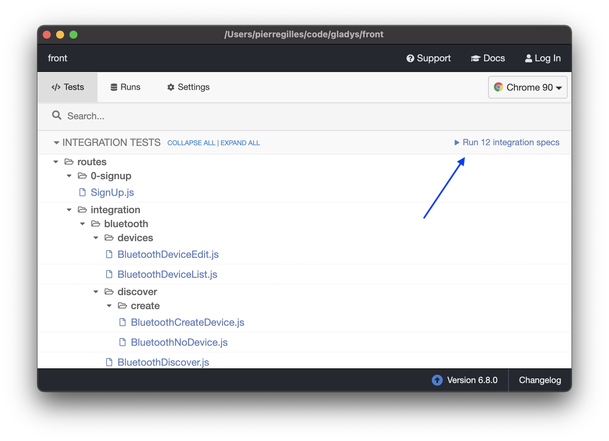

Nous utilisons [Cypress](https://www.cypress.io/) pour faire des tests frontend end-to-end.

## Lancer le backend

Dans le dossier `server`, exécutez :

```
npm run cypress
```

Cela va créer une base de donnée SQlite vide et lancer un backend.

## Ouvrir Cypress

Dans le dossier `front`, lancez un front Gladys :

```
npm run start:cypress
```

Puis, vous pouvez lancer Cypress :

```
npm run cypress:open
```

Ce qui va lancer l'application Electron Cypress.

Ensuite, vous pouvez lancer les tests dans votre navigateur :



## Lancer les tests en ligne de commande

Il est aussi possible de lancer Cypress en ligne de commande :

```
npm run cypress:run
```
