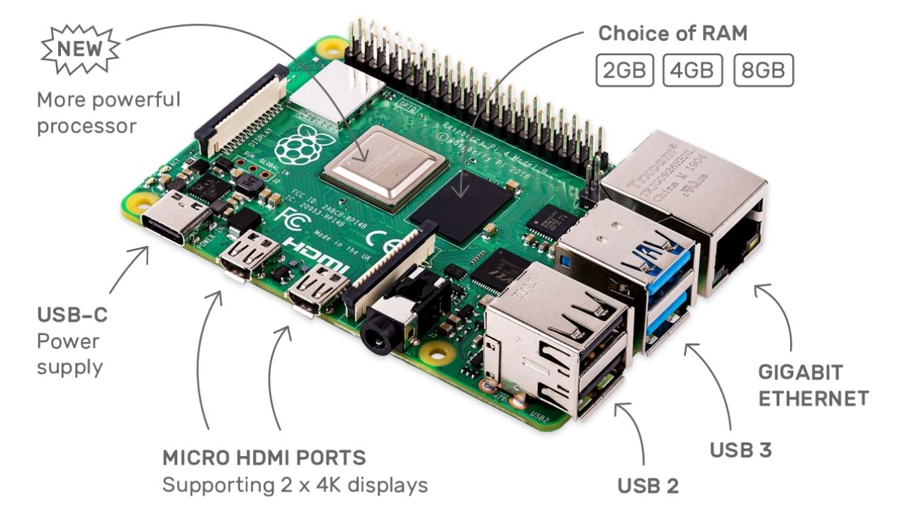

Gladys Assistant est un programme qui tourne sur n'importe quelle machine Linux: un Raspberry Pi, un NAS, un VPS, un serveur à la maison, etc...

Néanmoins, une grande partie de la communauté fait tourner Gladys sur un Raspberry Pi, et ce pour plusieurs raisons :

- C'est un micro-ordinateur très abordable (40-50€)
- Il consomme peu (se branche sur un chargeur USB-C)
- Complètement silencieux car il n'a pas de ventilateur
- Il offre de belles performances (Quad core Cortex-A72 en ARM v8 à 1.5GHz + jusqu'à 8GB de RAM)
- Enfin, c'est le micro-ordinateur le plus populaire du marché, avec plus de 39 millions d'unités vendus depuis son lancement. La communauté est grande, et réactive. Il est rare qu'un problème critique soit sans réponses, et l'OS est continuellement maintenu par le constructeur, même pour les vieux modèles.

## Commencer pour moins de 100€

- Un Raspberry Pi 4, disponible chez [Kubii.fr](https://www.kubii.fr/cartes-raspberry-pi/2771-nouveau-raspberry-pi-4-modele-b-2gb-0765756931175.html?gladys). Le modèle 4 est une belle amélioration par rapport à la troisième génération, car il offre 2 ports USB 3.0, un port Ethernet Gigabit, et offre enfin la possibilité de choisir des modèles avec plus de RAM.

Si vous comptez utiliser Gladys seule sur le Raspberry Pi, je vous conseille le modèle avec [2GB de RAM](https://www.kubii.fr/cartes-raspberry-pi/2771-nouveau-raspberry-pi-4-modele-b-2gb-0765756931175.html?gladys). Si vous comptez faire tourner Gladys + quelques autres services (Pi-Hole/Adguard, Node-RED), je vous conseille de prendre plus de RAM pour être tranquille ( [4GB](https://www.kubii.fr/cartes-raspberry-pi/2772-nouveau-raspberry-pi-4-modele-b-4gb-kubii-0765756931182.html?gladys), ou même [8GB](https://www.kubii.fr/cartes-raspberry-pi/2955-raspberry-pi-4-modele-b-8gb-0765756931199.html?gladys) si vous voulez être large )

- L'alimentation officielle USB-C 3A disponible chez [Kubii.fr](https://www.kubii.fr/14-chargeurs-alimentations-raspberry/2678-alimentation-officielle-usb-type-c-raspberry-pi-3272496300002.html?gladys). Il est important d'utiliser une alimentation USB-C de bonne qualité qui fournit un ampérage suffisant pour que le Raspberry Pi puisse tourner correctement. Si vous branchez un SSD externe sur votre Pi comme je recommande, il est encore plus important d'avoir un chargeur qui fournit un ampérage suffisant.

- Boitier officiel pour Raspberry Pi 4, disponible chez [Kubii.fr](https://www.kubii.fr/boitiers-et-supports/2681-boitier-officiel-pour-raspberry-pi-4-kubii-3272496298583.html?gladys)

- Une carte micro-SD class 10 disponible chez [Kubii.fr](https://www.kubii.fr/carte-sd-et-stockage/2939-micro-sdhc-16gb-class10-verbatim-023942440826.html?gladys)

Nous ne recommandons pas de faire tourner Gladys sur une carte-SD sur le long terme, car les cartes SD ne sont pas conçue pour supporter de tels cycles de lectures/écritures. Néanmoins, il est toujours pratique d'avoir une carte micro-SD sous la main, notamment pour pouvoir flasher le bootloader du Pi lors de la première installation

- Un disque SSD comme ce [PNY 120GB Sata III à 19€90 sur Amazon](https://www.amazon.fr/PNY-CS900-Disque-Flash-Interne/dp/B01KFLH1WS?tag=gladproj-21&th=1) couplé à un [boitier USB 3.0 à 11€](https://www.amazon.fr/EasyULT-Boitier-Externe-Vitesse-UASP-Noir/dp/B07PMWJB8P?&linkCode=ll1&tag=gladproj-21&linkId=d2bf9d23a85189d9ec0479a23dec4923&language=fr_FR&ref_=as_li_ss_tl).

Comme je disais plus haut, un disque SSD est largement recommandé pour utiliser Gladys.

### Si on récapitule

| Matériel         | Prix          |
| ---------------- | ------------- |
| Raspberry Pi 4   | 43,90€ **\*** |
| Alimentation     | 8,95€         |
| Boitier          | 5,95€         |
| Carte micro-SD   | 7,90€         |
| Disque SSD 120GB | 19,90€        |
| Boitier USB 3.0  | 10,99€        |
| **Prix total**   | 97,59€        |

** \* Note:** Due à la pénurie de composants et aux problèmes d'approvisionnements actuels, la fondation Raspberry Pi a des difficultés à produire le Raspberry Pi en quantitées suffisantes. Par conséquent, le Raspberry Pi est souvent en rupture de stock, et la fondation [a annoncé fin 2021](https://www.raspberrypi.com/news/supply-chain-shortages-and-our-first-ever-price-increase/) que les prix allaient augmenter temporairement de 10€.
