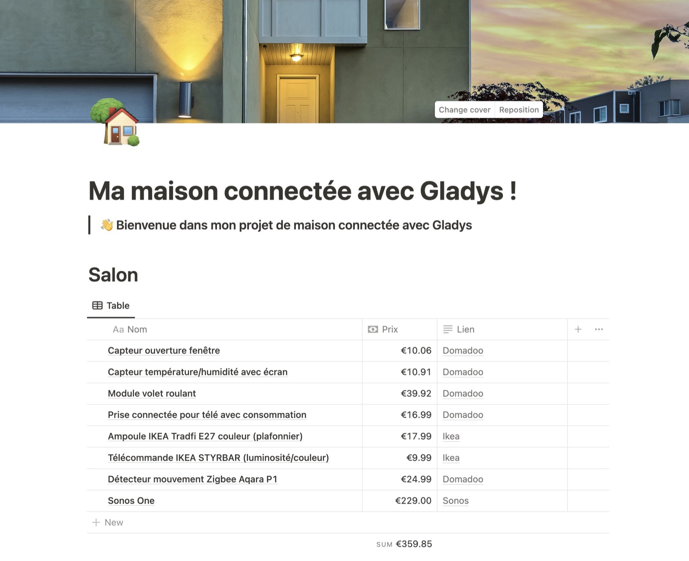
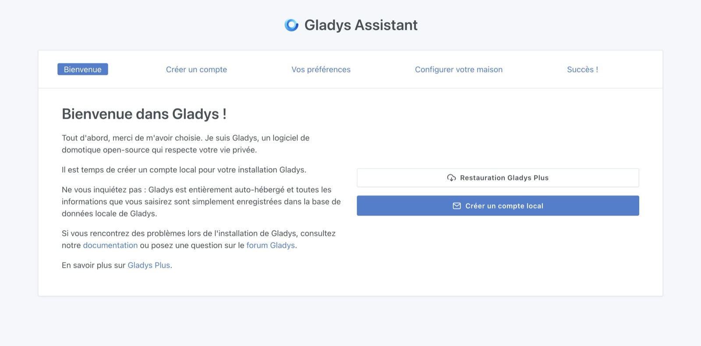
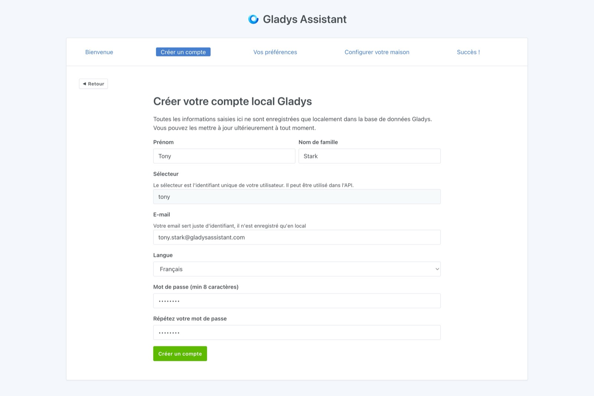
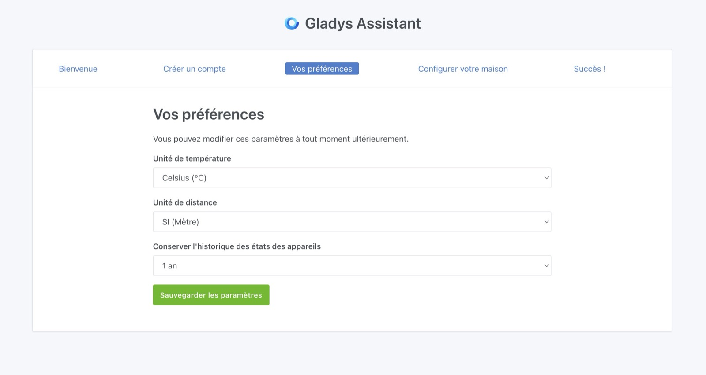

Il peut être difficile de savoir par où commencer lorsque l'on débute en domotique. Quel matériel choisir ? Quel budget prévoir ? Quel protocole domotique adopter ?

Ce guide vous aidera à répondre à ces questions et vous offrira un point de départ pour créer votre maison connectée de zéro.

## Choisir votre box domotique

Gladys Assistant est un logiciel auto-hébergé, ce qui signifie que tout fonctionne en local sur une box domotique chez vous. C'est l'une de ses principales forces : **vos données restent privées et votre maison fonctionne même sans Internet** !

### Solution recommandée : Le kit de démarrage Gladys

Pour démarrer simplement et rapidement, je propose **[le kit de démarrage Gladys](/fr/starter-kit/)** à partir de 119,99€.

**Pourquoi choisir le kit de démarrage ?**

- ✅ **Prêt à l'emploi** : Gladys est déjà installé et configuré, branchez et c'est parti !
- ✅ **Matériel testé et validé** : Mini-PC Beelink performant
- ✅ **Support prioritaire** : Aide personnalisée si besoin par email ou appel
- ✅ **6 mois de Gladys Plus inclus** : Accès à distance sécurisé, sauvegardes automatiques et plus encore
- ✅ **Tutoriels dédiés** : Guides pas à pas pour bien démarrer avec votre box

C'est la solution idéale si vous voulez éviter les complications techniques et vous concentrer sur la création de vos automatisations.

[👉 Découvrir le kit de démarrage](/fr/starter-kit/)

### Autres options d'installation

Si vous préférez installer Gladys vous-même, c'est tout à fait possible ! Gladys peut tourner sur n'importe quelle machine sous Linux :

- **Mini-PC (Beelink, Intel NUC, etc.)**

  - Installation manuelle d'Ubuntu Server + Docker
  - Exemple : Beelink Mini S13 disponible sur [Amazon](https://amzn.to/4hRtIE3)
  - Nécessite des connaissances techniques en Linux

- **Serveur ou NAS existant**

  - Si vous avez déjà un NAS Synology, un serveur Linux ou tout autre matériel compatible Docker
  - Idéal pour réutiliser du matériel existant

- **Raspberry Pi** (déconseillé)
  - Possible si vous possédez déjà un Raspberry Pi, mais **non recommandé pour une utilisation long terme**
  - Problèmes fréquents : coût total élevé (Pi + alimentation + boîtier + SSD), instabilité avec carte micro-SD, difficultés avec les dongles Zigbee/Z-Wave

## Définir votre projet de maison connectée

Le plus important est de définir les automatisations que vous souhaitez mettre en place chez vous : des lumières connectées, une alarme pour sécuriser votre domicile, des économies d'énergie en coupant les appareils inutilisés ou le chauffage ?

Un bon moyen de s'organiser est de créer un tableau (sur Excel, Google Sheets ou Notion) dans lequel vous listez tous les appareils que vous souhaitez intégrer, pièce par pièce.

### Exemple: Salon

| Nom                                            | Prix   | Lien                                                                                                                                                                   |
| ---------------------------------------------- | ------ | ---------------------------------------------------------------------------------------------------------------------------------------------------------------------- |
| Capteur température/humidité Zigbee avec écran | 10,91€ | [Domadoo](https://www.domadoo.fr/fr/peripheriques/6614-sonoff-capteur-de-temperature-et-d-humidite-zigbee-30-avec-ecran.html?domid=17)                                 |
| Module volet roulant Zigbee                    | 39,92€ | [Domadoo](https://www.domadoo.fr/fr/peripheriques/5245-sunricher-module-volet-roulant-zigbee-30.html?domid=17)                                                         |
| Prise connectée pour télé avec consommation    | 16,99€ | [Domadoo](https://www.domadoo.fr/fr/peripheriques/6165-nous-prise-intelligente-zigbee-30-mesure-de-consommation-5907772033517.html?domid=17)                           |
| Ampoule IKEA TRÅDFRI E27 couleur (plafonnier)  | 17,99€ | [IKEA](https://www.ikea.com/fr/fr/p/tradfri-ampoule-led-e27-806-lumen-connecte-sans-fil-a-variateur-dintensite-spectre-couleur-et-blanc-globe-70439158/)               |
| Télécommande IKEA STYRBAR (luminosité/couleur) | 9,99€  | [IKEA](https://www.ikea.com/fr/fr/p/styrbar-telecommande-connecte-blanc-30488363/)                                                                                     |
| Détecteur mouvement Zigbee Aqara P1            | 24,99€ | [Domadoo](https://www.domadoo.fr/fr/peripheriques/6138-aqara-detecteur-de-mouvement-et-luminosite-zigbee-30-aqara-motion-sensor-p1-ms-s02-6970504215979.html?domid=17) |

L'idée n'est pas nécessairement d'acheter tout d'un coup, mais plutôt de planifier et d'équiper progressivement votre maison, sauf si vous venez d'emménager et souhaitez tout installer immédiatement.

## Installation de Gladys Assistant

Selon le matériel choisi, vous pouvez suivre l'un des tutoriels suivants :

- [Installer Gladys Assistant sur un mini-PC](/fr/docs/installation/mini-pc/)
- [Installer Gladys Assistant sur une Freebox Delta](/fr/docs/installation/freebox-delta/)
- [Installer Gladys Assistant sur un NAS Synology](/fr/docs/installation/synology/)
- [Installer Gladys Assistant sur un NAS Unraid](/fr/docs/installation/unraid/)
- [Installer Gladys Assistant sur un Raspberry Pi](/fr/docs/installation/raspberry-pi/)

## Configuration de votre maison connectée

Une fois que Gladys fonctionne chez vous, vous pourrez y accéder via votre navigateur web et configurer votre maison.

Il vous suffira de suivre les étapes.

Vous commencerez par créer le compte de l’administrateur principal de votre maison connectée :

Ensuite, Gladys vous demandera quelques préférences :

Enfin, vous pourrez nommer votre maison :

Voilà ! Vous avez maintenant un système de maison connectée Gladys opérationnel.

Vous pouvez maintenant mettre en place les différentes intégrations présentes dans Gladys.

Si vous avez des questions, rejoignez-nous dès maintenant [sur le forum](https://community.gladysassistant.com/) !
