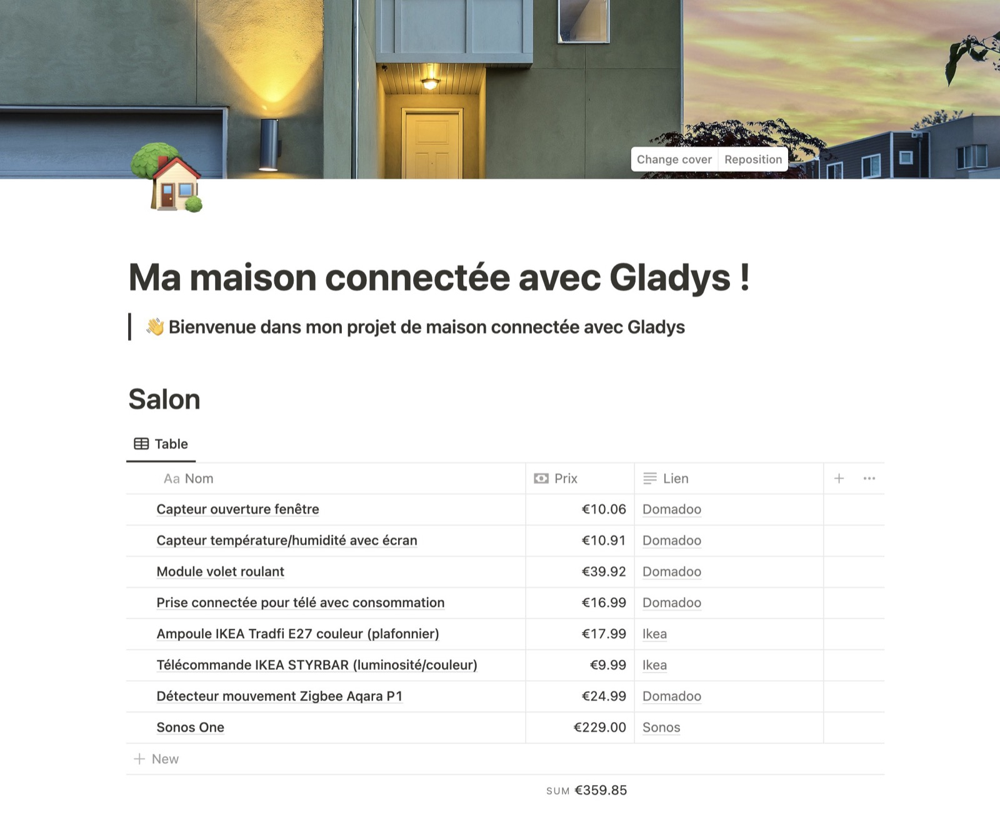
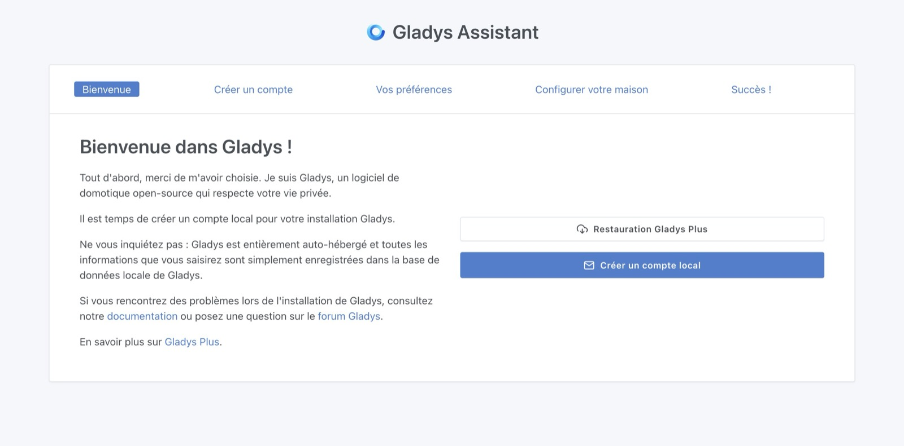
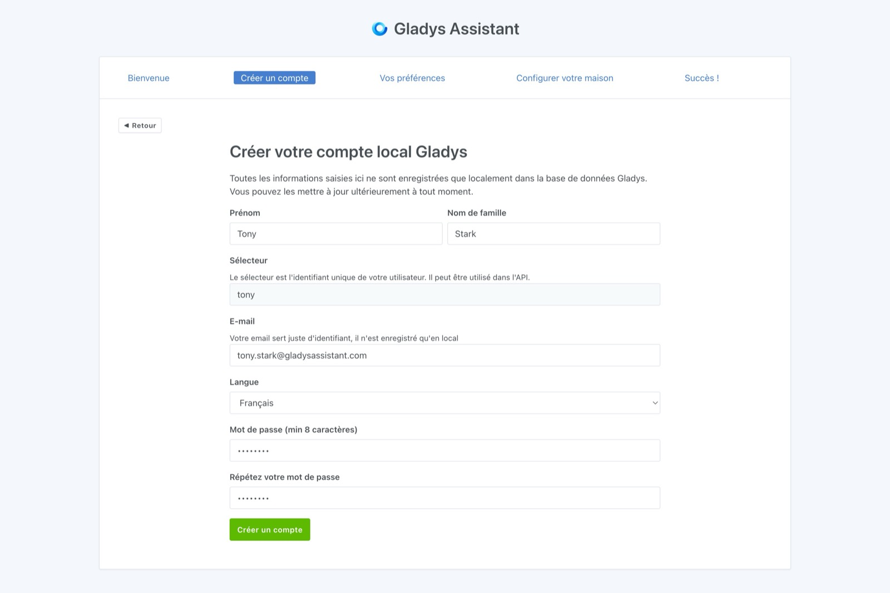
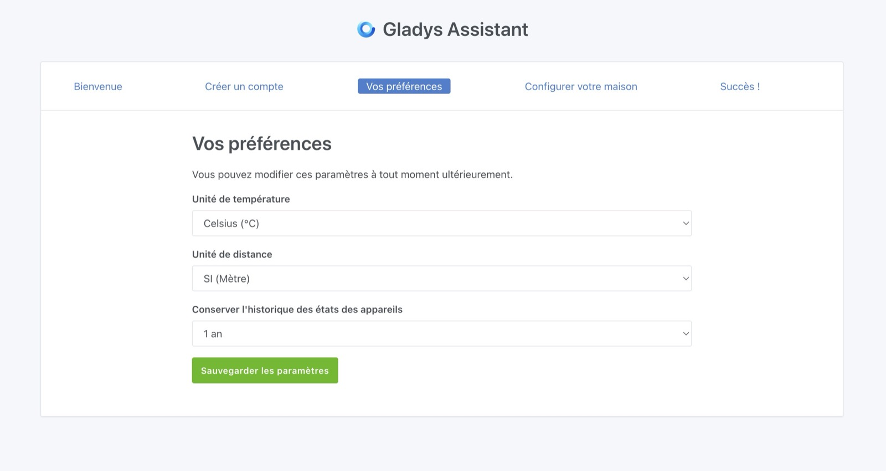
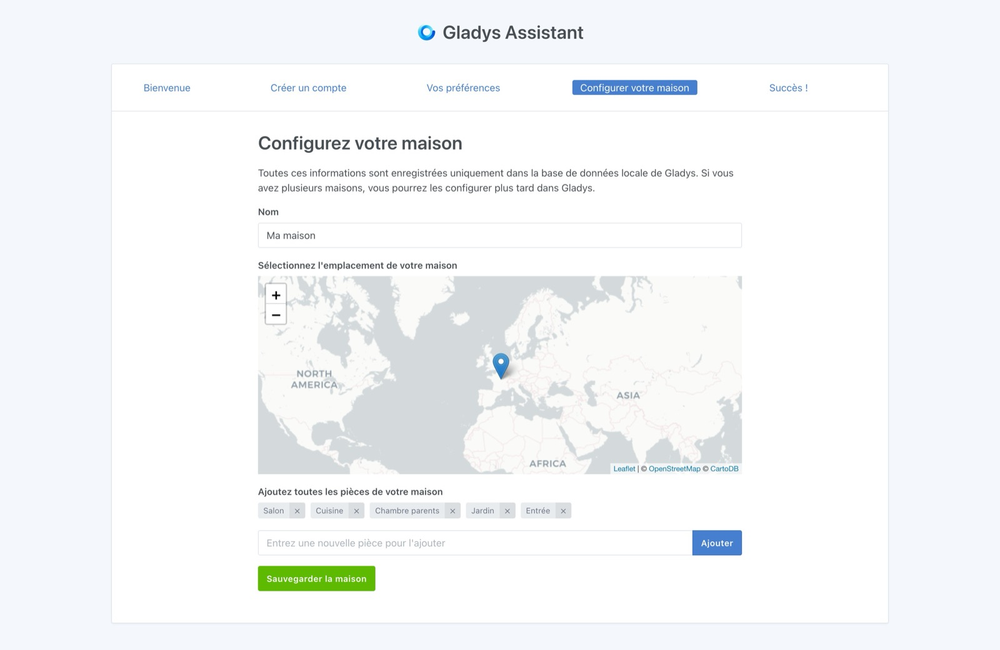

Il peut être difficile de savoir par où commencer lorsque l'on débute en domotique. Quel matériel choisir ? Quel budget prévoir ? Quel protocole domotique adopter ?

Ce guide vous aidera à répondre à ces questions et vous offrira un point de départ pour créer votre maison connectée de zéro.

## Choisir votre box domotique

Gladys Assistant est un logiciel auto-hébergé, ce qui signifie que tout fonctionne en local sur une box domotique chez vous. C'est l'une de ses principales forces : **vos données restent privées et votre maison fonctionne même sans Internet** !

La grande majorité des utilisateurs installent Gladys **eux-mêmes** sur un mini-PC. Le kit de démarrage Gladys n'est qu'une option pour ceux qui préfèrent une solution clé en main.

### Option recommandée : un mini-PC sous Linux

C'est le meilleur rapport qualité/prix pour une installation durable. Vous installez Ubuntu Server, puis Gladys via Docker. Notre documentation vous guide à chaque étape.

**Où trouver le matériel ?**

- **Mini-PC neuf** (Beelink, Intel NUC…) : comptez entre 330 € et 430 € pour un modèle performant comme le Beelink S13. Exemple : [Beelink Mini S13 sur Amazon](https://amzn.to/4hRtIE3)
- **Mini-PC reconditionné** : souvent nettement moins cher sur Leboncoin, eBay ou chez les revendeurs spécialisés. Vérifiez qu'il a au moins 8 Go de RAM et un SSD.
- **Matériel que vous avez déjà** : un vieux PC, un Intel NUC qui traîne… Si Docker tourne dessus, Gladys tourne dessus.

👉 [Tutoriel d'installation sur mini-PC](/fr/docs/installation/mini-pc/)

### Réutiliser un NAS ou un serveur existant

Si vous avez déjà un NAS Synology, un serveur Linux ou tout autre matériel compatible Docker, vous pouvez y installer Gladys sans acheter de nouvelle machine.

- [Installer sur un NAS Synology](/fr/docs/installation/synology/)
- [Installer sur un NAS Unraid](/fr/docs/installation/unraid/)
- [Installer sur une Freebox Delta](/fr/docs/installation/freebox-delta/)

### Raspberry Pi : pour découvrir

Idéal pour tester Gladys si vous avez déjà un Raspberry Pi (3, 4 ou 5). L'installation est simplifiée grâce à notre image officielle 64 bits.

👉 [Tutoriel d'installation sur Raspberry Pi](/fr/docs/installation/raspberry-pi/)

Pour une utilisation au quotidien sur le long terme, un mini-PC reste préférable (plus de RAM, SSD plus rapide, plus stable).

### Option clé en main : le kit de démarrage Gladys

Vous ne voulez pas vous occuper de l'installation ? Le **[kit de démarrage Gladys](/fr/starter-kit/)** est un mini-PC avec Gladys déjà pré-installé, livré avec formation et 6 mois de Gladys Plus.

C'est une option **premium et optionnelle**, pensée pour ceux qui préfèrent brancher et configurer leur maison connectée sans passer par Ubuntu ni Docker. Ce n'est en aucun cas obligatoire pour utiliser Gladys.

[Découvrir le kit de démarrage →](/fr/starter-kit/)

## Définir votre projet de maison connectée

Le plus important est de définir les automatisations que vous souhaitez mettre en place chez vous : des lumières connectées, une alarme pour sécuriser votre domicile, des économies d'énergie en coupant les appareils inutilisés ou le chauffage ?

Un bon moyen de s'organiser est de créer un tableau (sur Excel, Google Sheets ou Notion) dans lequel vous listez tous les appareils que vous souhaitez intégrer, pièce par pièce.

### Exemple: Salon

| Nom                                            | Prix   | Lien                                                                                                                                                                   |
| ---------------------------------------------- | ------ | ---------------------------------------------------------------------------------------------------------------------------------------------------------------------- |
| Capteur température/humidité Zigbee avec écran | 10,91€ | [Domadoo](https://www.domadoo.fr/fr/peripheriques/6614-sonoff-capteur-de-temperature-et-d-humidite-zigbee-30-avec-ecran.html?domid=17)                                 |
| Module volet roulant Zigbee                    | 39,92€ | [Domadoo](https://www.domadoo.fr/fr/peripheriques/5245-sunricher-module-volet-roulant-zigbee-30.html?domid=17)                                                         |
| Prise connectée pour télé avec consommation    | 16,99€ | [Domadoo](https://www.domadoo.fr/fr/peripheriques/6165-nous-prise-intelligente-zigbee-30-mesure-de-consommation-5907772033517.html?domid=17)                           |
| Ampoule IKEA TRÅDFRI E27 couleur (plafonnier)  | 17,99€ | [IKEA](https://www.ikea.com/fr/fr/p/tradfri-ampoule-led-e27-806-lumen-connecte-sans-fil-a-variateur-dintensite-spectre-couleur-et-blanc-globe-70439158/)               |
| Télécommande IKEA STYRBAR (luminosité/couleur) | 9,99€  | [IKEA](https://www.ikea.com/fr/fr/p/styrbar-telecommande-connecte-blanc-30488363/)                                                                                     |
| Détecteur mouvement Zigbee Aqara P1            | 24,99€ | [Domadoo](https://www.domadoo.fr/fr/peripheriques/6138-aqara-detecteur-de-mouvement-et-luminosite-zigbee-30-aqara-motion-sensor-p1-ms-s02-6970504215979.html?domid=17) |

L'idée n'est pas nécessairement d'acheter tout d'un coup, mais plutôt de planifier et d'équiper progressivement votre maison, sauf si vous venez d'emménager et souhaitez tout installer immédiatement.

## Installation de Gladys Assistant

Selon le matériel choisi, vous pouvez suivre l'un des tutoriels suivants :

- [Installer Gladys Assistant sur un mini-PC](/fr/docs/installation/mini-pc/)
- [Installer Gladys Assistant sur une Freebox Delta](/fr/docs/installation/freebox-delta/)
- [Installer Gladys Assistant sur un NAS Synology](/fr/docs/installation/synology/)
- [Installer Gladys Assistant sur un NAS Unraid](/fr/docs/installation/unraid/)
- [Installer Gladys Assistant sur un Raspberry Pi](/fr/docs/installation/raspberry-pi/)

## Configuration de votre maison connectée

Une fois que Gladys fonctionne chez vous, vous pourrez y accéder via votre navigateur web et configurer votre maison.

Il vous suffira de suivre les étapes.

Vous commencerez par créer le compte de l’administrateur principal de votre maison connectée :

Ensuite, Gladys vous demandera quelques préférences :

Enfin, vous pourrez nommer votre maison :

Voilà ! Vous avez maintenant un système de maison connectée Gladys opérationnel.

Vous pouvez maintenant mettre en place les différentes intégrations présentes dans Gladys.

Si vous avez des questions, rejoignez-nous dès maintenant [sur le forum](https://community.gladysassistant.com/) !
