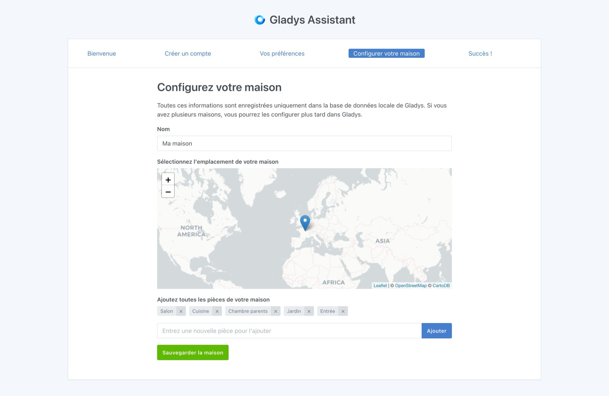

Il peut être difficile de savoir par où commencer lorsque l'on débute en domotique. Quel matériel choisir ? Quel budget prévoir ? Quel protocole domotique adopter ?

Ce guide vous aidera à répondre à ces questions et vous offrira un point de départ pour créer votre maison connectée de zéro.

## Définir son projet de maison connectée

Le plus important est de définir les automatisations que vous souhaitez mettre en place chez vous : des lumières connectées, une alarme pour sécuriser votre domicile, des économies d'énergie en coupant les appareils inutilisés ou le chauffage ?

Un bon moyen de s'organiser est de créer un tableau (sur Excel, Google Sheets ou Notion) dans lequel vous listez tous les appareils que vous souhaitez intégrer, pièce par pièce.

### Exemple: Salon

| Nom                                            | Prix   | Lien                                                                                                                                                                   |
| ---------------------------------------------- | ------ | ---------------------------------------------------------------------------------------------------------------------------------------------------------------------- |
| Capteur température/humidité Zigbee avec écran | 10,91€ | [Domadoo](https://www.domadoo.fr/fr/peripheriques/6614-sonoff-capteur-de-temperature-et-d-humidite-zigbee-30-avec-ecran.html?domid=17)                                 |
| Module volet roulant Zigbee                    | 39,92€ | [Domadoo](https://www.domadoo.fr/fr/peripheriques/5245-sunricher-module-volet-roulant-zigbee-30.html?domid=17)                                                         |
| Prise connectée pour télé avec consommation    | 16,99€ | [Domadoo](https://www.domadoo.fr/fr/peripheriques/6165-nous-prise-intelligente-zigbee-30-mesure-de-consommation-5907772033517.html?domid=17)                           |
| Ampoule IKEA TRÅDFRI E27 couleur (plafonnier)  | 17,99€ | [IKEA](https://www.ikea.com/fr/fr/p/tradfri-ampoule-led-e27-806-lumen-connecte-sans-fil-a-variateur-dintensite-spectre-couleur-et-blanc-globe-70439158/)               |
| Télécommande IKEA STYRBAR (luminosité/couleur) | 9,99€  | [IKEA](https://www.ikea.com/fr/fr/p/styrbar-telecommande-connecte-blanc-30488363/)                                                                                     |
| Détecteur mouvement Zigbee Aqara P1            | 24,99€ | [Domadoo](https://www.domadoo.fr/fr/peripheriques/6138-aqara-detecteur-de-mouvement-et-luminosite-zigbee-30-aqara-motion-sensor-p1-ms-s02-6970504215979.html?domid=17) |

L'idée n'est pas nécessairement d'acheter tout d'un coup, mais plutôt de planifier et d'équiper progressivement votre maison, sauf si vous venez d'emménager et souhaitez tout installer immédiatement.

## Choisir sa box domotique

Gladys Assistant est un logiciel auto-hébergé, ce qui signifie que tout fonctionne en local sur une box domotique. C'est l'une de ses principales forces !

Gladys peut tourner sur n'importe quelle machine sous Linux :

- **Beelink Mini S12 Pro** (Entre 179€ et 249€ selon promotions)

  - Mini-PC puissant (Intel 12e génération, 16GB RAM, SSD NVMe 500 Gb).
  - Stable et performant sur le long terme.
  - Installation d'Ubuntu Server via clé USB bootable + installation de Gladys via Docker.
  - Disponible sur [Amazon](https://amzn.to/47yVAaL)

- **N’importe quel serveur, NAS, mini-PC**

  - Si vous avez un NAS Synology, un Intel NUC ou tout autre serveur Linux compatible Docker, vous pouvez installer Gladys dessus.

- **Raspberry Pi**
  - Si vous possédez déjà un Raspberry Pi, cela peut être une solution pour tester Gladys.
  - Cependant, **je déconseille cette option sur le long terme** pour plusieurs raisons :
    - Le coût total est relativement élevé, en tenant compte du Pi, de l'alimentation, du boîtier et du SSD.
    - L'utilisation d'une carte micro-SD pour le stockage est **fortement déconseillée**, car elle entraîne un risque élevé de corruption des données.
    - Les problèmes d'instabilité de l'alimentation via les ports USB rendent l'utilisation de dongles Zigbee/Z-Wave difficile et peu fiable.

Si tu es intéressé par la gamme Beelink, je propose un kit de démarrage basé sur cette marque, [accessible dès 165€](/fr/starter-kit/).

## Installation de Gladys Assistant

Selon le matériel choisi, vous pouvez suivre l'un des tutoriels suivants :

- [Installer Gladys Assistant sur un mini-PC](/fr/docs/installation/mini-pc/)
- [Installer Gladys Assistant sur une Freebox Delta](/fr/docs/installation/freebox-delta/)
- [Installer Gladys Assistant sur un NAS Synology](/fr/docs/installation/synology/)
- [Installer Gladys Assistant sur un NAS Unraid](/fr/docs/installation/unraid/)
- [Installer Gladys Assistant sur un Raspberry Pi](/fr/docs/installation/raspberry-pi/)

## Configuration de votre maison connectée

Une fois que Gladys tourne chez vous, vous allez pouvoir y accéder via votre navigateur web et la configuration de votre maison.

Il vous suffit ici de suivre les étapes.

Nous allons d’abord créer le compte de l’administrateur principal de votre maison connectée :

Ensuite, Gladys vous demande quelques préférences :

Enfin, vous pouvez nommer votre maison :

Voilà ! Tu as maintenant un système de maison connectée Gladys chez toi.

Tu peux maintenant mettre en place les différentes intégrations présentes dans Gladys.

Si tu as des questions, rejoins-nous dès maintenant [sur le forum](https://community.gladysassistant.com/) !
