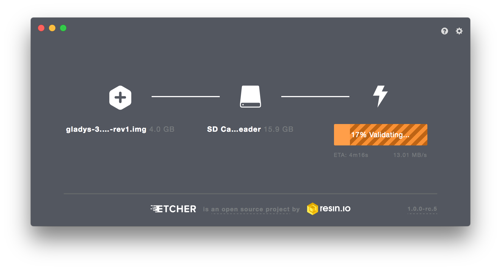

Historiquement, je recommandais l’utilisation des Raspberry Pi pour installer Gladys.

Cependant, ils sont de moins en moins compétitifs pour plusieurs raisons :

- Un coût global élevé une fois l’alimentation, le boîtier et le SSD ajoutés.
- Une fiabilité limitée avec une carte micro-SD et une installation complexe avec un SSD. En plus, même avec un SSD en USB, les performances restent bien inférieures à celles d'un mini-PC équipé d’un SSD NVMe intégré.
- Un processeur moins performant par rapport aux équivalents Intel à basse consommation.
- Des problèmes récurrents d’alimentation lorsqu’on ajoute un dongle Zigbee et un SSD.

Ma recommandation est d'acheter un mini-PC. Il y a des monstres de puissance dès [190€ sur Amazon](https://amzn.to/47yVAaL), et des versions en dessous de 100€ si on cherche en reconditionné ou en occasion sur LeBonCoin.

De mon côté, je propose un [kit de démarrage](/fr/starter-kit/) basé sur le Beelink mini S12 Pro, c'est d'ailleurs ce que je fais tourner chez moi.

Si vous avez un Raspberry Pi qui est déjà configuré (vous avez déjà installé Raspberry Pi OS), il est possible d'installer Gladys manuellement avec Docker [sur ce tutoriel](/fr/docs/installation/docker).

## Installation sur une carte micro-SD

Nous proposons 2 façons d'installer Gladys: sur une micro-SD, ou sur un disque externe SSD.

L'installation sur micro-SD est un bon moyen de commencer avec Gladys.

<iframe src="https://www.youtube.com/embed/yWAX-NAxjZQ" frameborder="0" allow="accelerometer; autoplay; encrypted-media; gyroscope; picture-in-picture" allowfullscreen></iframe>

Il faut néanmoins rester conscient que sur le long terme, il est possible que vous ayez des problèmes de corruptions de données car les micro-SD s'usent vite.

### Télécharger l'image Raspberry Pi OS

Nous mettons à disposition une image Raspberry Pi OS toute prête.

Pour Raspberry Pi 3, 4 et 400 :

<a class="button button--primary margin-bottom--md" href="https://gladysassistant.com/download/latest-64" rel="nofollow" >Télécharger Gladys Assistant OS Bullseye 64 bits</a>

:::note
Les anciens Raspberry Pi ne sont plus supportés à cause de leur architecture arm/v6 qui n'est plus supportées par certaines technos dans Gladys.

Pour installer Gladys sur un Raspberry Pi 5, je vous conseille d'installer Raspberry Pi OS, puis de suivre le tutoriel [Docker](/fr/docs/installation/docker).
:::

L'image Raspberry Pi OS est compressée dans un fichier zip, que vous devez dézipper afin d'arriver à un fichier `.img`.

### Cloner l'image sur une carte SD

Je vous conseille pour cela le super outil [Etcher](https://www.balena.io/etcher/) (compatible Linux/MacOS/Windows).

Installez Etcher, branchez votre carte SD à votre ordinateur, et clonez le fichier .img sur la carte.

Débranchez votre carte SD de votre ordinateur et insérez-la dans votre Raspberry Pi.

### Branchez votre Raspberry Pi

Branchez votre Raspberry Pi au réseau et au secteur afin qu'il démarre.

Attendez quelques minutes que le Pi boot et que Gladys démarre.

**Attention :** Cette étape peut prendre un certain temps en fonction de la puissance de votre Raspberry Pi et de la vitesse de votre réseau, car l'image télécharge la dernière version de Gladys lors du premier démarrage.

### Accéder à Gladys

Vous pouvez accéder à Gladys en accédant à `http://gladys.local` sur n'importe quel navigateur sur le réseau.

Si cela ne marche pas, vous pouvez y accéder en tapant l'IP de votre Raspberry Pi sur votre navigateur. Pour trouver l'IP de votre Raspberry Pi, vous pouvez utiliser des apps comme ([Network Scanner](https://play.google.com/store/apps/details?id=com.easymobile.lan.scanner&hl=fr) sur Android ou [iNet](https://itunes.apple.com/fr/app/inet-network-scanner/id340793353?mt=8) sur iOS)

## Installer Gladys sur un SSD

Pour installer Gladys sur un SSD, j'ai fais un tutoriel vidéo assez complet sur le sujet :

<iframe  src="https://www.youtube.com/embed/Zn7imzI0oYU" title="YouTube video player" frameborder="0" allow="accelerometer; autoplay; clipboard-write; encrypted-media; gyroscope; picture-in-picture" allowfullscreen></iframe>

:::warning
Si vous faites tourner Gladys sur un Raspberry Pi avec un disque externe et que vous souhaitez utiliser une clé USB Zigbee avec, votre Raspberry Pi risque d'avoir des problèmes d'alimentation pour alimenter en même temps le disque externe et la clé USB Zigbee.

Nous recommandons d'utiliser un hub USB alimenté de manière externe.
:::
