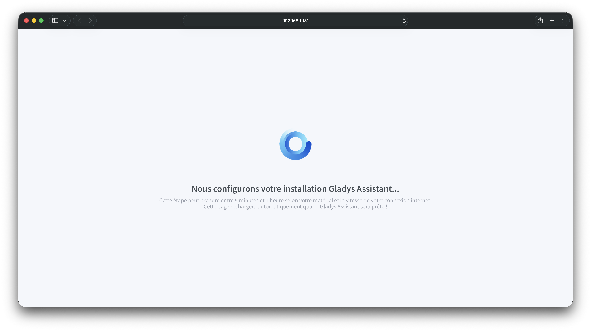

Si vous possédez déjà un Raspberry Pi, vous pouvez installer Gladys Assistant en quelques minutes grâce à notre nouvelle image officielle **64 bits**, compatible avec les **Raspberry Pi 3, 4 et 5**.

C'est le moyen le plus simple de découvrir Gladys, sans avoir à installer Raspberry Pi OS puis Docker vous-même.

:::info
**Pour une installation long terme**, je recommande plutôt un mini-PC (meilleur rapport performance/prix, SSD NVMe intégré, plus fiable avec les dongles Zigbee/Z-Wave). Si vous êtes en Europe, vous pouvez aussi opter pour notre [kit de démarrage](/fr/starter-kit/) avec Gladys pré-installé.

Mais si vous avez déjà un Raspberry Pi sous la main, profitez-en pour tester Gladys. C'est exactement pour ça que nous avons simplifié cette installation !
:::

## Matériel nécessaire

- Un **Raspberry Pi 3, 4 ou 5** (modèle 64 bits)
- Un **SSD USB** de préférence (adaptateur USB 3.0 + SSD SATA ou NVMe). Une carte micro-SD de 16 Go minimum fonctionne aussi pour tester.
- Une **alimentation officielle** adaptée à votre modèle (5V / 3A pour un Pi 4, 5V / 5A pour un Pi 5)
- Un **câble Ethernet** ou une connexion Wi-Fi
- Un ordinateur (Windows, macOS ou Linux) pour flasher l'image

## Étape 1 : Télécharger Raspberry Pi Imager

Téléchargez et installez [Raspberry Pi Imager](https://www.raspberrypi.com/software/) sur votre ordinateur. C'est l'outil officiel pour flasher des images sur carte SD ou SSD.

## Étape 2 : Sélectionner votre Raspberry Pi

Ouvrez Raspberry Pi Imager et cliquez sur **Choisir l'appareil** (ou **SUIVANT** si vous êtes dans le nouvel assistant pas-à-pas).

Sélectionnez votre modèle de Raspberry Pi dans la liste :

## Étape 3 : Choisir l'image Gladys Assistant

Cliquez sur **Choisir le système d'exploitation**, puis naviguez dans les catégories suivantes :

1. **Other specific-purpose OS** (Autres OS spécialisés)
2. **Home automation** (Domotique)
3. **Gladys Assistant**

Sélectionnez ensuite l'image **Gladys Assistant (64-bit, for Rpi 3, 4 & 5)** :

:::tip
L'image fait environ 900 Mo à télécharger. Raspberry Pi Imager se charge de tout : téléchargement, vérification et écriture sur votre support de stockage.
:::

## Étape 4 : Choisir le support de stockage

Insérez votre carte micro-SD ou branchez votre SSD USB, puis cliquez sur **Choisir le stockage** et sélectionnez le périphérique correspondant.

:::warning
Vérifiez bien que vous sélectionnez le bon périphérique : **toutes les données présentes sur ce support seront effacées**.
:::

## Étape 5 : Personnaliser l'installation (recommandé)

Avant d'écrire l'image, configurez les paramètres de votre Raspberry Pi. Cela vous évitera d'avoir à brancher un écran et un clavier au premier démarrage.

### Nom d'hôte

Choisissez un nom pour votre Raspberry Pi sur le réseau. Par exemple `gladys`, vous pourrez ensuite y accéder via `http://gladys.local` :

### Localisation

Sélectionnez votre ville, fuseau horaire et type de clavier :

### Compte utilisateur

Créez un nom d'utilisateur et un mot de passe. Ce compte servira pour la connexion SSH et l'accès au système :

### Wi-Fi (optionnel)

Si vous n'utilisez pas de câble Ethernet, renseignez le nom et le mot de passe de votre réseau Wi-Fi :

### Accès SSH (recommandé)

Activez SSH pour pouvoir vous connecter à distance à votre Raspberry Pi. L'authentification par mot de passe est la plus simple pour démarrer :

## Étape 6 : Écrire l'image

Vérifiez le résumé de votre configuration, puis cliquez sur **ÉCRIRE** :

L'écriture peut prendre plusieurs minutes selon la vitesse de votre support de stockage. Une fois terminée, Raspberry Pi Imager éjecte automatiquement le périphérique :

## Étape 7 : Premier démarrage

1. Insérez la carte micro-SD (ou branchez le SSD USB) dans votre Raspberry Pi
2. Branchez l'alimentation
3. Attendez environ 2 minutes que le Raspberry Pi démarre

## Étape 8 : Accéder à Gladys Assistant

Ouvrez votre navigateur et rendez-vous à l'une de ces adresses :

- `http://gladys.local` (si vous avez configuré le nom d'hôte `gladys`)
- `http://VOTRE_IP_LOCALE` (par exemple `http://192.168.1.131`)

Au premier démarrage, Gladys effectue sa configuration initiale. Cette étape peut prendre **entre 5 minutes et 1 heure** selon votre matériel et votre connexion internet :

La page se rechargera automatiquement quand Gladys sera prête. Vous pourrez alors créer votre compte et commencer à configurer votre maison connectée !

## Et ensuite ?

- Consultez le guide [Matériel recommandé](/fr/docs/installation/recommended-hardware/) pour choisir vos appareils connectés
- Découvrez comment [installer des intégrations](/fr/docs/integrations/) (Zigbee, Z-Wave, etc.)
- Si vous souhaitez passer à une installation plus performante, consultez le guide [Installation sur mini-PC](/fr/docs/installation/mini-pc/)
