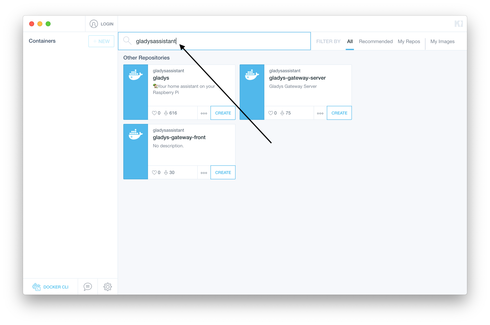
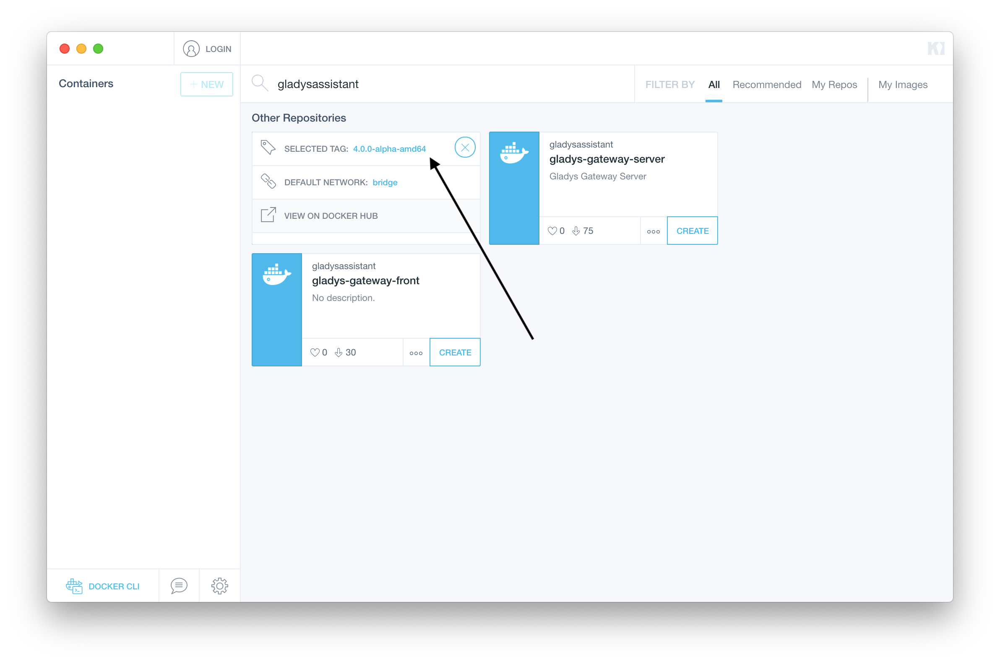
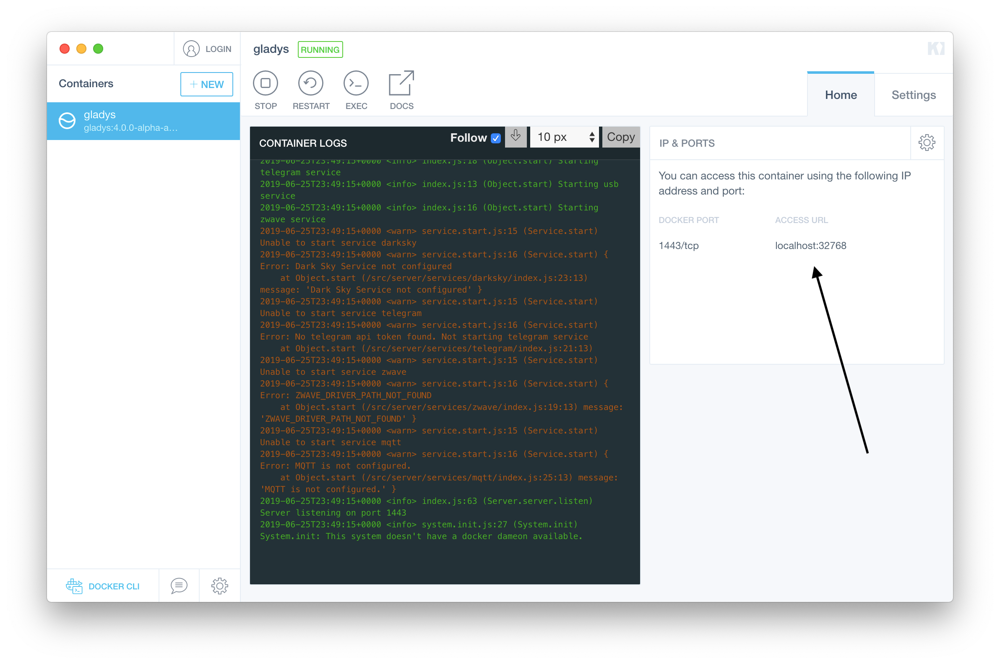
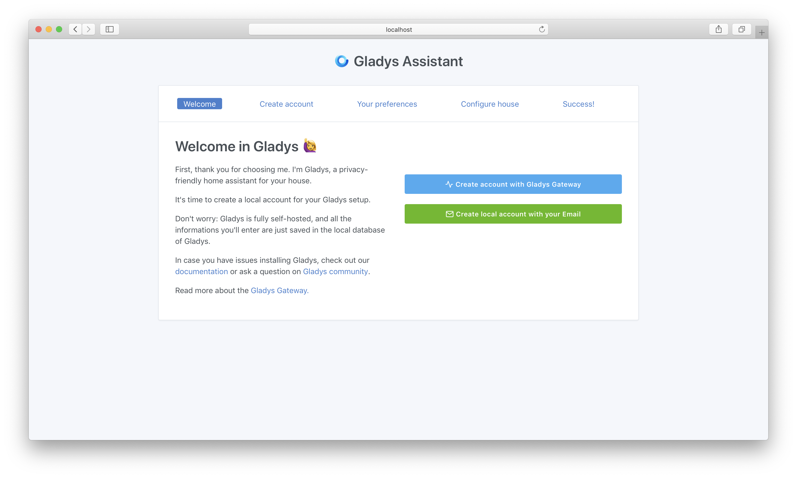

Le process est presque le même que pour Raspberry Pi.

### Installer Docker Desktop

Vous devez d'abord installer [Docker Desktop](https://www.docker.com/products/docker-desktop).

Suivez les instructions sur leur site.

Docker Desktop devrait normalement installer Kitematic. Si ce n'est pas le cas, rendez-vous sur le site de [Kitematic](https://kitematic.com/).

### Lancer Gladys

Vous devez lancer Kitematic.

Puis, dans l'interface, cherchez "gladysassistant":

Sélectionnez le tag "v4-amd64":

Cliquez sur "Create" pour lancer un nouveau container:

Puis lancez dans votre navigateur l'URL indiquée par Kitematic (ici, "http://localhost:32768")

Hop, vous avez accès à Gladys!
