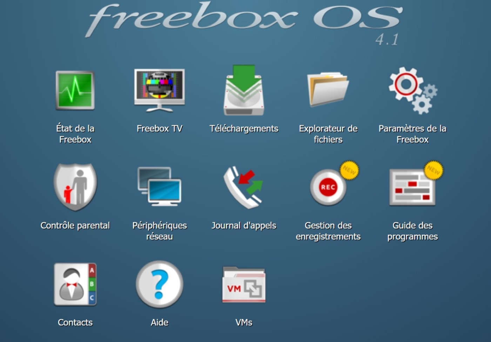

## Sur Freebox Delta

Ce tutoriel vous explique comment installer Gladys avec Docker sur une Freebox Delta.

### Créer une machine virtuelle sur la Freebox Delta

Tout d'abord il faut se rendre sur l'interface Freebox à l'adresse suivante : mafreebox.free.fr.



Cliquez sur "VMs". Cette fenêtre apparait :


Choisissez un nom pour la VM, par exemple Gladys.

Sélectionnez l'option "Choisir un système d'exploitation pré-installé parmi une liste".

Cliquez sur "Suivant".


Sélectionnez le système à installer, par exemple Debian ou Ubuntu.
(Préférez Debian à Ubuntu pour une meilleure reconnaissance des ports USB de la Freebox)

Renseignez une clé SSH publique ou un mot de passe.

Choisissez un nom d'utilisateur, par exemple `gladys`.

Cliquez sur "Suivant".


Cliquez sur "Terminer".

La VM est prête, cliquez sur "Allumer" pour démarrer la VM.


Accédez à votre VM en SSH et mettez à jour le système.

```bash
sudo apt update
sudo apt upgrade
```

### Installer Docker sur la VM

```bash
sudo apt install docker.io
sudo systemctl enable --now docker
sudo usermod -aG docker gladys
```

Ensuite, fermez votre session SSH puis reconnectez-vous à votre VM.

### Lancer Gladys

Pour lancer Gladys, exécutez la commande suivante sur votre VM:

```bash
docker run -d \
--log-driver json-file \
--log-opt max-size=10m \
--cgroupns=host \
--restart=always \
--privileged \
--network=host \
--name gladys \
-e NODE_ENV=production \
-e SERVER_PORT=80 \
-e TZ=Europe/Paris \
-e SQLITE_FILE_PATH=/var/lib/gladysassistant/gladys-production.db \
-v /var/run/docker.sock:/var/run/docker.sock \
-v /var/lib/gladysassistant:/var/lib/gladysassistant \
-v /dev:/dev \
-v /run/udev:/run/udev:ro \
gladysassistant/gladys:v4
```

## Mise à jour automatique avec Watchtower

Vous pouvez utiliser Watchtower pour mettre automatiquement Gladys à jour quand une nouvelle version est disponible. Pour cela, lancez le container:

```bash
docker run -d \
  --name watchtower \
  --restart=always \
  -v /var/run/docker.sock:/var/run/docker.sock \
  containrrr/watchtower \
  --cleanup --include-restarting
```

### Accéder à Gladys

Vous pouvez accéder à Gladys en tapant l'IP de votre VM sur votre navigateur.


