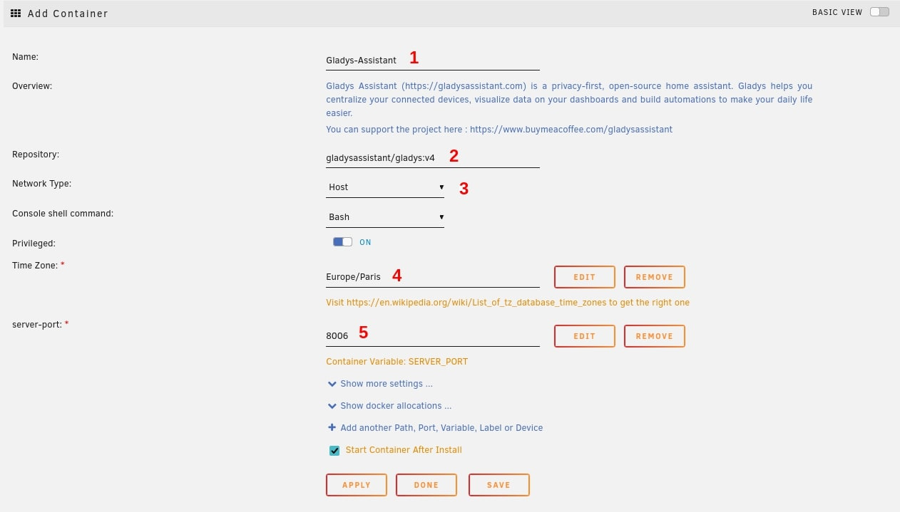

Dans ce tutoriel, nous verrons les instructions pour installer Gladys Assistant sur Unraid à l'aide de Docker

## Trouver Gladys-Assistant

Tout d'abord, vous devez trouvez l'application au sein de l'App Manager.
Pour ce faire :
1) Depuis votre plateforme d'administration d'Unraid, cliquez sur 'Apps'
2) Cherchez Gladys-Assistant
3) Cliquez sur install 

## Configuration de Gladys

Après avoir cliquez sur installer, vous serez redirigé vers la page de configuration de Gladys.

Voici les différents paramètres qui vous seront proposez : 

1) Le nom de l'application, si vous n'avez pas d'autres instance vous pouvez laisser par défaut Gladys-Assistant
2) Le repo du docker hub, n'y touchez pas sauf si vous êtes expérimenté. (Possibilité d'installer une image de test en changeant le tag)
3) Le Network Type doit absolument rester sur **HOST**. Cela permettra à Gladys de scanner le réseau pour trouver de nouveaux objets connectés
4) Le fuseau horaire, faites bien attention à suivre cette [nomenclature](https://en.wikipedia.org/wiki/List_of_tz_database_time_zones)
5) Le port sur lequel vous aurez accès à l'interface de Gladys

Attention : Si vous prévoyez d'utiliser des appareils MQTT, les ports 1883 et 1884 doivent être libre. De même si vous souhaitez utiliser des appareils Zigbee, vous aurez en plus besoin du port 8080 de disponible.

Attention : si vous changez le port par défaut 8006, le bouton qui redirige vers l'interface Gladys pourrait ne pas fonctionner, pour changer cela cliquez sur advanced view, trouvez le paramètre web UI, et changez le numéro avec le port, puis appliquez les changements.

Cliquez sur apply et attendez que l'installation se finissent.

## Accès à Gladys

Gladys sera accessible depuis un navigateur internet à l'adresse : `http://YOUR_NAS_IP:PORT`

Par exemple : `http://192.168.1.2:8006`

Vous pouvez aussi acceder à l'interface en cliquant sur docker, puis sur le logo de gladys et enfin Web UI.

## Mettre à jour Gladys

Actuellement Watchtower n'est pas disponible sur Unraid (cela pourrait changer prochainement).

Ainsi pour mettre à jour votre instance : 
0) Cliquez sur Docker
1) Puis sur Advanced view
2) Et enfin sur force update

Vous pouvez voir la version de votre instance depuis l'interface Gladys en cliquant sur votre profil en haut à droite puis sur paramètres et système.

## Paramètres avancés

En configurant Gladys, vous avez peut être vu qu'il y a des paramètres avancés.
Les voici en détails : 
- Gladys lib folder : dossier dans lequel les fichiers permanents de l'installation seront stockés.
- Gladys Dev Folder : dossier d'accès aux appareils branchés aux NAS
- Gladys uDev Folder : Udev est le device manager du noyaux Linux 
- DB File path : Chemin d'accès à la base de données SQLite (A l'intérieur du docker)
- Environement : production ou developement (Affichage des debugs)
- Gladys Docker Folder : chemin d'accès à la commande Docker pour créer et manager des dockers depuis l'intérieur de Gladys
