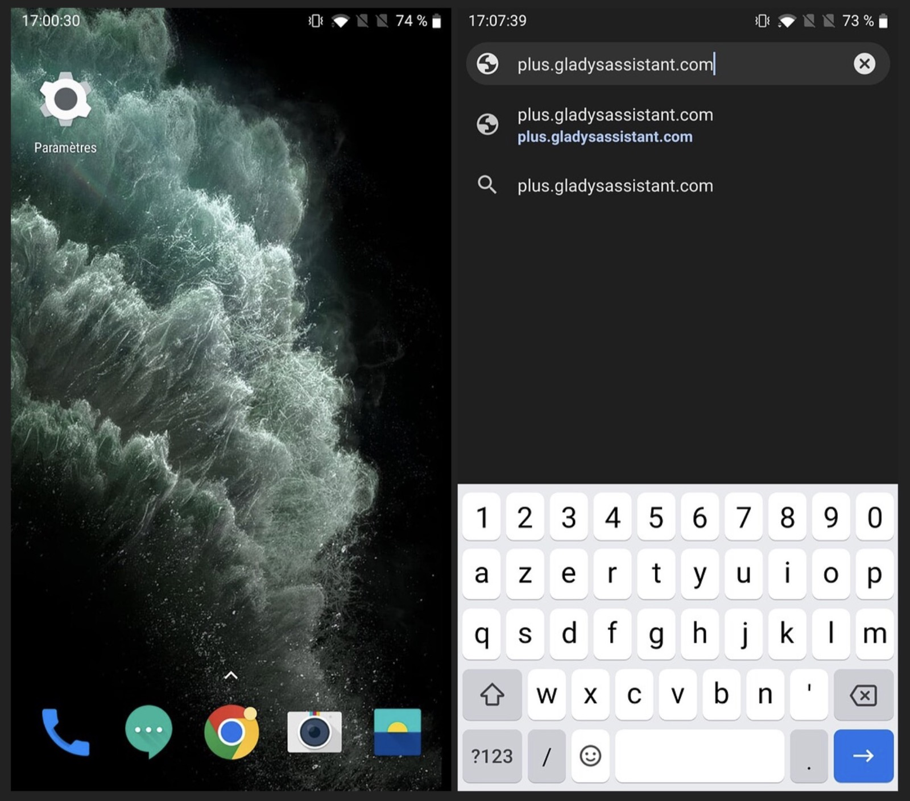
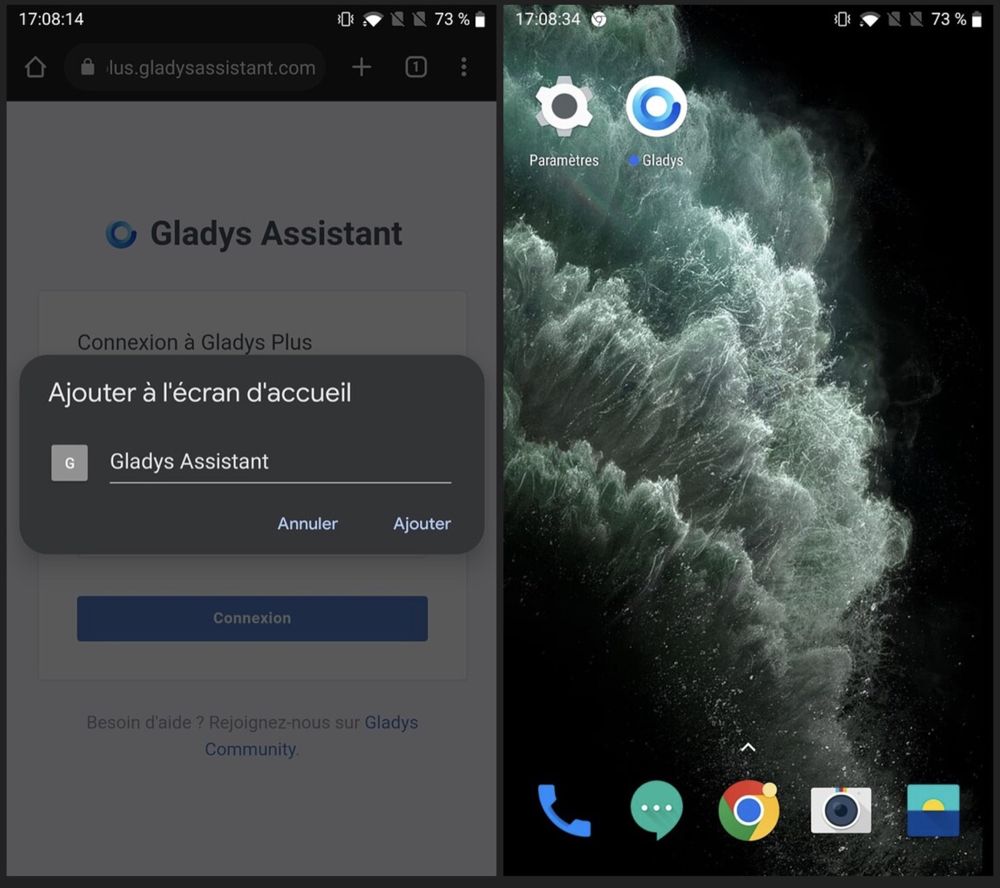
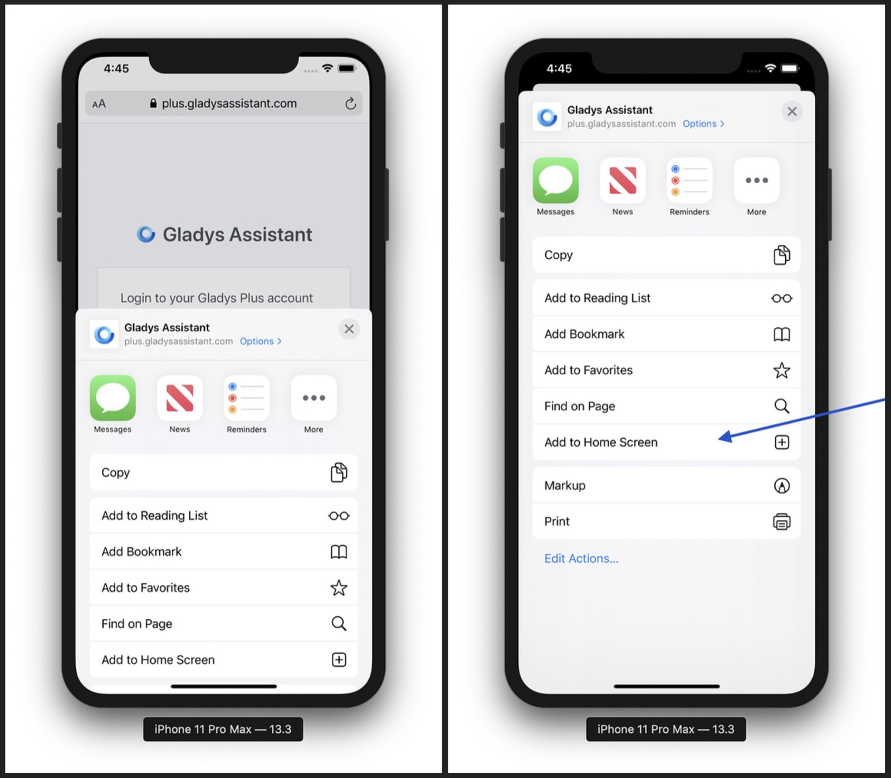
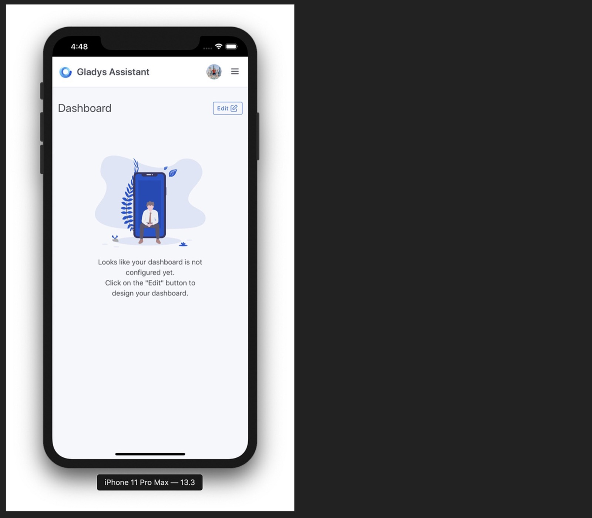

Gladys Assistant est une PWA ([Progressive Web App](https://fr.wikipedia.org/wiki/Progressive_web_app)), c'est une application web qui peut s'installer sur n'importe quel appareil : iOS, Android, Windows, Mac, etc...

Comme Gladys n'est disponible par défaut que sur votre réseau local, par défaut si vous installez Gladys sur votre téléphone, vous n'aurez accès à Gladys que depuis chez vous.

Pour palier à ça, nous proposons [Gladys Plus](/fr/plus), un service qui proxy le traffic de [plus.gladysassistant.com](https://plus.gladysassistant.com/) à votre instance locale Gladys, tout ça en chiffré de bout en bout pour respecter votre vie privée, et sans configuration !

Si vous voulez utiliser Gladys uniquement en local, ou via votre propre domaine, suivez ce tutoriel de la même façon, en remplaçant l'URL de Gladys Plus par l'URL de votre instance Gladys.

## Sur Android

Il est très simple d'installer Gladys sur un téléphone ou une tablette Android

Ouvrez [plus.gladysassistant.com](https://plus.gladysassistant.com/) sur Chrome.

Vous devriez voir un bouton "Ajouter Gladys à l'écran d'accueil".

Si ce n'est pas le cas, cliquez sur les 3 petits points en haut à droite, et cliquez sur "Ajouter à l'écran d'accueil" :

Donnez un nom à l'application, et c'est bon !

Vous avez maintenant une application qui est en tout point semblable à une application native.

## Sur iOS

Il est très simple d'installer Gladys sur un appareil iOS (Autant un iPhone qu'un iPad).

Ouvrez [plus.gladysassistant.com](https://plus.gladysassistant.com/) dans Safari, and cliquez sur le bouton "Partager" en bas de l'écran :

Cliquez sur "Ajouter à l'écran d'accueil" :

Donnez un nom à l'application, et "Ajouter" :

C'est bon, vous avez installé Gladys sur votre téléphone !

