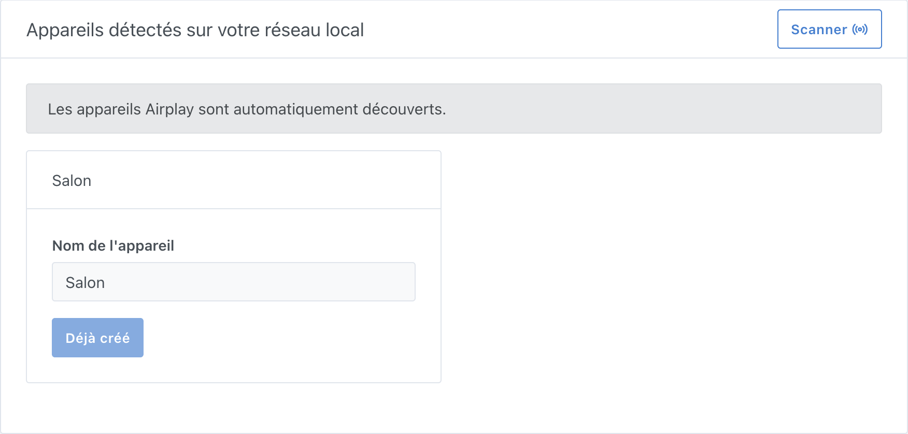
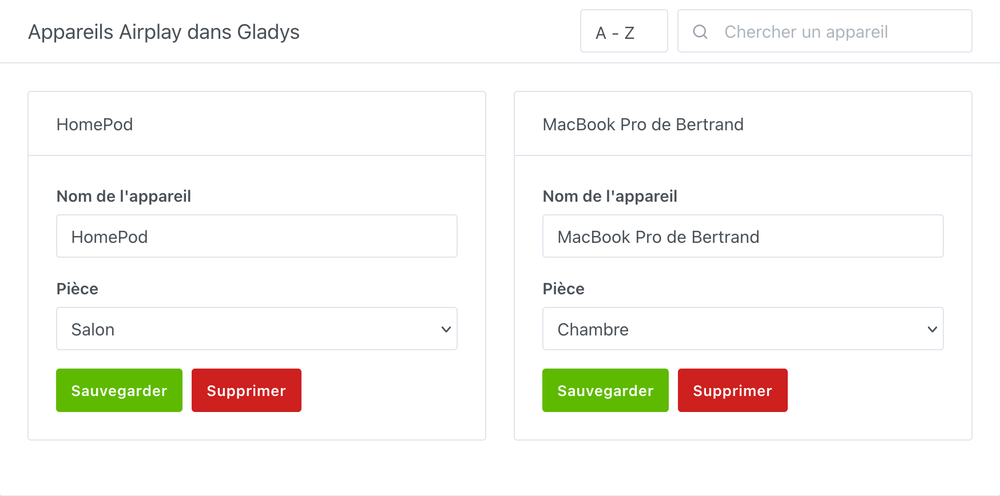
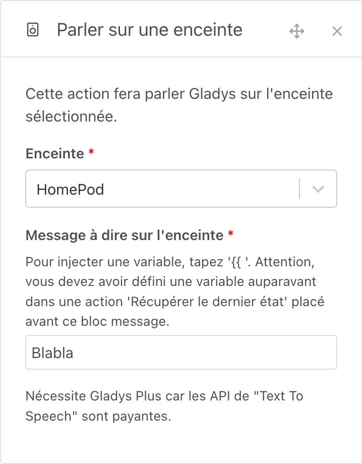

## Prérequis

Vérifiez que votre enceinte est accessible depuis l'ensemble des appareils du même réseau.

Pour un HomePod, rendez vous dans l'application Maison, `Règlages du domicile` puis choisissez `Haut-parleurs et téléviseurs` -> puis sélectionnez `Tout utilisateur sur le même réseau` et désactivez le mot de passe.

## Ajouter une enceinte dans Gladys

1. allez sur la page `Intégration -> Airplay` dans Gladys
2. sélectionnez le menu `Découverte Airplay`

   

3. cliquez sur le bouton `Scanner` en haut à droite (si le périphérique n'est pas déjà dans la liste)
4. enfin, cliquez sur `Sauvegarder` pour les enceintes que vous voulez intégrer à Gladys
5. et voilà !

## Renommer / placer une enceinte dans une pièce

Si nécessaire, vous pouvez vous rendre dans le menu `Appareils` pour modifier / compléter la configuration de vos enceintes en les ajoutant dans une pièce ou en les renommant.

## Faire parler Gladys

Dans les scènes, vous pouvez maintenant faire parler Gladys via votre appareil Airplay.

