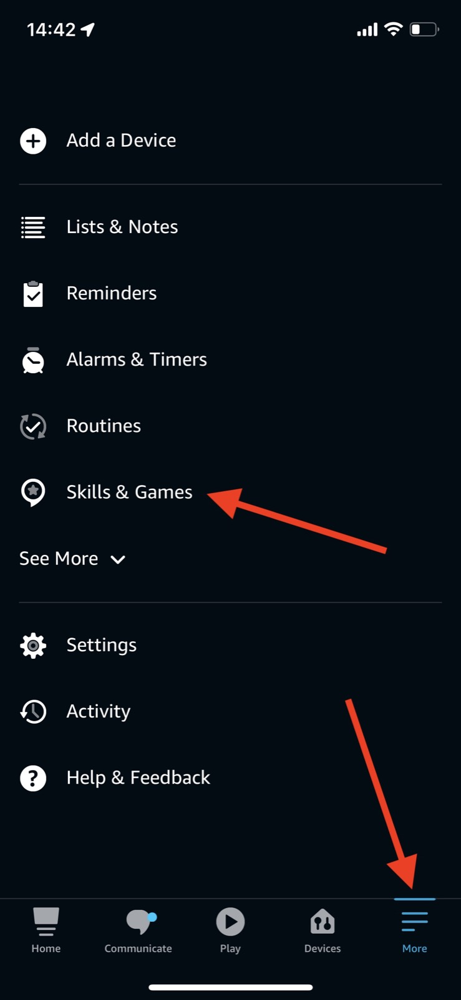
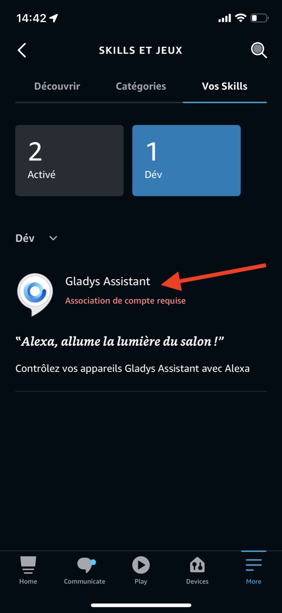
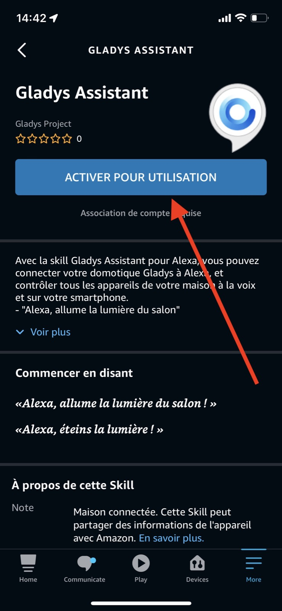
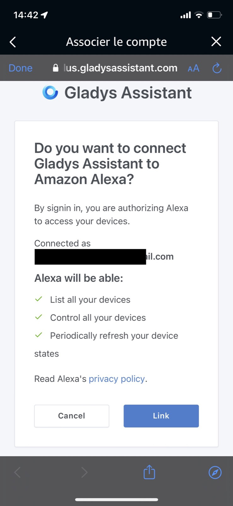
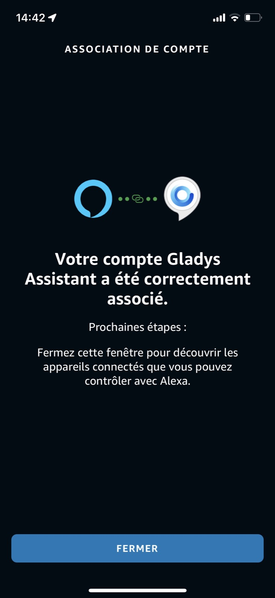
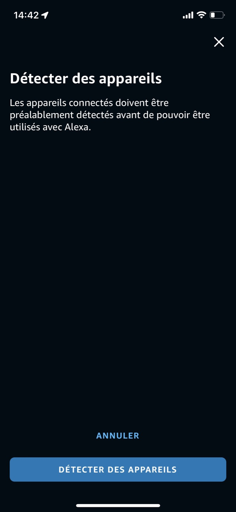

Ce tutoriel vous expliquera comment configurer **l'intégration Alexa** en quelques minutes sur votre instance **Gladys**.

## Un petit mot avant de commencer

**L'intégration Alexa** est une intégration particulière.

Alexa étant un produit 100% Cloud, Amazon demande à ce que ses partenaires soient eux aussi hébergés dans le Cloud.

Ainsi, contrairement aux autres intégrations qui peuvent fonctionner entièrement localement, Alexa par nature ne peut fonctionner qu'en passant par une intégration approuvée par Amazon, et hébergée dans le cloud.

Afin de permettre à la communauté Gladys d'utiliser Alexa avec Gladys, nous avons développé notre propre intégration **Alexa**, via [Gladys Plus](https://gladysassistant.com/fr/plus/), notre passerelle web.

Être partenaire Alexa n'était pas une tâche facile, il nous a fallu :

- Passer une certification pour être partenaire Alexa
- Valider des tests automatisés
- Passer une revue manuelle avec un employé de chez Amazon

Tout ce process, la maintenance et les coûts d'infrastructure demandée par cette intégration justifient la participation que nous demandons pour faire fonctionner cette intégration, et j'espère que vous comprendrez.

## Créer un compte Gladys Plus
Tu peux créer un compte sur cette page de [Gladys Plus](https://gladysassistant.com/fr/plus/).

N'hésite pas à nous faire des retours sur le forum !

## Configurer Gladys Plus

Tu vas normalement recevoir un email qui t'expliquera comment configurer **Gladys Plus**.

Tu peux suivre les étapes dans le mail.

Si tu veux, j'ai aussi fait un live où je montre comment configurer **Gladys Plus**:

<iframe  src="https://www.youtube.com/embed/TmjrBeufjyo" title="YouTube video player" frameborder="0" allow="accelerometer; autoplay; clipboard-write; encrypted-media; gyroscope; picture-in-picture" allowfullscreen></iframe>

## Configurer Alexa

Allez à "Skills & Games" :

Cliquez sur l'intégration "Gladys Assistant" :

Activez l'intégration

Vous devez ensuite vous connecter avec votre compte Gladys Plus.

Succès !

Alexa va maintenant scanner votre instance Gladys pour trouver des appareils compatibles.

## Appareils compatibles

Pour l'instant, seuls les appareils suivants sont supportés par l'intégration :

- Lampes (On/Off, Couleur et luminosité)
- Prises (On/Off)

Sur demande, nous ajouterons d'autres appareils suivant les besoins de la communauté.

Je vous invite à poster un message sur [le forum](https://community.gladysassistant.com/), si jamais vous avez besoin d’aide.
