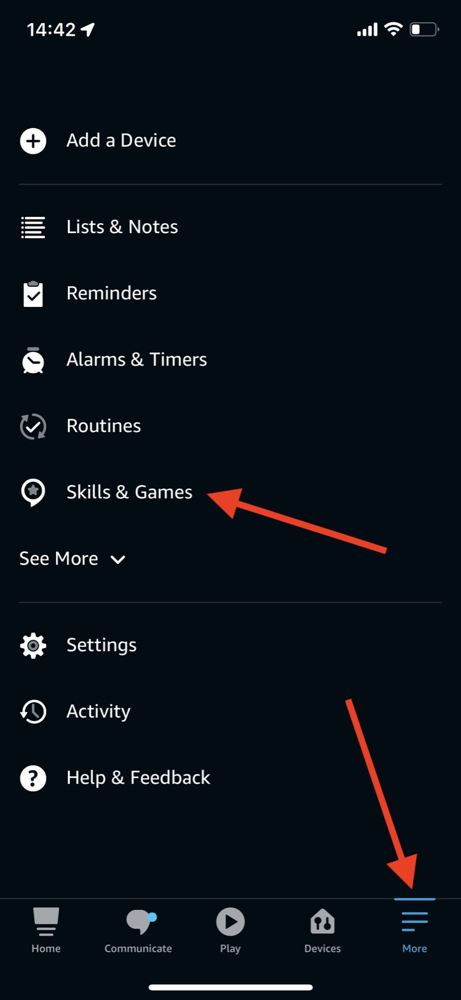
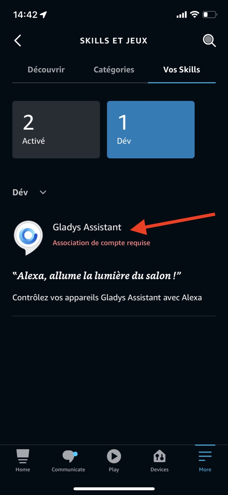
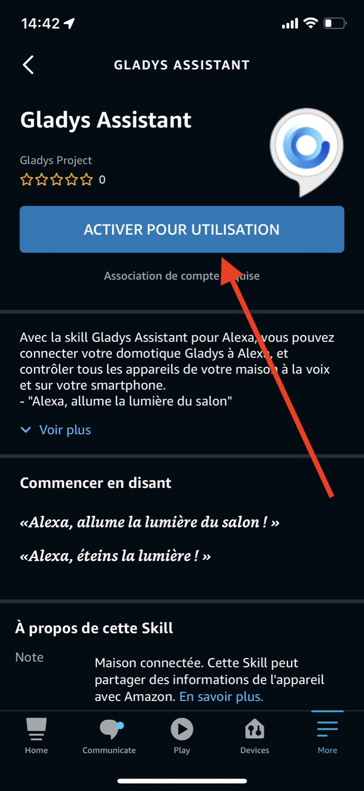
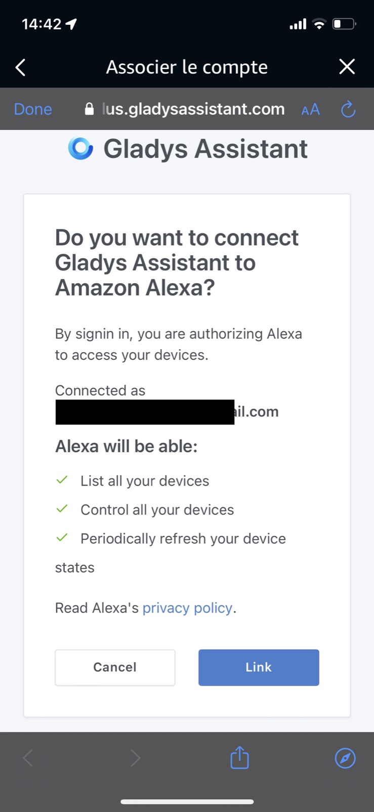
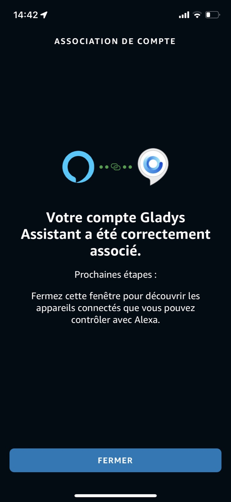
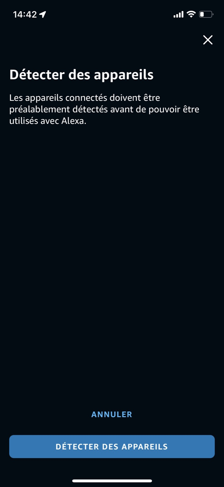

## Introduction

L'intégration d'Alexa avec Gladys Assistant est désormais disponible ! 🎉

Ce guide vous expliquera comment la configurer en quelques minutes sur votre instance Gladys.

## Avant de commencer

L'intégration Alexa est un cas particulier.

Étant un service 100 % cloud, Amazon exige que ses partenaires soient également hébergés dans le cloud. Contrairement aux autres intégrations qui peuvent fonctionner entièrement en local, Alexa nécessite une intégration approuvée par Amazon et hébergée sur Internet.

Pour permettre à la communauté d'utiliser Alexa avec Gladys, nous avons développé une intégration spécifique via [Gladys Plus](/fr/plus), notre passerelle web sécurisée.

Devenir partenaire Alexa n'a pas été une tâche facile. Nous avons dû :

- Obtenir une certification officielle d'Amazon
- Réussir des tests automatisés
- Passer une revue manuelle avec un employé d'Amazon

Ce processus, ainsi que la maintenance et les coûts d'infrastructure associés, expliquent la nécessité d'un abonnement pour utiliser cette intégration. Nous espérons que vous comprendrez. 😊

## Création d'un compte Gladys Plus

Vous pouvez créer un compte sur [Gladys Plus](/fr/plus).

Vos retours sont toujours les bienvenus, que ce soit par email ou sur le [forum](https://community.gladysassistant.com/) !

## Configuration de Gladys Plus

Après votre inscription, vous recevrez un email avec les instructions de configuration.

Vous pouvez suivre ces étapes ou consulter notre tutoriel vidéo :

<iframe src="https://www.youtube.com/embed/TmjrBeufjyo" title="YouTube video player" frameborder="0" allow="accelerometer; autoplay; clipboard-write; encrypted-media; gyroscope; picture-in-picture" allowfullscreen></iframe>

## Configuration d'Alexa

1. Ouvrez l'application Alexa et accédez à "Skills & Games".

   

2. Recherchez "Gladys Assistant" et sélectionnez l'intégration.

   

3. Activez l'intégration.

   

4. Connectez-vous avec votre compte Gladys Plus.

   

5. Une fois connecté, l'intégration est activée avec succès ! 🎉

   

6. Alexa va maintenant scanner votre instance Gladys pour détecter les appareils compatibles.

   

   

## Appareils compatibles

Actuellement, les appareils suivants sont pris en charge :

- **Lampes** : On/Off, couleur et luminosité
- **Prises** : On/Off

Nous ajouterons d'autres types d'appareils en fonction des besoins de la communauté. N'hésitez pas à en faire la demande sur [le forum](https://community.gladysassistant.com/) ou à nous contacter par email !
