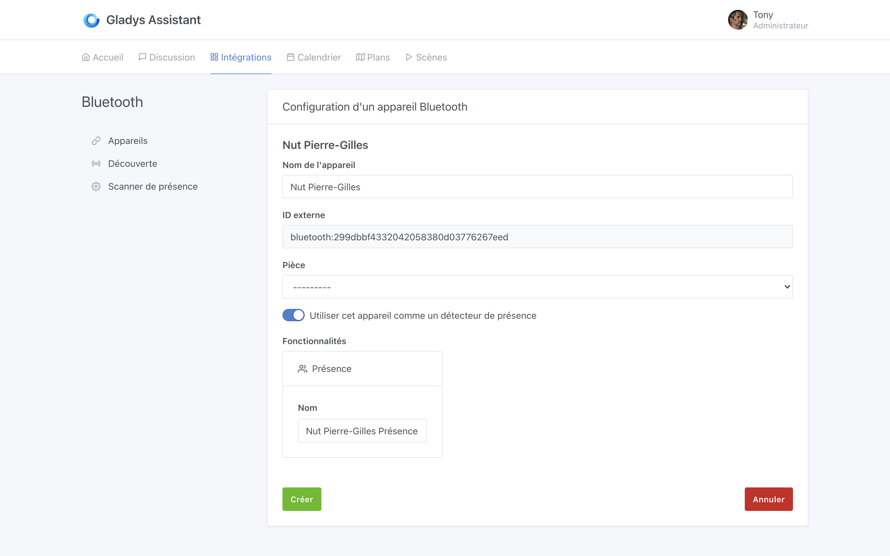
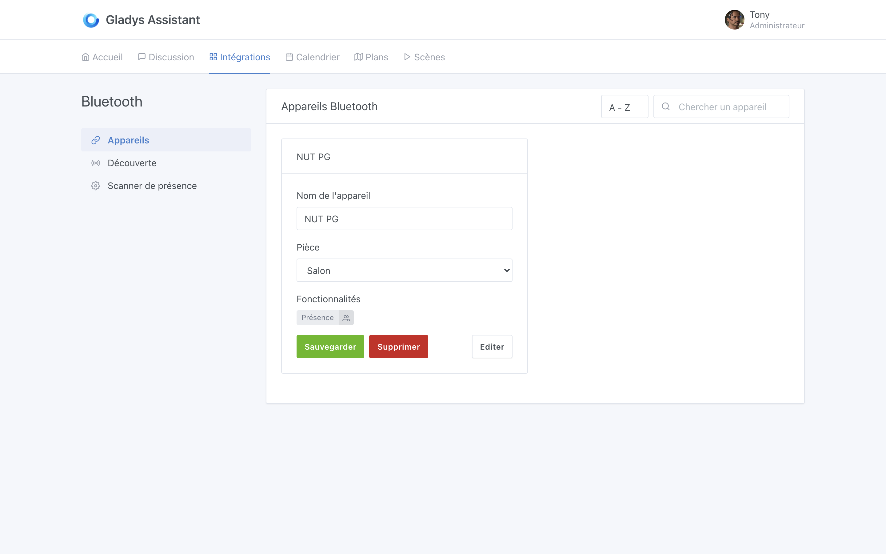
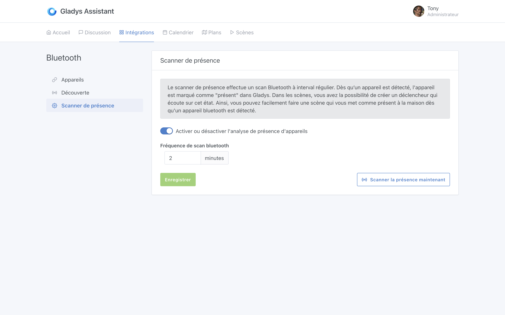
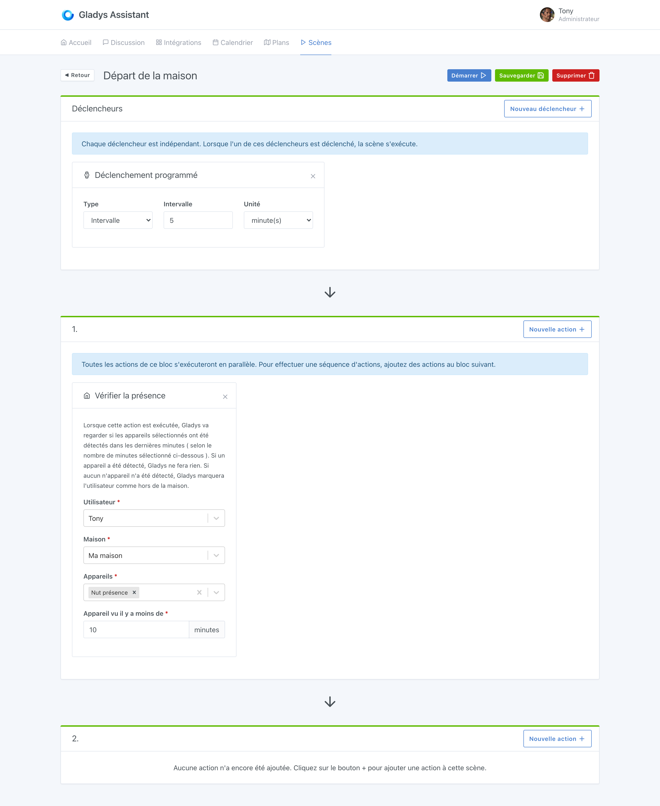
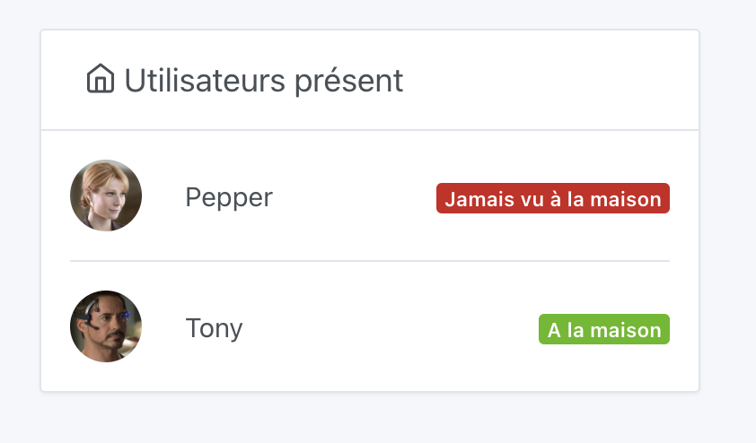

# Gérer la présence avec la détection Bluetooth.

**L'intégration Bluetooth** est utile pour la gestion de la présence.

Il existe des portes-clés Bluetooth comme le [porte clé NUT](https://www.amazon.fr/NUT-%C3%89crou-Mini-Bluetooth-Tracker/dp/B01M664D98/ref=sr_1_1?tag=gladproj-21) qui signalent leur présence en Bluetooth en permanence.

Avec ce genre de porte-clé, **Gladys** peut détecter quand vous êtes/n'êtes pas à la maison en scannant tout simplement les appareils bluetooth à proximité.

**Note :** Cette astuce ne fonctionne pas avec tous les appareils Bluetooh. Cela fonctionne uniquement avec les appareils bluetooth qui émettent en permanence, et qui ne font pas des techniques d'obfuscation de leur adresse bluetooth, comme le font la plupart des téléphone par exemple. De manière générale, plus l'appareil est "bête", plus cela marches mieux ! J'avais par exemple un bracelet Fitbit Force 2, et cela fonctionnait. En revanche, ça ne fonctionne pas avec une Apple Watch.

## Configurer votre appareil Bluetooth

Rendez-vous dans ****`Intégration **-**> Bluetooth`, onglet `Découverte`. Scannez les appareils Bluetooth environnant, et cherchez l'appareil que vous voulez ajouter.

Cliquez sur `Connecter à Gladys`:

Puis activez bien l'option `Utiliser cet appareil comme un détecteur de présence`.

Donnez un nom unique à cet appareil, et ajoutez le à Gladys.

Vous devriez arriver sur cet écran:

Maintenant, rendez-vous dans l'écran `Scanner de présence`, et vérifiez que votre configuration ressemble bien à ça:

C'est bon, tout est configuré côté Bluetooth !

## Gérer la présence dans les scènes

### Une scène "retour à la maison"

Maintenant, nous allons créer une scène qui va vous marquer comme "présent à la maison" quand ce porte clé Nut est détecté.

Rendez-vous dans l'onglet `Scènes`, et créez une scène comme celle-ci:

La scène est très simple.

QUAND "le porte clé est détecté" ALORS "mettre l'utilisateur Tony comme présent à la maison".

### Une scène "départ de la maison"

Pour gérer le départ de la maison, je vous recommande de faire une scène exécutée périodiquement qui va vérifier si votre porte clé NUT a été détecté récemment à la maison, ou pas.

Si oui, Gladys ne fera rien. Si non, Gladys marquera l'utilisateur comme absent.

La scène doit ressembler à ça :

Vous pouvez jouer avec les réglages en fonction de votre maison. Si vous estimez que 10 minutes c'est trop court pour être mis comme absent, vous pouvez rallonger à 20 minutes pour éviter les "faux-départs" :)

## Afficher la présence sur le tableau de bord[]

Vous pouvez maintenant rajouter un **widget Utilisateurs présents** sur votre tableau de bord pour afficher la présence des différents utilisateurs à la maison.

Rendez-vous sur le dashboard de Gladys et cliquez sur le bouton `éditer` pour modifier le dashboard.

Cliquez sur `ajouter +` puis sélectionnez le widget `Utilisateurs présents`, vous pouvez déplacer ce widget dans une colonne.

Sélectionnez le ou les utilisateur(s) que vous voulez afficher, et cliquez sur `Enregistrer`  

Voilà ! Votre widget est visible sur le dashboard.

Je vous invite à poster un message sur [le forum](https://community.gladysassistant.com/), si jamais vous avez besoin d’aide.
