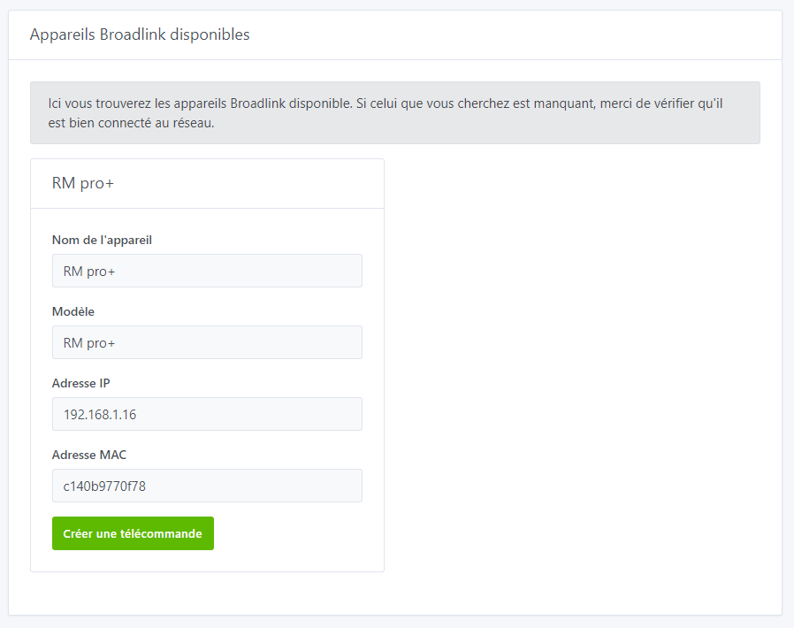
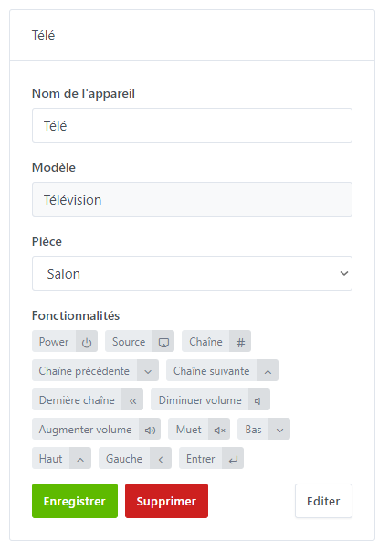
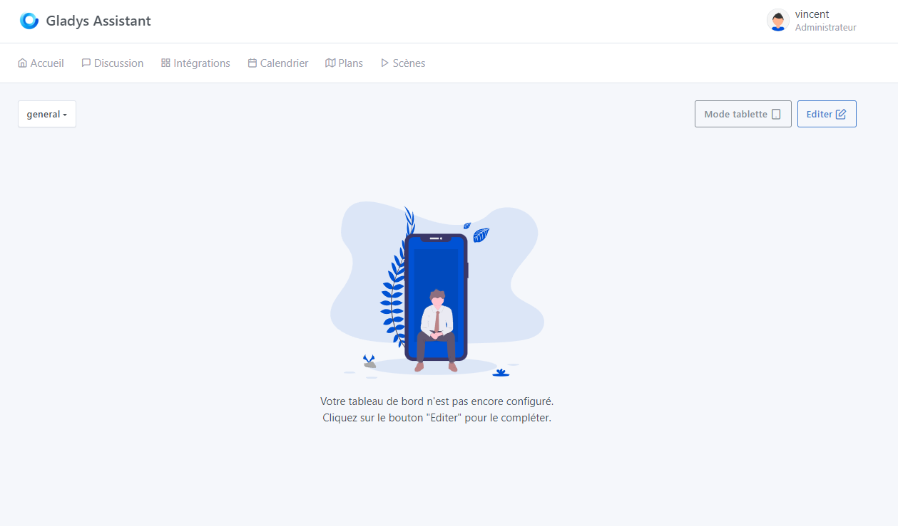
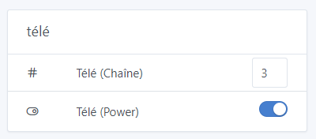

# Pilotez vos télévisions et climatiseurs avec un émetteur infrarouge BroadlLink

**Gladys** permet de gérer les appareils **Broadlink** et de créer des télécommandes permettant de piloter vos appareils par infrarouge.

## Connectez l'appareil sur votre réseau

Afin d'être visible par Gladys, l'appareil **Broadlink** doit être connecté au même réseau WiFi que Gladys. Pour cela, il suffit de suivre la procédure d'installation officielle du matériel Broadlink.

## Ajouter un appareil dans Gladys

Depuis Gladys, allez dans `Intégrations -> Broadlink`, puis cliquez sur `Appareils disponibles` pour trouver les appareils détectés sur votre réseau.

Il suffit alors de cliquer sur `Enregistrer` pour ajouter un appareil.

## Créer une télécommande dans Gladys

Il est possible de remplacer vos télécommandes par Gladys. Rendez-vous dans le menu `Appareils -> Créer +`, saisissez un nom, choisissez une pièce, votre contrôleur Broadlink et le type d'appareil, puis laissez vous guider par le mode d'apprentissage.

Exemple pour une télécommande de Télévision :

Après l’appairage cliquer sur `Enregistrer`.

Vous n'aurez plus besoin de vos télécommandes.

Votre télécommande est maintenant enregistrer dans les `appareils`.

## Dépannage

### Appareil verrouillé

Depuis l'application mobile Broadlink, il vous faut décocher l'option dans les paramètres.

### Gestion RF

Actuellement, seuls les signaux infra-rouges sont pris en compte.

## Contrôler votre télécommande sur le tableau de bord

Vous pouvez maintenant rajouter un **widget appareils** sur votre tableau de bord et contrôler votre télécommande.

Rendez-vous sur le dashboard de Gladys et cliquez sur le bouton `éditer` pour modifier le dashboard

Cliquez sur `ajouter +` puis sélectionnez le widget `appareils` vous pouvez le déplacer dans une colonne.

Sélectionnez la ou les fonctionnalités que vous souhaitez rajouter, et cliquez sur `Enregistrer`

  

Voilà ! Votre widget est visible sur le dashboard.

Je vous invite à poster un message sur [le forum](https://community.gladysassistant.com/), si jamais vous avez besoin d’aide.