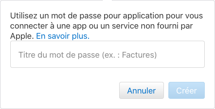
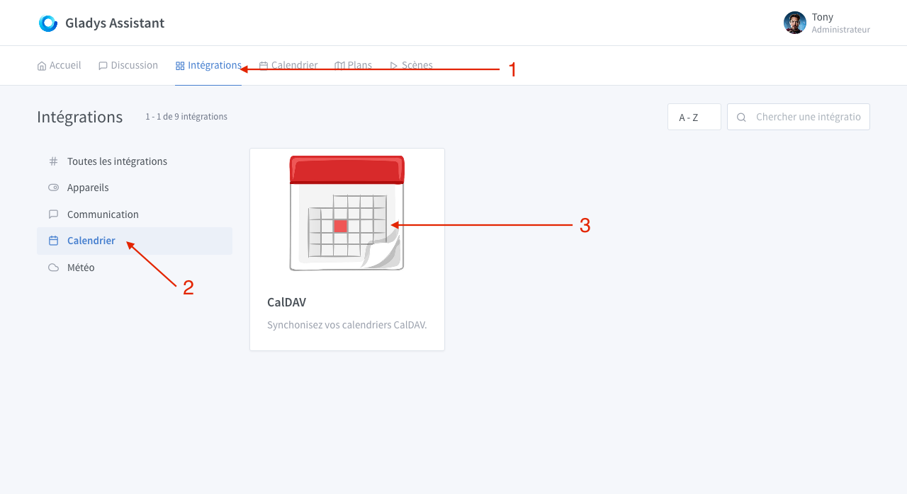
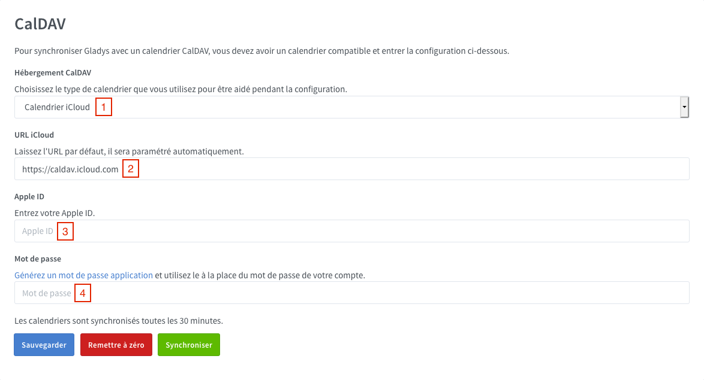
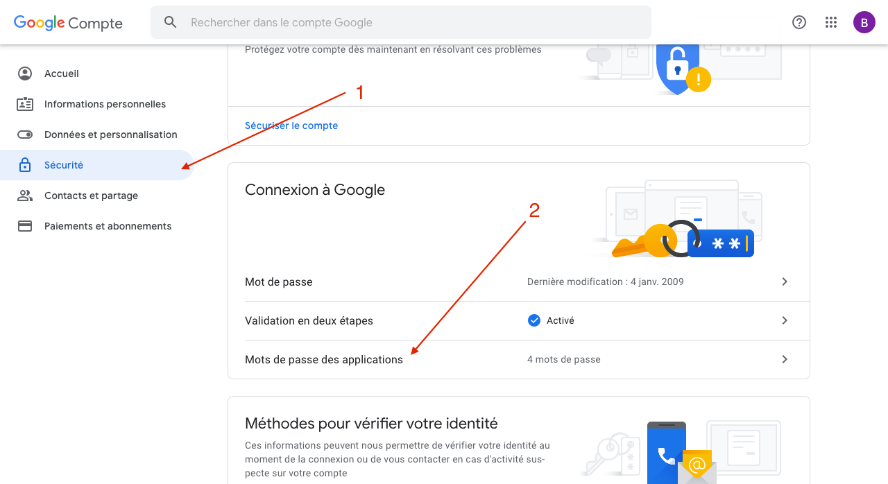
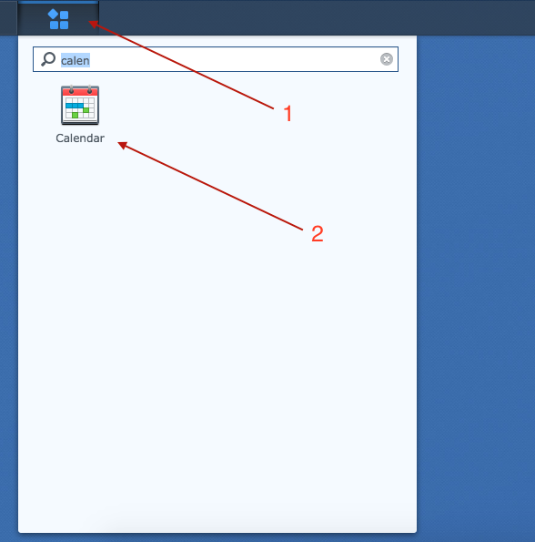
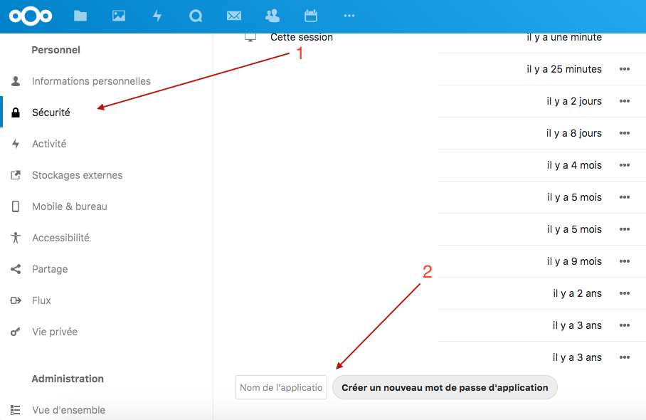
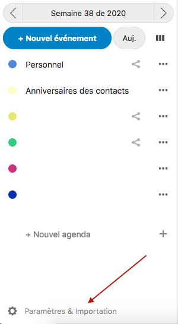
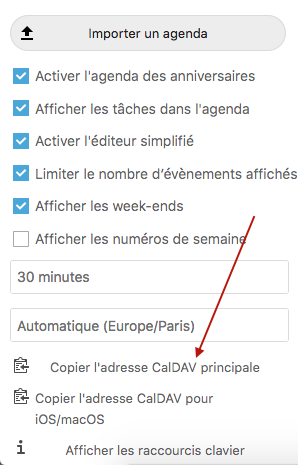

import JsonLd from '@site/src/components/seo/JsonLd';

CalDAV est un standard ouvert qui permet à des applications de lire et de synchroniser les événements d'un agenda hébergé sur un serveur de calendrier. La plupart des services le prennent en charge, dont iCloud, Google Agenda, le calendrier Synology et Nextcloud : c'est donc un moyen pratique et universel de récupérer votre agenda existant dans une autre application.

Dans Gladys, vous utilisez CalDAV pour synchroniser votre agenda avec ces services externes. Une fois vos événements dans Gladys, vous pouvez vous en servir pour déclencher des [scènes](/fr/docs/scenes/intro/) : allumer le chauffage avant une réunion, envoyer un rappel au début d'un événement, ou changer le mode de la maison quand vous êtes en vacances.

La plupart des services demandent un mot de passe d'application dédié, et non le mot de passe principal de votre compte. Les étapes ci-dessous montrent comment le générer et où le coller pour chaque service.

## Services disponibles (testés & autres)

1. [iCloud](#icloud)
2. [Google Agenda](#google-agenda)
3. [Calendrier Synology](#calendrier-synology)
4. [Nextcloud](#nextcloud)
5. [Autres](#autres)

### iCloud

Connectez vous avec votre compte Apple : [https://appleid.apple.com](https://appleid.apple.com)

Cliquez sur "Générer un mot de passe"

Entrez le nom voulu associé à votre mot de passe

Puis notez le mot de passe généré

Dans Gladys rejoignez la page de configuration CalDAV

1. Choisissez "Calendrier iCloud"
2. Laissez l'URL par défaut
3. Entrez votre Apple ID (normalement l'adresse email associée à votre compte Apple)
4. Collez ici le mot de passe précédement généré

Cliquez sur "Sauvegarder". S'il y a un message de validation, votre calendrier est prêt à être synchronisé. Si une erreur apparait, vérfiez les étapes précédentes et recommencez.

### Google Agenda

Connectez vous avec votre compte Google : [https://myaccount.google.com/](https://myaccount.google.com/)

Rejoignez le panneau sécurité puis cliquez sur "Mot de passe des applications"

1. Sélectionnez "Agenda" comme application
2. Sélectionnez "Autre" comme appareil
3. Une fois le nom entré ("Gladys" par exemple), cliquez sur "Générer" et notez le mot de passe créé

Dans Gladys rejoignez la page de configuration CalDAV

1. Choississez "Google Agenda"
2. Laissez l'URL par défaut
3. Entrez l'email de votre compte Google
4. Collez ici le mot de passe précédement généré

Cliquez sur "Sauvegarder". S'il y a un message de validation, votre calendrier est prêt à être synchronisé. Si une erreur apparait, vérfiez les étapes précédentes et recommencez.

### Calendrier Synology

Depuis votre Synology, ouvrez l'application "Calendar"

1. Au niveau du calendrier cliquez sur la petit flèche
2. Puis cliquez sur "Compte CalDAV"

Copiez l'url qui se trouve au niveau de "macOS / iOS"

Dans Gladys rejoignez la page de configuration CalDAV

1. Choisissez "Synlogy Calendar"
2. Collez ici l'url copiée précédement
3. Entrez votre nom d'utilisateur Synology
4. Entrez ici le mot de passe de votre compte

Cliquez sur "Sauvegarder". S'il y a un message de validation, votre calendrier est prêt à être synchronisé. Si une erreur apparait, vérfiez les étapes précédentes et recommencez.

### Nextcloud

1. Sur votre instance Nextcloud rejoignez la page de configuration, puis l'onglet sécurité
2. En bas entrez "Gladys" et cliquez sur "Créer un nouveau mot de passe d'application"

Notez le mot de passe créé

Dans l'application Agenda cliquez sur "Paramètres & Importation"

Puis "Copiez l'adresse CalDAV principale"

Dans Gladys rejoignez la page de configuration CalDAV

1. Choisissez "Autre"
2. Collez ici l'url copiée précédement
3. Entrez votre pseudo Nexcloud
4. Collez ici le mot de passe précédement généré

Cliquez sur "Sauvegarder". S'il y a un message de validation, votre calendrier est prêt à être synchronisé. Si une erreur apparait, vérfiez les étapes précédentes et recommencez.

### Autres

Pour tout autre service

1. Entrez l'URL CalDAV de votre service
2. Entrez votre nom d'utilisateur ou votre adresse email
3. Entrez le mot de passe de votre compte

## Foire aux questions

### Qu'est-ce que le CalDAV ?

CalDAV est un standard ouvert, construit au-dessus de WebDAV, qui permet à des applications d'accéder aux données d'un agenda et de les synchroniser depuis un serveur de calendrier. Il est pris en charge par la plupart des fournisseurs d'agenda, ce qui permet à une application comme Gladys de lire vos événements depuis iCloud, Google Agenda, Synology ou Nextcloud sans intégration spécifique à chaque service.

### Faut-il le mot de passe de mon compte ou un mot de passe d'application ?

Pour la plupart des services, il faut un mot de passe d'application dédié, et non le mot de passe principal de votre compte. iCloud, Google et Nextcloud permettent tous de générer un mot de passe spécifique pour Gladys depuis leurs paramètres de sécurité, que vous pouvez révoquer à tout moment sans changer votre mot de passe principal. Les étapes ci-dessus montrent où le générer pour chaque service.

### Comment connecter Google Agenda en CalDAV ?

Connectez-vous à votre compte Google, ouvrez les paramètres de sécurité et créez un mot de passe d'application pour "Agenda". Ensuite, dans Gladys, allez sur la page de configuration CalDAV, choisissez "Google Agenda", laissez l'URL par défaut, entrez votre email Google et collez le mot de passe d'application généré. Gladys synchronisera vos événements.

### Comment connecter mon agenda iCloud ?

Connectez-vous sur appleid.apple.com et générez un mot de passe d'application. Dans Gladys, ouvrez la page de configuration CalDAV, choisissez "Calendrier iCloud", laissez l'URL par défaut, entrez l'email de votre Apple ID et collez le mot de passe. Si cela ne fonctionne pas, vérifiez bien que vous avez généré un mot de passe d'application et non votre mot de passe Apple ID habituel.

### Puis-je utiliser CalDAV avec n'importe quel autre service d'agenda ?

Oui. Si votre service prend en charge CalDAV, choisissez "Autre" dans Gladys, puis entrez son URL CalDAV, votre nom d'utilisateur ou email et votre mot de passe. Cela couvre les serveurs auto-hébergés comme Baïkal ou Radicale, et la plupart des fournisseurs qui exposent un point d'accès CalDAV.

<JsonLd
  data={{
    "@context": "https://schema.org",
    "@type": "FAQPage",
    mainEntity: [
      {
        "@type": "Question",
        name: "Qu'est-ce que le CalDAV ?",
        acceptedAnswer: {
          "@type": "Answer",
          text: "CalDAV est un standard ouvert, construit au-dessus de WebDAV, qui permet à des applications d'accéder aux données d'un agenda et de les synchroniser depuis un serveur de calendrier. Il est pris en charge par la plupart des fournisseurs d'agenda, ce qui permet à une application comme Gladys de lire vos événements depuis iCloud, Google Agenda, Synology ou Nextcloud sans intégration spécifique à chaque service.",
        },
      },
      {
        "@type": "Question",
        name: "Faut-il le mot de passe de mon compte ou un mot de passe d'application pour CalDAV ?",
        acceptedAnswer: {
          "@type": "Answer",
          text: "Pour la plupart des services, il faut un mot de passe d'application dédié, et non le mot de passe principal de votre compte. iCloud, Google et Nextcloud permettent tous de générer un mot de passe spécifique pour Gladys depuis leurs paramètres de sécurité, que vous pouvez révoquer à tout moment sans changer votre mot de passe principal.",
        },
      },
      {
        "@type": "Question",
        name: "Comment connecter Google Agenda en CalDAV ?",
        acceptedAnswer: {
          "@type": "Answer",
          text: "Connectez-vous à votre compte Google, ouvrez les paramètres de sécurité et créez un mot de passe d'application pour Agenda. Ensuite, dans Gladys, allez sur la page de configuration CalDAV, choisissez Google Agenda, laissez l'URL par défaut, entrez votre email Google et collez le mot de passe d'application généré. Gladys synchronisera vos événements.",
        },
      },
      {
        "@type": "Question",
        name: "Comment connecter mon agenda iCloud en CalDAV ?",
        acceptedAnswer: {
          "@type": "Answer",
          text: "Connectez-vous sur appleid.apple.com et générez un mot de passe d'application. Dans Gladys, ouvrez la page de configuration CalDAV, choisissez Calendrier iCloud, laissez l'URL par défaut, entrez l'email de votre Apple ID et collez le mot de passe. Si cela ne fonctionne pas, vérifiez que vous avez généré un mot de passe d'application et non votre mot de passe Apple ID habituel.",
        },
      },
      {
        "@type": "Question",
        name: "Puis-je utiliser CalDAV avec n'importe quel autre service d'agenda ?",
        acceptedAnswer: {
          "@type": "Answer",
          text: "Oui. Si votre service prend en charge CalDAV, choisissez Autre dans Gladys, puis entrez son URL CalDAV, votre nom d'utilisateur ou email et votre mot de passe. Cela couvre les serveurs auto-hébergés comme Baikal ou Radicale, et la plupart des fournisseurs qui exposent un point d'accès CalDAV.",
        },
      },
    ],
  }}
/>
