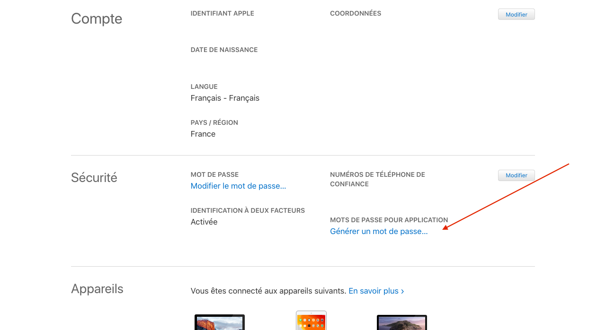

Pour synchroniser votre calendrier Gladys avec les serveurs compatibles (Google Agenda, iCloud, Nextcloud...)

## Services disponibles (testés & autres)

1. [iCloud](#icloud)
2. [Google Agenda](#google-agenda)
3. [Calendrier Synology](#calendrier-synology)
4. [Nextcloud](#nextcloud)
5. [Autres](#autres)

### iCloud

Connectez vous avec votre compte Apple : [https://appleid.apple.com](https://appleid.apple.com)

Cliquez sur "Générer un mot de passe"

Entrez le nom voulu associé à votre mot de passe

Puis notez le mot de passe généré

Dans Gladys rejoignez la page de configuration CalDAV

1. Choisissez "Calendrier iCloud"
2. Laissez l'URL par défaut
3. Entrez votre Apple ID (normalement l'adresse email associée à votre compte Apple)
4. Collez ici le mot de passe précédement généré

Cliquez sur "Sauvegarder". S'il y a un message de validation, votre calendrier est prêt à être synchronisé. Si une erreur apparait, vérfiez les étapes précédentes et recommencez.

### Google Agenda

Connectez vous avec votre compte Google : [https://myaccount.google.com/](https://myaccount.google.com/)

Rejoignez le panneau sécurité puis cliquez sur "Mot de passe des applications"

1. Sélectionnez "Agenda" comme application
2. Sélectionnez "Autre" comme appareil
3. Une fois le nom entré ("Gladys" par exemple), cliquez sur "Générer" et notez le mot de passe créé

Dans Gladys rejoignez la page de configuration CalDAV

1. Choississez "Google Agenda"
2. Laissez l'URL par défaut
3. Entrez l'email de votre compte Google
4. Collez ici le mot de passe précédement généré

Cliquez sur "Sauvegarder". S'il y a un message de validation, votre calendrier est prêt à être synchronisé. Si une erreur apparait, vérfiez les étapes précédentes et recommencez.

### Calendrier Synology

Depuis votre Synology, ouvrez l'application "Calendar"

1. Au niveau du calendrier cliquez sur la petit flèche
2. Puis cliquez sur "Compte CalDAV"

Copiez l'url qui se trouve au niveau de "macOS / iOS"

Dans Gladys rejoignez la page de configuration CalDAV

1. Choisissez "Synlogy Calendar"
2. Collez ici l'url copiée précédement
3. Entrez votre nom d'utilisateur Synology
4. Entrez ici le mot de passe de votre compte

Cliquez sur "Sauvegarder". S'il y a un message de validation, votre calendrier est prêt à être synchronisé. Si une erreur apparait, vérfiez les étapes précédentes et recommencez.

### Nextcloud

1. Sur votre instance Nextcloud rejoignez la page de configuration, puis l'onglet sécurité
2. En bas entrez "Gladys" et cliquez sur "Créer un nouveau mot de passe d'application"

Notez le mot de passe créé

Dans l'application Agenda cliquez sur "Paramètres & Importation"

Puis "Copiez l'adresse CalDAV principale"

Dans Gladys rejoignez la page de configuration CalDAV

1. Choisissez "Autre"
2. Collez ici l'url copiée précédement
3. Entrez votre pseudo Nexcloud
4. Collez ici le mot de passe précédement généré

Cliquez sur "Sauvegarder". S'il y a un message de validation, votre calendrier est prêt à être synchronisé. Si une erreur apparait, vérfiez les étapes précédentes et recommencez.

### Autres

Pour tout autre service

1. Entrez l'URL CalDAV de votre service
2. Entrez votre nom d'utilisateur ou votre adresse email
3. Entrez le mot de passe de votre compte

