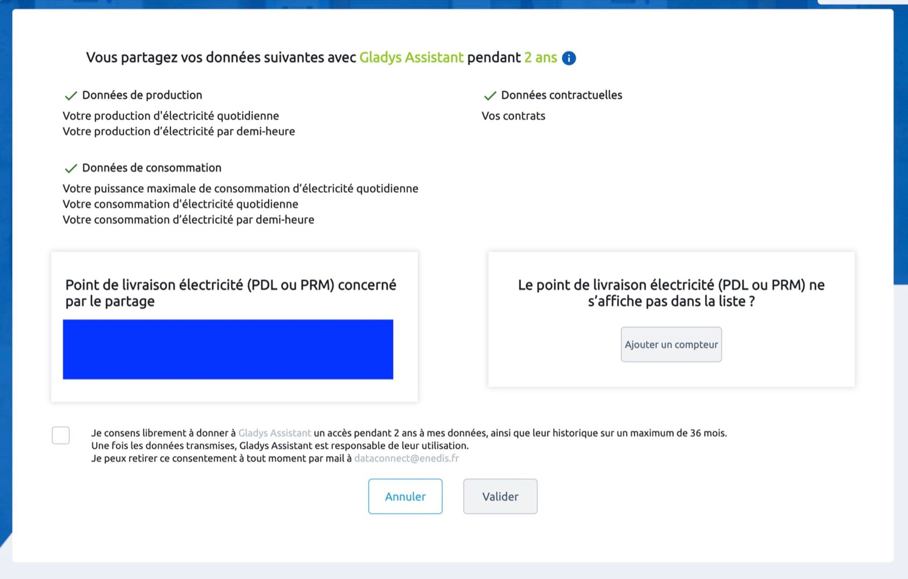
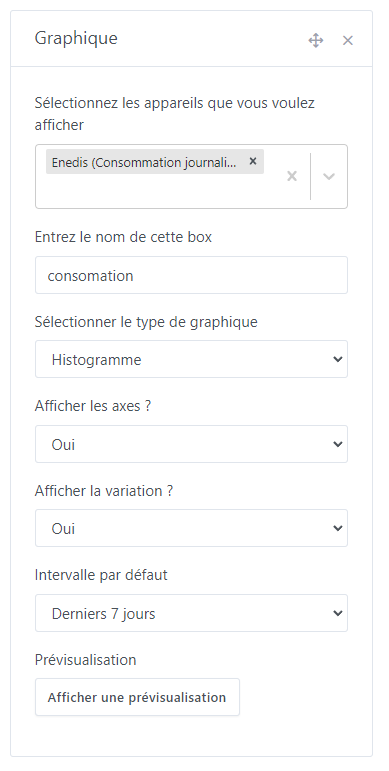
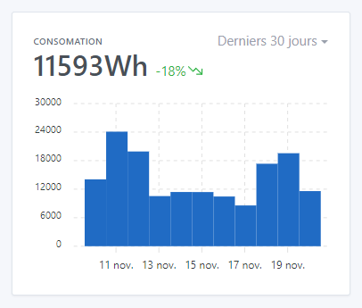

# Visualiser sa consommation électrique dans Gladys avec Enedis

Enedis propose une API qui permet de récupérer les données de consommation électrique venant d'un compteur Linky d'un foyer.

Cette API est uniquement proposée aux entreprises après signature d'un contrat et d'un processus de certification.

Côté Gladys, nous avons une structure juridique, "Gladys Assistant SAS", qui nous permet d'avoir accès à cette API et nous autorise à la mettre à disposition des particuliers.

Cette API est mise à disposition via [Gladys Plus](https://gladysassistant.com/fr/plus/).

REMARQUE

Cette intégration est uniquement utilisable en France, Enedis étant le gestionnaire du réseau de distribution d'électricité français.

## Se connecter à Enedis dans Gladys

Rendez-vous sur [plus.gladysassistant.com](https://plus.gladysassistant.com/), et cliquez sur `Intégration -> Enedis` :

Cliquez sur le bouton `J'accède à mon espace client Enedis`:

Côté Enedis, acceptez le consentement et cliquez sur `Valider`.

Vous devriez arriver sur Gladys, qui se synchronisera avec votre compte Enedis.

La première synchronisation peut prendre un certain temps selon la charge sur l'API Enedis, je vous conseiller de quitter Gladys et de revenir plus tard 🙂

Dans Gladys, vous retrouvez votre compteur électrique dans `Mes compteurs` :

## Visualisez votre consommation sur le tableau de bord

Rendez-vous sur le dashboard de Gladys et cliquez sur le bouton `éditer` pour modifier le dashboard.

Cliquez sur `ajouter +` puis sélectionnez le widget `graphique`, vous pouvez le déplacer dans une colonne et sélectionnez `Consommation journalière` :

Choisissez `Histogramme`, vous devriez voir ce graphique sur votre tableau de bord :

## FAQ

### Je n'arrive pas à faire le consentement Enedis ?

La plateforme Enedis est parfois hors-ligne pour des mises à jour du côté d'Enedis. Souvent, la meilleure chose à faire est de réessayer plus tard.

Si cela ne fonctionne toujours pas, vérifiez que votre compte Enedis est bien fonctionnel : est-ce vous arrivez à voir vos données de consommation électrique dans Enedis ? Si ce n’est pas le cas, le souci se trouve probablement chez Enedis.

### Je n'ai plus de données sur les précédents jours ?

L'API Enedis se met à jour tous les matins en théorie.

Néanmoins, en pratique les données ne sont pas toujours disponibles à la même heure, et certain jours (les jours fériés par exemple), les données ne sont pas disponibles.

Si toutefois vous observez des trous sur votre tableau de bord qui persiste dans le temps, merci de mettre un message sur [le forum](https://community.gladysassistant.com/).

### La synchronisation ne se fait plus ?

Votre consentement est valide 2 ans, et doit être renouvelé si vous voulez que Gladys continue à récupérer vos données.

Si votre compte ne se synchronise plus, en cas de doutes je vous conseille de refaire un consentement en cliquant sur le bouton bleu "J'accède à mon espace client Enedis".

Je vous invite à poster un message sur [le forum](https://community.gladysassistant.com/), si jamais vous avez besoin d’aide.