L'intégration "Suivi de l'énergie" permet de surveiller votre consommation énergétique avec Gladys Assistant.

Elle est disponible depuis Gladys Assistant 4.66.

## Le matériel compatible

Pour utiliser cette intégration, vous devez avoir des appareils remontant des données de consommation énergétique en kWh.

Il y a plusieurs façons de faire ça :

### 1. **Avec un Lixee ZLinky TIC en Zigbee (recommandé)**

C’est la meilleure solution pour suivre précisément sa consommation en France : relevés toutes les minutes en kWh, parfait pour monitorer tout son logement.

Compatible Zigbee, disponible à 49 € :

- [sur Domadoo](https://www.domadoo.fr/fr/eco-energie/7492-lixee-module-tic-vers-zigbee-30-pour-compteur-linky-v2-v4000-0014-3770014375179.html?domid=17)
- [sur le site de Lixee](https://lixee.fr/fr/produits/42-zlinky-tic-v2-3770014375179.html)

Chez moi, cela me permet d'avoir un graphique de ce type :


Chaque couleur représente un prix de l'énergie (je suis en Tempo), on voit bien les jours blancs qui sont apparus fin novembre avec le retour du froid 🥶

### 2. **Grâce à l’intégration Enedis sur Gladys Plus**

L'intégration Enedis vous permet de récupérer les valeurs relevées de votre compteur Linky, envoyées automatiquement à Enedis une fois par jour.

Cette intégration fonctionne sans matériel, mais elle a l'inconvénient de ne renvoyer la consommation qu'une fois par jour, contrairement au ZLinky qui renvoie les données en direct toutes les 60 secondes.

Pour configurer Enedis, rendez-vous sur [ce tutoriel](/fr/integrations/enedis/).

### 3. **Avec une prise Zigbee mesurant la consommation**

Idéal pour suivre un appareil en particulier, chez moi j'utilise cette prise NOUS pour suivre la consommation de mon lave-linge par exemple :

[Prise NOUS A1Z avec mesure de consommation sur Domadoo](https://www.domadoo.fr/fr/prises-connectees/6165-nous-prise-intelligente-zigbee-30-mesure-de-consommation-5907772033517.html?domid=17)

### 4. **Avec un appareil personnalisé MQTT**

Si vous avez un compteur exotique ou des appareils qui renvoient des valeurs de consommation en kWh, vous pouvez les intégrer avec Gladys Assistant en utilisant l'intégration MQTT.

Pour cela, il faut avoir des appareils dans l'intégration MQTT avec 3 fonctionnalités :

1. Une fonctionnalité "Capteur d'énergie / Index", qui correspond à l'index de votre appareil en kWh.
2. Une fonctionnalité "Capteur d'énergie / Consommation 30 minutes", qui correspond à la consommation de votre appareil en kWh sur les 30 dernières minutes.
3. Une fonctionnalité "Capteur d'énergie / Coût 30 minutes", qui correspond au coût de votre appareil en euros ou dollars sur les 30 dernières minutes.

La première fonctionnalité doit être remplie en MQTT par vos soins. Les deux autres seront déduites de la première et calculées automatiquement par Gladys.

## Configuration

:::info
Vous devez être en Gladys Assistant 4.66 ou plus pour utiliser cette intégration.
Vous pouvez mettre à jour en un clic dans les paramètres systèmes de Gladys.
:::

L'ordre des étapes de ce tutoriel est important !

### Étape n°1 : Configuration de l'intégration Enedis (optionnel)

Si vous comptez utiliser l'intégration Enedis, rendez-vous sur [ce tutoriel](/fr/integrations/enedis/) et suivez les instructions.

Si vous utilisez déjà l'intégration Enedis, vous devez vous rendre dans l'intégration et vérifier que l'appareil n'a pas besoin d'une mise à jour de ses fonctionnalités :

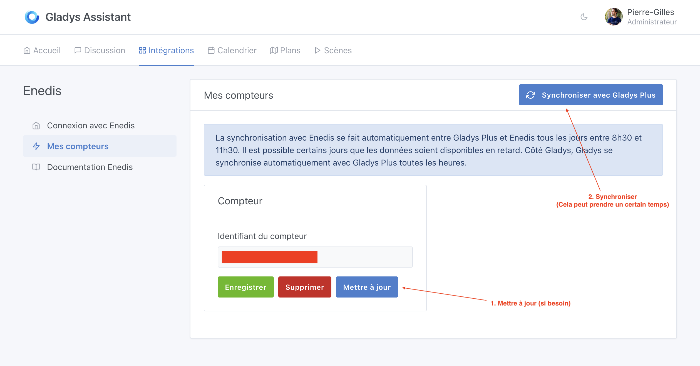

Si un bouton "Mise à jour" est affiché, cliquez dessus, puis cliquez sur "Synchroniser avec Gladys Plus".

À la fin de la synchronisation, vous pouvez vérifier que votre appareil Enedis a bien remonté des données dans Gladys en créant un graphique sur la fonctionnalité "Enedis (Consommation 30 minutes)".

Si vous voyez toute votre consommation en kWh, tant mieux, vous pouvez passer à l'étape suivante !

### Étape n°2 : Configuration de vos tarifs de l'énergie

Il faut maintenant dire à Gladys quel fournisseur d'énergie vous utilisez et quel est votre tarif.

Deux options s'offrent à vous : soit vous êtes sur un contrat que Gladys connaît et vous pouvez l'importer facilement, soit vous avez un contrat inconnu et vous devez le configurer manuellement.

Note : La liste des contrats d'énergie est open-source et peut être modifiée par tous sur [ce dépôt GitHub](https://github.com/GladysAssistant/energy-contracts).

#### Importer un contrat

Pour configurer votre contrat, rendez-vous sur l'intégration "Suivi de l'énergie", dans l'onglet "Tarifs de l'énergie", puis cliquez sur "Importer" :

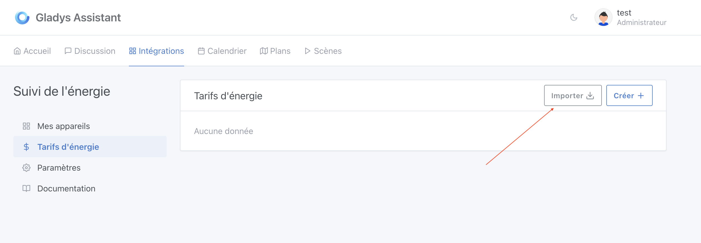

Gladys vous demande de sélectionner un compteur électrique.

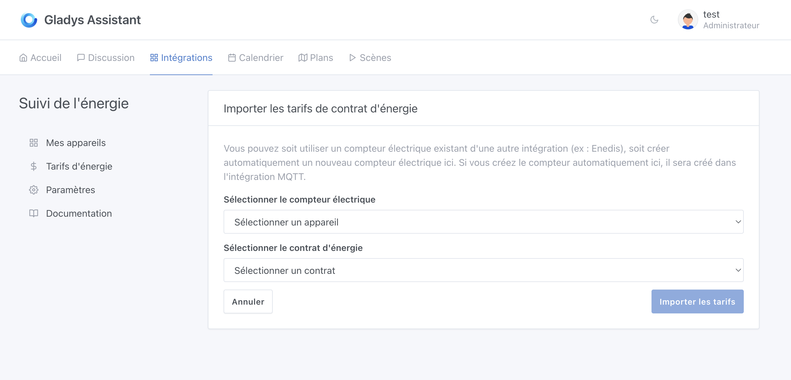

Si vous utilisez l'intégration Enedis, vous devriez voir votre compteur ici, vous pouvez le sélectionner.

Sinon, vous pouvez cliquer sur "Créer un compteur électrique" pour que Gladys crée automatiquement un appareil qui sera le "parent" de tous vos capteurs d'énergie dans votre maison.

Ensuite, sélectionnez votre contrat dans la liste, puis votre puissance souscrite :

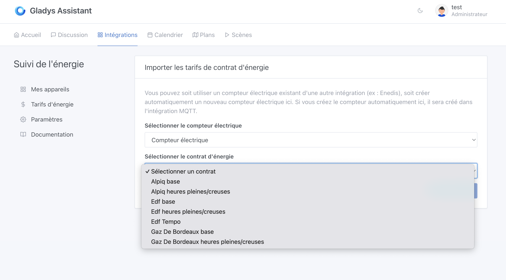

Si vous êtes en heure pleine/heure creuse, vous devrez sélectionner les horaires de votre contrat.

Dans le cas de Tempo, cela va vous créer des dizaines de prix car cela va importer tout l'historique de ce contrat avec 6 prix par période !

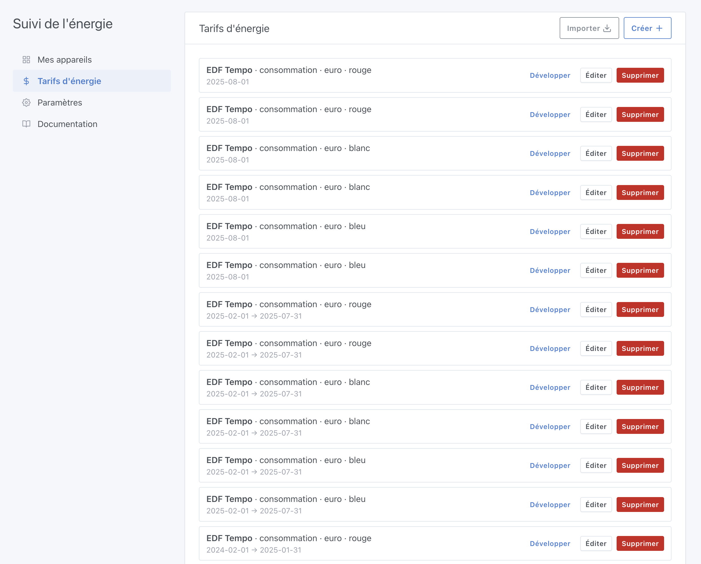

### Créer manuellement un contrat

Si votre contrat n'est pas dans la liste, cliquez sur "Créer".

Il faudra créer un prix par période et par type de prix. Si vous êtes en contrat heure pleine/heure creuse, il faudra créer 2 prix pour chaque période.

Exemple:

Si en 2024 votre tarif de l'énergie était de 0,15 €/kWh en heure pleine et 0,10 €/kWh en heure creuse, et qu'en 2025 les prix baissent de 0,05 €/kWh, vous devrez créer 4 prix :

- 2024 heure pleine
- 2024 heure creuse
- 2025 heure pleine
- 2025 heure creuse

Cela peut vite devenir long si votre contrat change souvent de prix, c'est pour cela que je vous incite très fortement à ajouter votre contrat à la base commune de contrat sur [le dépôt GitHub](https://github.com/GladysAssistant/energy-contracts).

C'est participatif et tout le monde peut proposer un tarif !

### Étape n°3 : Mettre à jour vos appareils Zigbee

Dans l'intégration Zigbee, si vous aviez ajouté des appareils Zigbee mesurant la consommation **avant cette mise à jour**, vous devez les mettre à jour.

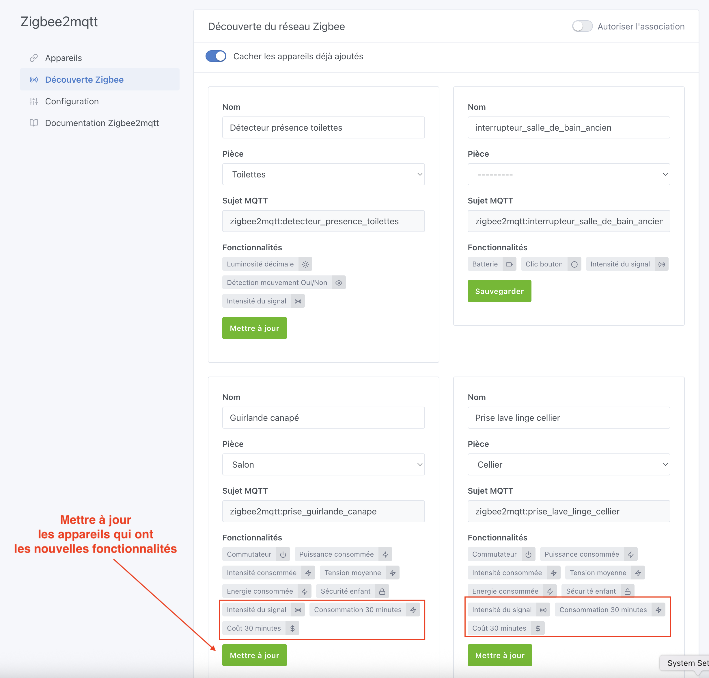

Cela servira à ajouter les fonctionnalités nécessaires au suivi de l'énergie.

### Étape n°4 : Vérifier la hiérarchie de votre réseau électrique

Rendez-vous dans l'intégration "Suivi de l'énergie", et sur le premier onglet, vous devriez voir la hiérarchie de votre réseau électrique.

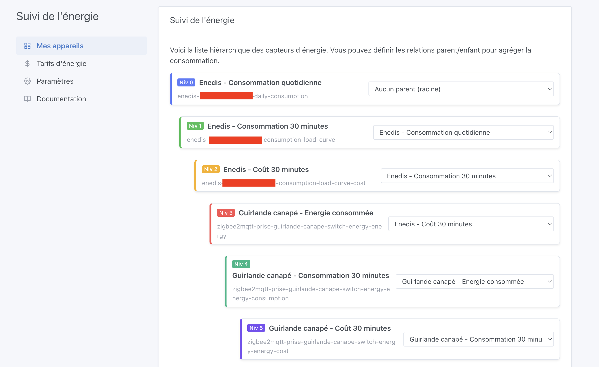

Vérifiez que chaque appareil est bien associé à son parent.

Dans la logique de Gladys, le "parent" d'un appareil correspond à celui sur lequel l'appareil est branché.

Un exemple de hiérarchie :

```
- Compteur électrique
  - Prise NOUS A1Z (Energie consommée)
     - Prise NOUS A1Z (Consommation 30 minutes)
        - Prise NOUS A1Z (Coût 30 minutes)
```

La hiérarchie est très importante pour que Gladys puisse calculer correctement le coût de votre consommation.

### Étape n°5 : Recalculer toutes les consommations historiques

Si vos appareils ont un historique de consommation, vous pouvez lancer un recalcul des consommations et des coûts sur 30 minutes depuis l'onglet "Paramètres" :

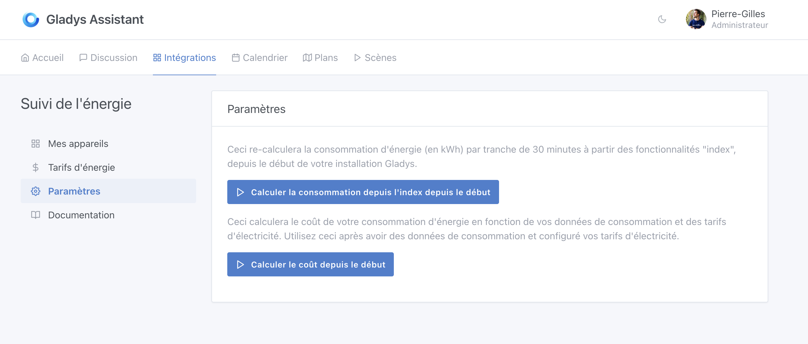

Cliquez d'abord sur le premier bouton pour calculer la consommation depuis les index, puis cliquez sur le deuxième bouton pour calculer les coûts 30 minutes.

### Étape n°6 : Afficher sa consommation sur le tableau de bord

Sur votre tableau de bord, il est maintenant possible d'ajouter un nouveau widget "Consommation Énergétique" :

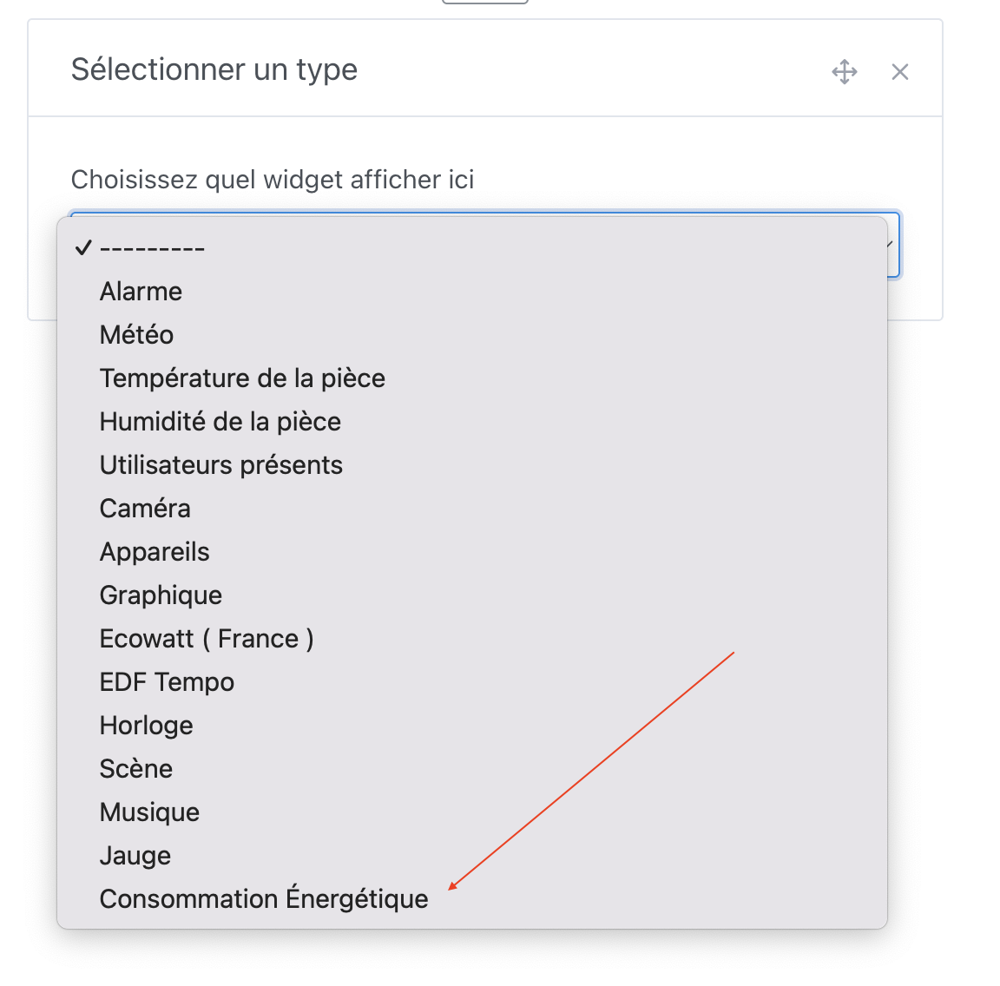

Si vous avez un Lixee ZLinky TIC en Zigbee, vous devriez avoir une fonctionnalité par tarif d'énergie (1 seul en base, 2 en heure pleine/heure creuse, et 6 en Tempo).

Je vous conseille de sélectionner toutes les fonctionnalités, chez moi par exemple de `tier-1` à `tier-6` pour mes 6 tarifs Tempo :

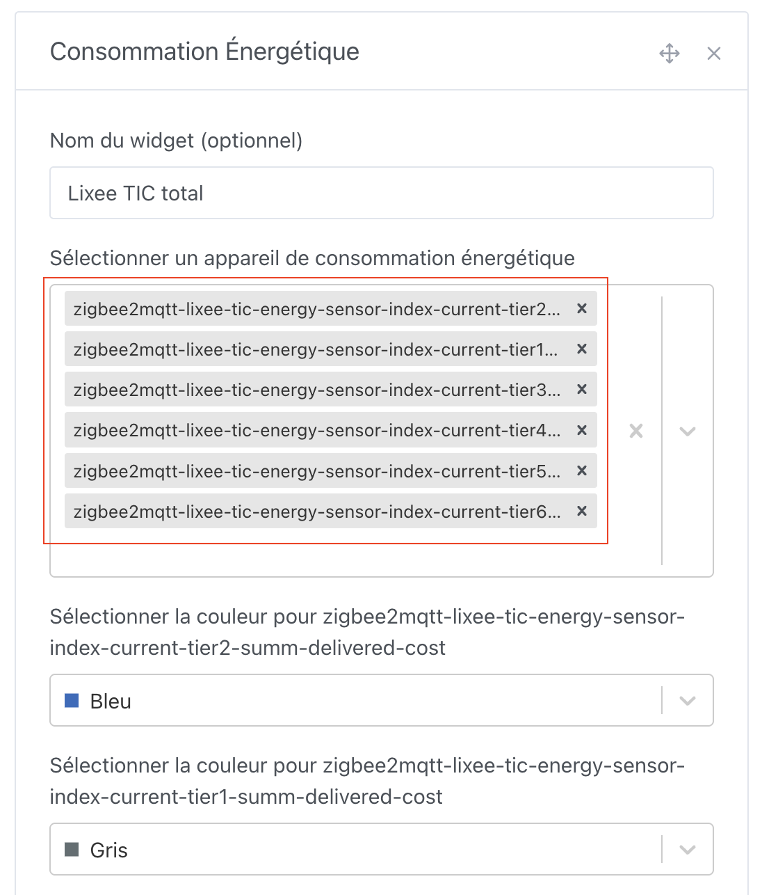

Ce qui vous donnera un bel affichage comme ceci :


Vous pouvez aussi afficher chaque appareil en particulier, par exemple mon lave-linge :

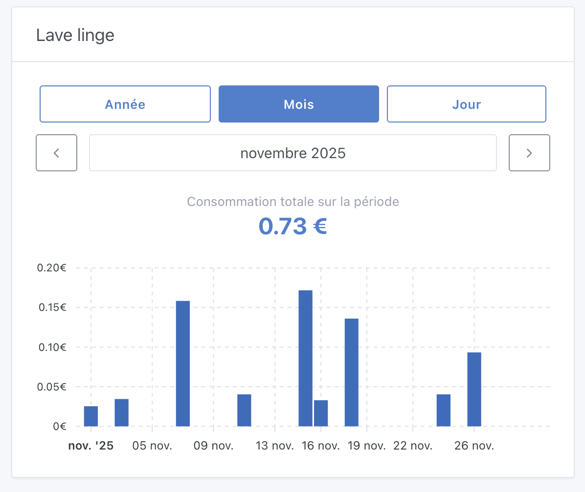

## Des retours ?

Cette fonctionnalité est toute nouvelle, si vous avez des questions ou des retours, n'hésitez pas à poster un message [sur le forum](https://community.gladysassistant.com/).

J'aimerais remercier Thomas Lemaistre, qui a financé ce développement et m'a permis de lui donner vie !

Si à l'avenir vous souhaitez voir de gros développements comme celui-ci dans Gladys, sachez que je suis disponible pour du sponsoring de fonctionnalités.
