L'intégration "Suivi de l'énergie" permet de surveiller votre consommation énergétique avec Gladys Assistant.

:::tip[Aller plus loin]
Comment transformer les données en économies : [Réduire sa facture d'électricité](/fr/home-energy-monitoring/). Vos heures creuses changent ? Lisez [ce que change la réforme des heures creuses](/fr/heures-creuses/), et suivez la [couleur Tempo du jour](/fr/edf-tempo/) en direct.
:::

Elle est disponible depuis Gladys Assistant 4.66. Depuis Gladys Assistant 5.2, le coût de votre consommation est calculé à partir de **contrats d'énergie**, capables de décrire les contrats d'électricité de presque tous les pays : plages horaires, saisons, couleurs de jour, tranches de consommation, prix spot...

## Le matériel compatible

Pour utiliser cette intégration, vous devez avoir des appareils remontant des données de consommation énergétique en kWh.

Il y a plusieurs façons de faire ça :

### 1. **Avec un Lixee ZLinky TIC en Zigbee (recommandé)**

C’est la meilleure solution pour suivre précisément sa consommation en France : relevés toutes les minutes en kWh, parfait pour monitorer tout son logement.

Compatible Zigbee, disponible à 49 € :

- [sur Domadoo](https://www.domadoo.fr/fr/eco-energie/7492-lixee-module-tic-vers-zigbee-30-pour-compteur-linky-v2-v4000-0014-3770014375179.html?domid=17)
- [sur le site de Lixee](https://lixee.fr/fr/produits/42-zlinky-tic-v2-3770014375179.html)

Chez moi, cela me permet d'avoir un graphique de ce type :

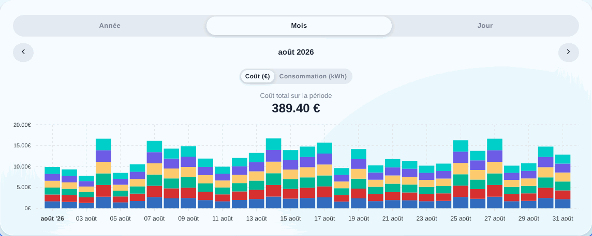

Chaque couleur représente un prix de l'énergie (je suis en Tempo), on voit bien les jours blancs qui sont apparus fin novembre avec le retour du froid 🥶

### 2. **Grâce à l’intégration Enedis sur Gladys Plus**

L'intégration Enedis vous permet de récupérer les valeurs relevées de votre compteur Linky, envoyées automatiquement à Enedis une fois par jour.

Cette intégration fonctionne sans matériel, mais elle a l'inconvénient de ne renvoyer la consommation qu'une fois par jour, contrairement au ZLinky qui renvoie les données en direct toutes les 60 secondes.

Pour configurer Enedis, rendez-vous sur [ce tutoriel](/fr/docs/integrations/enedis/).

### 3. **Avec une prise Zigbee mesurant la consommation**

Idéal pour suivre un appareil en particulier, chez moi j'utilise cette prise NOUS pour suivre la consommation de mon lave-linge par exemple :

[Prise NOUS A1Z avec mesure de consommation sur Domadoo](https://www.domadoo.fr/fr/prises-connectees/6165-nous-prise-intelligente-zigbee-30-mesure-de-consommation-5907772033517.html?domid=17)

### 4. **Avec un appareil personnalisé MQTT**

Si vous avez un compteur exotique ou des appareils qui renvoient des valeurs de consommation en kWh, vous pouvez les intégrer avec Gladys Assistant en utilisant l'intégration MQTT.

## Configuration

:::info
Vous devez être en Gladys Assistant 4.66 ou plus pour utiliser cette intégration.
Vous pouvez mettre à jour en un clic dans les paramètres systèmes de Gladys.
:::

L'ordre des étapes de ce tutoriel est important !

### Étape n°1 : Configuration de l'intégration Enedis (optionnel)

Si vous comptez utiliser l'intégration Enedis, rendez-vous sur [ce tutoriel](/fr/docs/integrations/enedis/) et suivez les instructions.

Si vous utilisez déjà l'intégration Enedis, vous devez vous rendre dans l'intégration et vérifier que l'appareil n'a pas besoin d'une mise à jour de ses fonctionnalités :

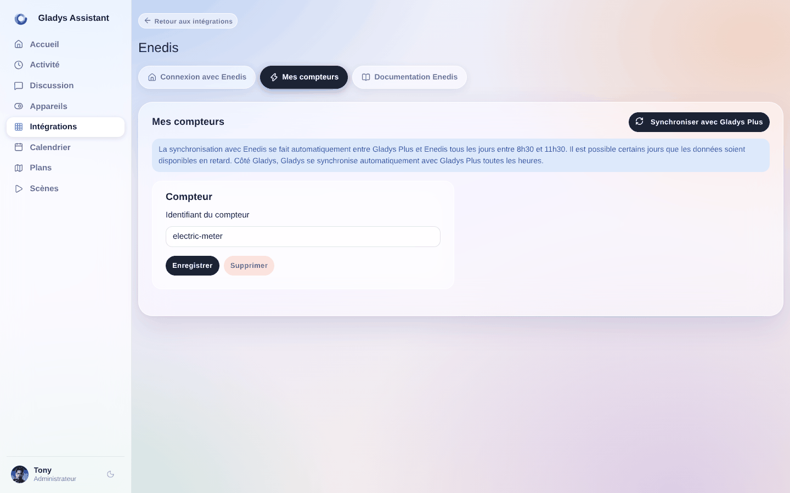

Si un bouton "Mise à jour" est affiché, cliquez dessus, puis cliquez sur "Synchroniser avec Gladys Plus".

À la fin de la synchronisation, vous pouvez vérifier que votre appareil Enedis a bien remonté des données dans Gladys en créant un graphique sur la fonctionnalité "Enedis (Consommation 30 minutes)".

Si vous voyez toute votre consommation en kWh, tant mieux, vous pouvez passer à l'étape suivante !

### Étape n°2 : Créer votre contrat d'énergie

Il faut maintenant dire à Gladys comment votre fournisseur vous facture. Depuis Gladys Assistant 5.2, cela prend la forme d'un **contrat d'énergie** : une période de validité, une devise, un fuseau horaire et une définition du tarif, rattachés à votre compteur électrique.

Rendez-vous dans l'intégration "Suivi de l'énergie", onglet "Contrats", puis cliquez sur "Créer". Un assistant vous guide en 4 étapes.

**1. Compteur**

Sélectionnez votre compteur électrique. Si vous utilisez l'intégration Enedis, vous devriez voir votre compteur ici, vous pouvez le sélectionner.

Sinon, choisissez "Créer un compteur électrique" pour que Gladys crée automatiquement un appareil qui sera le "parent" de tous vos capteurs d'énergie dans votre maison.

**2. Modèle**

Choisissez votre contrat dans la liste. Vous pouvez filtrer par pays et chercher par fournisseur ou par nom de contrat. Chaque modèle indique d'où il vient : le catalogue communautaire, un service de Gladys (EDF Tempo, alimenté en couleurs du jour par Gladys Plus) ou une intégration installée.

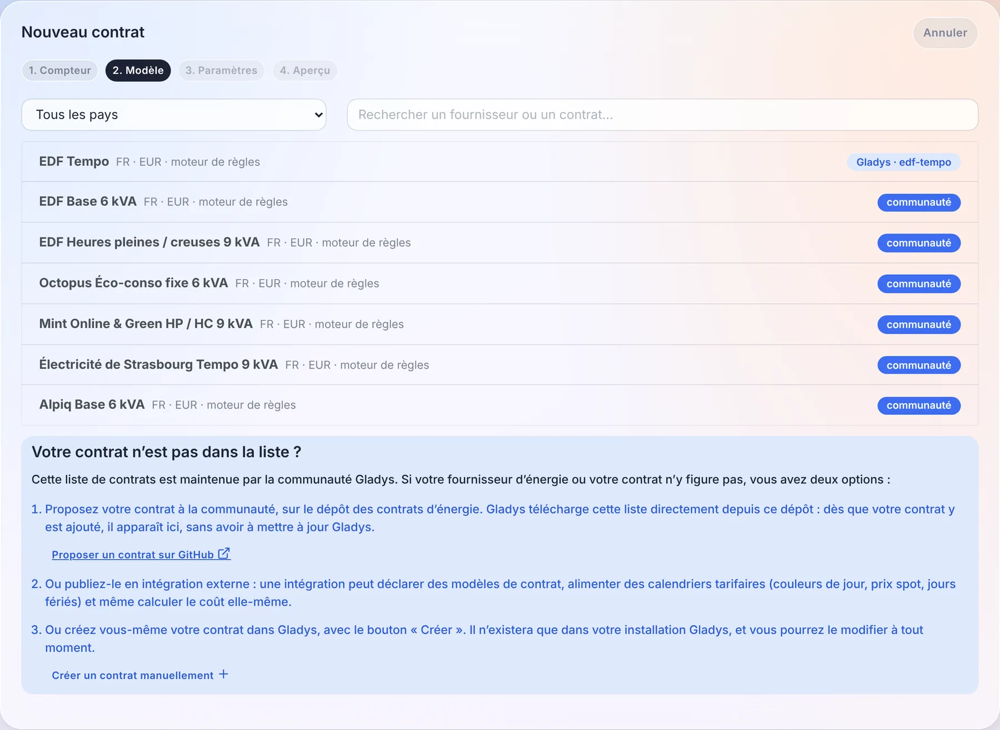

La liste des contrats communautaires est open source et peut être modifiée par tous sur [ce dépôt GitHub](https://github.com/GladysAssistant/energy-contracts).

**3. Paramètres**

Vérifiez le nom du contrat, sa date de début (et sa date de fin s'il en a une), la devise, le fuseau horaire et le jour de début de votre période de facturation. Renseignez ensuite les paramètres du modèle : la puissance souscrite, les prix, vos heures creuses sur une grille de créneaux de 30 minutes pour un contrat heures pleines / heures creuses...

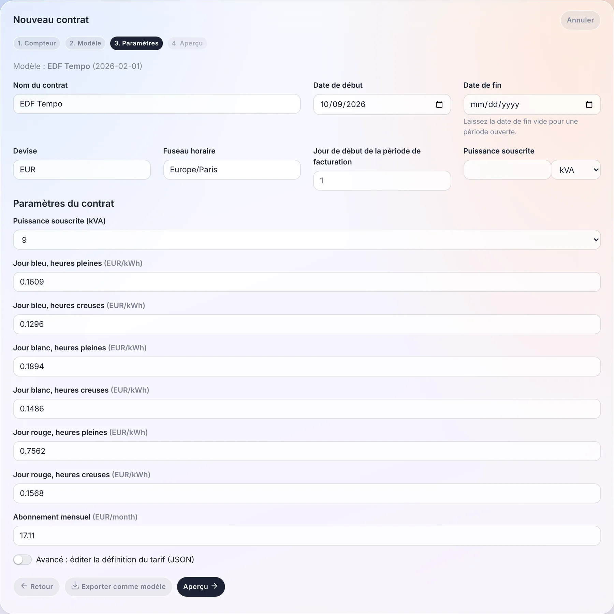

**4. Aperçu**

Avant d'enregistrer quoi que ce soit, Gladys tarifie votre **consommation réelle des 7 derniers jours** avec ce contrat : le total, le détail par composante (énergie, abonnement...) et un échantillon de créneaux de 30 minutes avec le prix appliqué à chacun. C'est le meilleur moyen de vérifier que le contrat correspond à votre facture.


Cliquez sur "Enregistrer" : le contrat apparaît dans la liste, avec son statut (actif, programmé, expiré).

Quand vos prix changent, vous ne touchez pas au passé : terminez le contrat en cours à la date du changement, et créez-en un nouveau qui commence le lendemain. Un compteur a au plus un contrat actif à une date donnée.

:::info[Vous venez d'une version précédente ?]
Vos prix d'énergie créés avant Gladys 5.2 sont convertis automatiquement en contrats au premier démarrage, sans toucher à l'historique des coûts déjà calculés. Vérifiez-les dans l'onglet "Contrats" : un contrat converti dont le calcul diffère de l'ancien est signalé.
:::

#### Mon contrat n'est pas dans la liste

Vous avez trois options :

1. **Le proposer à la communauté**, sur [le dépôt des contrats d'énergie](https://github.com/GladysAssistant/energy-contracts). Gladys télécharge cette liste directement : dès que votre contrat y est ajouté, il apparaît dans toutes les instances Gladys, sans mise à jour.
2. **Le publier en intégration externe** : une intégration peut déclarer des modèles de contrat, alimenter des calendriers tarifaires (couleurs de jour, prix spot, jours fériés) et même calculer le coût elle-même. Voir [la documentation développeur](/fr/docs/dev/external-integrations/).
3. **Le créer vous-même** : à l'étape "Paramètres", activez "Avancé : éditer la définition du tarif (JSON)" et décrivez votre contrat. Le bouton "Exporter comme modèle" produit ensuite un modèle prêt à être partagé.

#### Ce qu'un contrat sait exprimer

Le moteur de tarification de Gladys ne connaît aucun fournisseur par son nom : un contrat est une liste de règles, évaluées pour chaque créneau de 30 minutes. Une règle peut dépendre :

- de l'**heure** (heures pleines / heures creuses, plages horaires) ;
- du **jour de la semaine** (week-end moins cher) ;
- du **mois ou de la saison** (tarifs été / hiver) ;
- d'une **période de dates** (promotion, période de transition) ;
- d'un **calendrier tarifaire** : couleur du jour (Tempo), jours fériés, jours de pointe ;
- de **tranches de consommation**, par jour, par mois ou par période de facturation (tarifs progressifs) ;
- de la **puissance maximale** du créneau.

Et un contrat peut ajouter des **frais fixes** (par jour ou par mois), des **taxes** en pourcentage, une **composante de puissance** par kW de pointe, et des **prix de marché horaires ou au quart d'heure** (prix spot) avec un coefficient et une marge.

Le moteur est testé sur des contrats réels de France, de Belgique, du Royaume-Uni, d'Allemagne, de Finlande, de Norvège, des États-Unis, du Canada, d'Australie, du Japon, de Corée du Sud et d'Inde.

#### Les calendriers tarifaires

Certains contrats dépendent de valeurs qui changent tous les jours : la couleur Tempo, les prix spot, les jours de pointe. Ces valeurs sont stockées dans des **calendriers tarifaires**, visibles dans l'onglet "Paramètres" de l'intégration, avec leur fournisseur, leur granularité (jour, 30 minutes, 15 minutes), leur couverture et leurs dernières valeurs.

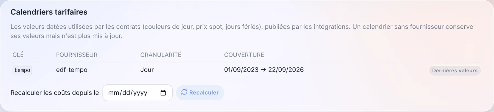

Depuis la même carte, "Recalculer les coûts depuis le" recalcule les coûts de tous les compteurs à partir de la date choisie, par exemple après avoir corrigé un prix.

### Étape n°3 : Mettre à jour vos appareils Zigbee

Dans l'intégration Zigbee, si vous aviez ajouté des appareils Zigbee mesurant la consommation **avant cette mise à jour**, vous devez les mettre à jour.

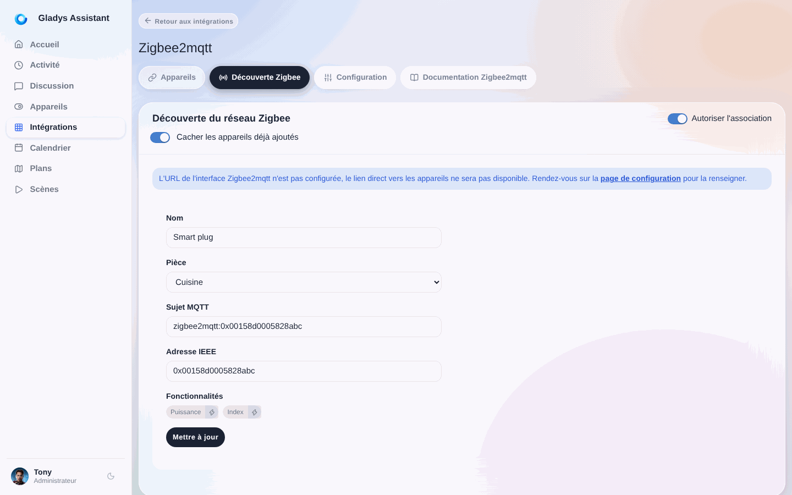

Cela servira à ajouter les fonctionnalités nécessaires au suivi de l'énergie.

### Étape n°4 : Mettre à jour vos appareils MQTT

Dans l'intégration MQTT, si vous aviez ajouté des appareils MQTT avec des fonctionnalités "Capteur d'énergie / Index", vous devriez voir un bouton sur chaque fonctionnalité "Index" :

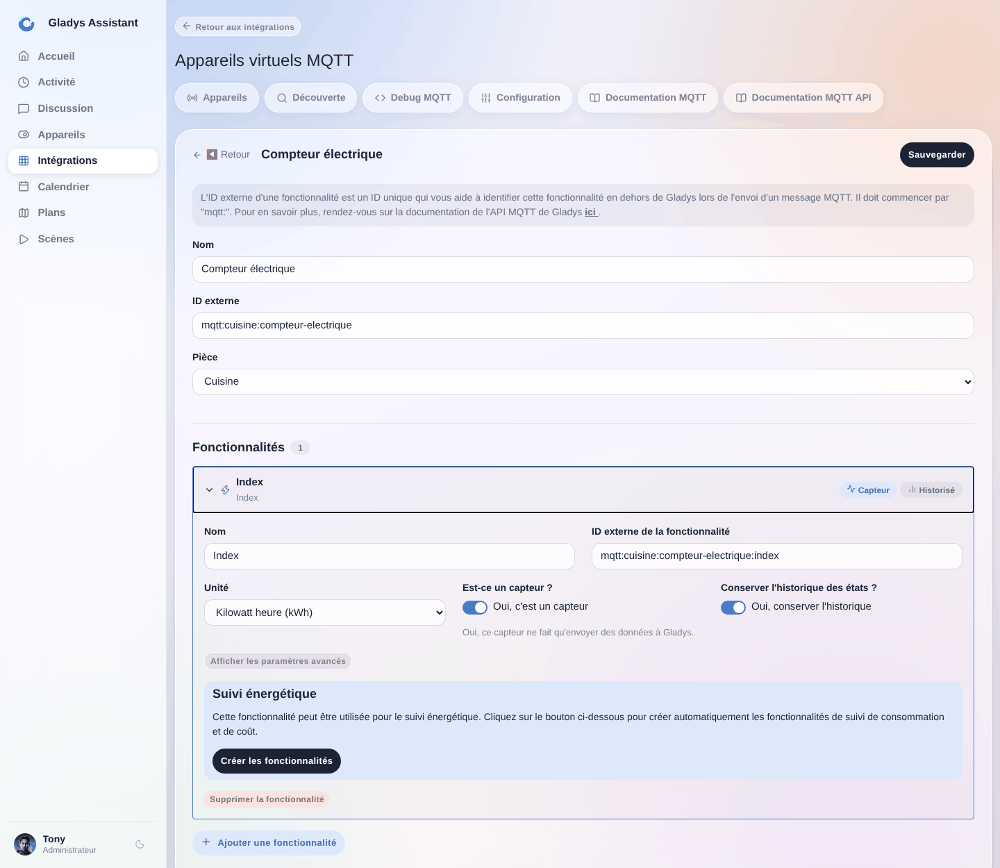

Si vous cliquez sur ce bouton, Gladys créera automatiquement les fonctionnalités nécessaires au suivi de l'énergie pour cet index.

### Étape n°5 : Vérifier la hiérarchie de votre réseau électrique

Rendez-vous dans l'intégration "Suivi de l'énergie", et sur le premier onglet, vous devriez voir la hiérarchie de votre réseau électrique.

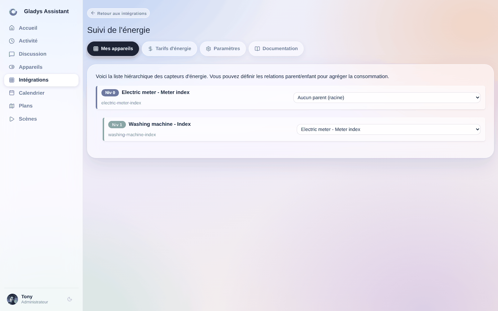

Vérifiez que chaque appareil est bien associé à son parent.

Dans la logique de Gladys, le "parent" d'un appareil correspond à celui sur lequel l'appareil est branché.

Un exemple de hiérarchie :

```
- Compteur électrique
  - Prise NOUS A1Z (Energie consommée)
     - Prise NOUS A1Z (Consommation 30 minutes)
        - Prise NOUS A1Z (Coût 30 minutes)
```

La hiérarchie est très importante pour que Gladys puisse calculer correctement le coût de votre consommation.

### Étape n°6 : Recalculer toutes les consommations historiques

Si vos appareils ont un historique de consommation, vous pouvez lancer un recalcul des consommations et des coûts sur 30 minutes depuis l'onglet "Paramètres" :

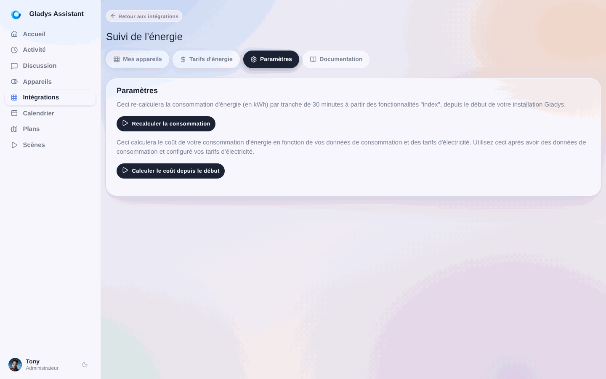

Cliquez d'abord sur le premier bouton pour calculer la consommation depuis les index, puis cliquez sur le deuxième bouton pour calculer les coûts 30 minutes.

### Étape n°7 : Afficher sa consommation sur le tableau de bord

Sur votre tableau de bord, il est maintenant possible d'ajouter un nouveau widget "Consommation Énergétique" :

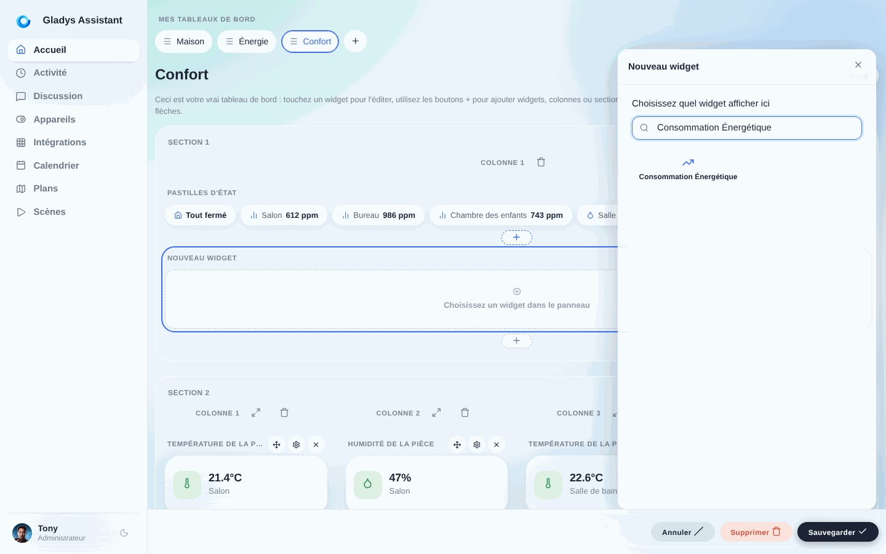

Si vous avez un Lixee ZLinky TIC en Zigbee, vous devriez avoir une fonctionnalité par tarif d'énergie (1 seul en base, 2 en heure pleine/heure creuse, et 6 en Tempo).

Je vous conseille de sélectionner toutes les fonctionnalités, chez moi par exemple de `tier-1` à `tier-6` pour mes 6 tarifs Tempo :

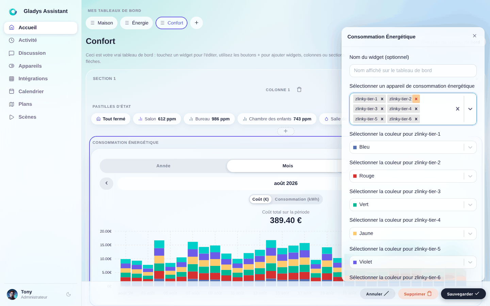

Ce qui vous donnera un bel affichage comme ceci :


Vous pouvez aussi afficher chaque appareil en particulier, par exemple mon lave-linge :

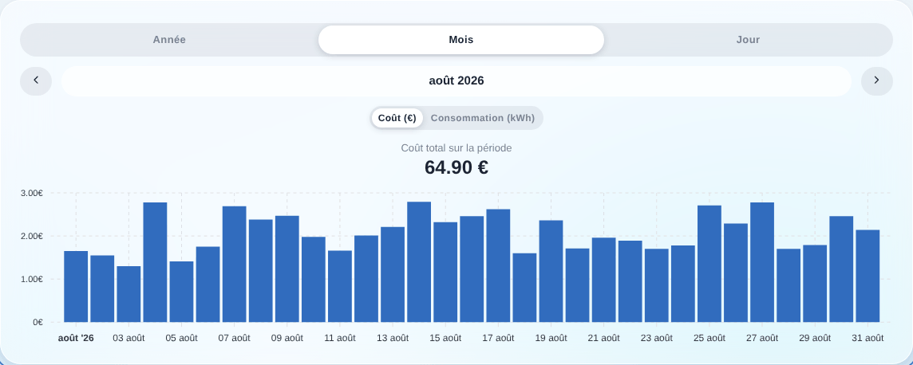

### Étape n°8 : Afficher le prix actuel de l'électricité

Le widget "Prix de l'électricité" affiche, pour le contrat de votre choix, le prix actuel du kWh, la tranche en cours (par exemple "Blue peak"), jusqu'à quand il s'applique et quel sera le prix suivant, ainsi que la consommation du jour.


Il fonctionne avec tous les contrats, quel que soit leur fournisseur ou leur pays, et se rafraîchit toutes les 5 minutes.

### Étape n°9 : Utiliser le prix dans vos scènes

Deux blocs de scène utilisent votre contrat :

- le déclencheur **"Changement de prix de l'électricité"** lance une scène dès que le prix du kWh (ou la tranche tarifaire) du contrat change, par exemple au passage des heures creuses aux heures pleines ;
- l'action **"Condition sur le prix de l'électricité"** ne laisse la scène continuer que si le prix actuel est inférieur, supérieur ou égal au seuil choisi.

Par exemple, pour lancer le lave-vaisselle dès que l'électricité devient moins chère :

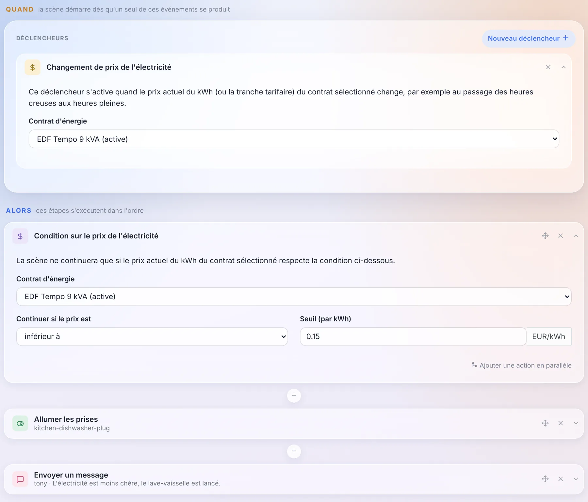

## Des retours ?

Cette fonctionnalité est toute nouvelle, si vous avez des questions ou des retours, n'hésitez pas à poster un message [sur le forum](https://community.gladysassistant.com/).

J'aimerais remercier Thomas Lemaistre, qui a financé ce développement et m'a permis de lui donner vie !

Si à l'avenir vous souhaitez voir de gros développements comme celui-ci dans Gladys, sachez que je suis disponible pour du sponsoring de fonctionnalités.
