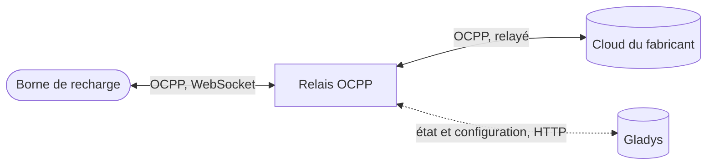

{/* GENERATED FILE: built by `yarn load-external-integrations` from the
integration store. Do not edit by hand, edit docs/fr.md in
https://github.com/sescandell/gladys-ocpp-integration instead. */}

import ExternalIntegrationHeader from "@site/src/components/ExternalIntegrationHeader";

<ExternalIntegrationHeader slug="charger-station" />

**Supervision en lecture seule.** Cette intégration observe un
nombre quelconque de bornes de recharge OCPP 1.6 et affiche leur état dans
Gladys (statut du connecteur, état de charge, puissance, courant, tension,
énergie totale) — il n'est pas encore possible de démarrer, arrêter ou
limiter une charge depuis Gladys.

## Fonctionnement

L'intégration embarque son propre relais OCPP. Chaque borne se connecte à la
**même** URL — le relais les distingue grâce à l'identity que chacune
annonce à la connexion. Dès qu'une borne pointe vers cette URL (voir
Installation ci-dessous), le relais la supervise **automatiquement**, sans
qu'il soit besoin de la déclarer dans Gladys au préalable : il lui répond
normalement, donc la charge elle-même continue de fonctionner. Mais tant que
vous ne lui avez pas associé **son propre** cloud d'origine, ce dernier est
totalement hors circuit — rien de ce qui passe par l'application du
fabricant (pilotage à distance, statut en direct, historique) ne fonctionne
pendant cette période, puisque son cloud n'a plus aucune connexion à la
borne. Associer le cloud d'origine change cela : le relais se met alors
aussi à relayer le trafic de la borne vers ce cloud, et l'application du
fabricant refonctionne exactement comme avant. Le relais se contente
d'_observer_ ce qui transite pour construire l'état affiché dans Gladys ; il
n'invente ni ne retient jamais rien sur le fil, dans aucun des deux modes.

## Prérequis

**Gladys 4.85.0 ou ultérieur.** L'état des bornes est publié via les
fonctionnalités « borne de recharge » de Gladys, que les versions
antérieures ne connaissent pas (elles refuseraient de créer l'appareil).

L'application ou le portail de chaque borne doit permettre de consulter et
de modifier l'URL du serveur OCPP auquel elle se connecte. Tous les
fabricants ne proposent pas cette option — si le vôtre ne le fait pas, cette
intégration ne peut pas être utilisée pour cette borne.

**Avant de changer quoi que ce soit, notez l'URL du serveur OCPP actuellement
affichée par l'application du fabricant.** C'est le seul moyen de revenir au
cloud d'origine pour cette borne si vous souhaitez un jour arrêter d'utiliser
cette intégration.

## Installation

Cinq étapes, une fois par borne. Rien n'est perdu au passage : la borne
conserve sa propre connexion au cloud du fabricant, Gladys se place
simplement au milieu et observe.

1. **Notez l'URL du serveur OCPP** actuellement utilisée par votre borne,
   dans l'application du fabricant. C'est votre seul chemin de retour vers
   le cloud du fabricant — gardez-la précieusement.
2. **Pointez la borne vers Gladys** : dans cette même application, remplacez
   l'URL par celle affichée dans le guide de l'écran **Configuration** de
   l'intégration — elle est déjà complétée pour vous, adresse et port
   inclus. La même URL fonctionne pour **toutes** les bornes.
3. **Ajoutez-la à Gladys** : elle se connecte immédiatement et apparaît dans
   l'onglet **Découverte**, déjà supervisée. Ajoutez-la depuis là.
4. **Rendez-lui son cloud** : sur l'écran Configuration, lancez l'action
   **"Ajouter une borne"**, choisissez-la dans la liste, et collez l'URL de
   l'étape 1 — exactement telle que l'application l'affichait, y compris une
   éventuelle chaîne de requête finale que certains fabricants utilisent
   (ex. se terminant par `?sn=`).
5. **C'est tout.** La borne se reconnecte toute seule en quelques secondes et
   continue de dialoguer avec le cloud du fabricant exactement comme avant,
   en passant par Gladys — qui la suit désormais en direct.

Répétez pour chaque autre borne : même URL Gladys, sa propre URL fabricant,
même d'un fabricant différent.

Pour corriger une erreur ou changer l'URL du cloud d'origine d'une borne,
relancez l'action pour cette même borne avec l'URL corrigée (vérifiez
d'abord son URL actuelle sur sa fiche appareil). Pour détacher une borne de
son cloud et la remettre en supervision locale uniquement, relancez
l'action pour elle avec une URL **vide** — prend effet à la prochaine
reconnexion de cette borne (elle continue d'être relayée via sa connexion
en cours jusque-là).

Si vous **supprimez** de Gladys l'appareil d'une borne encore associée à un
cloud d'origine, elle disparaît de la liste déroulante et l'action ne peut
plus la modifier — le relais continue d'utiliser ce cloud. Ré-ajoutez
l'appareil depuis Découverte pour reprendre la main.

## Repartir de zéro

Désinstaller l'intégration supprime tout ce qu'elle a créé : ses appareils,
sa configuration stockée, ainsi que le conteneur et les données du relais.
Rien n'est laissé derrière, une réinstallation repart donc vraiment de zéro.

Pour revenir directement au cloud de votre fabricant, remettez l'URL notée à
l'étape 1 dans l'application de la borne — elle cesse de passer par Gladys à
sa prochaine reconnexion.

## Ce que vous voyez sur une borne

Chaque connecteur remonte deux fonctionnalités d'état, en plus de ses
mesures (puissance, courant, tension, énergie totale) :

- **Statut** — ce que fait le connecteur lui-même : _Disponible_, _Occupé_,
  _Réservé_, _Indisponible_, _En défaut_.
- **État de charge** — ce que fait la session : _En charge_, _Véhicule
  connecté_, _En pause (véhicule)_, _En pause (borne)_, _Inactif_.

Les bornes OCPP 1.6 rapportent un statut unique, plus détaillé, qui est
réparti entre ces deux fonctionnalités : `Preparing` et `Finishing`
deviennent tous les deux « Occupé / Véhicule connecté » (un véhicule est
physiquement branché dans les deux cas), `Charging` devient « Occupé / En
charge », et `SuspendedEV`/`SuspendedEVSE` deviennent « Occupé / En pause
(véhicule) »/« Occupé / En pause (borne) ». Quand aucune session n'est en
cours, l'état de charge affiche _Inactif_. Les deux fonctionnalités restent
vides tant que la borne n'a pas rapporté son statut au moins une fois.

Les valeurs se mettent à jour **au fil de l'eau**, en quelques secondes : le
relais signale à l'intégration chaque changement qu'il observe, au lieu d'être
interrogé à intervalles réguliers. Une borne qui se connecte pour la première
fois apparaît elle aussi toute seule dans Découverte, sans attendre un
rafraîchissement.

## Connecteurs multiples

Une borne est un seul appareil dans Gladys, quel que soit son nombre de
connecteurs physiques. Elle démarre avec les fonctionnalités d'un seul
connecteur (statut, état de charge, puissance, courant, tension,
énergie) ; si elle possède plusieurs connecteurs physiques, les
supplémentaires apparaissent comme fonctionnalités additionnelles
("Connecteur 2 - ...", etc.) une fois que le relais les a réellement vus
rapporter leur statut au moins une fois. Si vous avez déjà créé l'appareil,
Gladys affiche un bouton **Mettre à jour** dès que de nouveaux connecteurs
sont détectés — rien n'est ajouté silencieusement à un appareil déjà créé.
Si un connecteur n'apparaît pas encore, essayez **Relancer un scan** depuis
l'onglet Découverte après avoir utilisé ce connecteur.

## Note de sécurité

Exposer le port OCPP du relais le rend joignable par tout appareil de votre
réseau local, sans authentification — c'est inhérent à la façon dont les
bornes OCPP se connectent à un serveur. Le relais se contente d'_observer_ ce
qui transite et ne prend jamais de décision de lui-même (il n'invente jamais
de transaction, n'autorise jamais une charge) : au pire, un appareil
malveillant de votre réseau local pourrait injecter des données trompeuses
dans la vue de cette intégration, mais il ne peut pas affecter une borne
réelle, qui garde sa propre connexion indépendante au cloud de son fabricant
via le relais. Gardez cela à l'esprit sur un réseau partagé ou non fiable.

## Limitations connues (cette version)

- **L'état du relais est réinitialisé à chaque redémarrage** (redémarrage de
  l'hôte, plantage) : il ne se souvient que de ce qu'il a vu depuis son
  dernier démarrage, y compris quelles bornes sont configurées — l'intégration
  renvoie l'ensemble complet des bornes configurées dès qu'elle se reconnecte
  à Gladys, donc ça se répare tout seul en quelques secondes, sans avoir à
  relancer l'action. Juste après un redémarrage, des bornes déjà connues
  disparaissent brièvement jusqu'à leur reconnexion (généralement quelques
  secondes) ; cela ne supprime jamais un appareil déjà créé dans Gladys.
- **Démarrer une charge pendant qu'une borne est encore supervisée
  localement (pas de cloud d'origine associé), puis associer un cloud en
  cours de session :** la borne peut continuer de référencer la session
  démarrée localement une fois reconnectée en mode relais, que le vrai cloud
  d'origine n'a jamais vue. Un chevauchement rare en pratique (associer un
  cloud se fait généralement une seule fois, juste après la première
  connexion) — si cela arrive, les données de cette session peuvent ne pas
  remonter correctement au cloud d'origine ; la session suivante n'est pas
  affectée.
- **Aucun pilotage depuis Gladys.** Démarrer, arrêter ou limiter une charge
  n'est pas possible dans cette version.

## Dépannage

Consultez les logs de l'intégration depuis l'interface Gladys (bloc de
supervision → sélecteur de conteneur), pour le conteneur principal et,
séparément, pour le sous-conteneur `gateway` — c'est là que le relais OCPP
lui-même journalise chaque connexion, déconnexion et message relayé (payload
complet, dans les deux sens) pour chaque borne.

## Paramètres de configuration

Voici les paramètres demandés par Charger Station dans son écran de configuration dans Gladys.

| Paramètre | Type | Obligatoire | Description |
| --- | --- | --- | --- |
| Raccorder une borne | `section` | Non | Dans l'application de votre borne, notez son URL OCPP actuelle et conservez toutes les informations de configuration qui s'y trouvent : c'est ce qui vous permettra de revenir à un fonctionnement normal en cas de problème. Remplacez cette URL par ws://\{\{gladys_host\}\}:\{\{port:ocpp\}\}/ - la même pour toutes vos bornes. Votre borne s'y reconnecte aussitôt et apparaît dans l'onglet Découverte : ajoutez-la à Gladys. Revenez ensuite ici, dans la zone Action ci-dessous, sélectionnez votre borne et saisissez l'URL OCPP notée à la première étape - c'est elle qui permet à votre borne de continuer à dialoguer avec le cloud de son fabricant, désormais relayé par Gladys. |

## Comment installer Charger Station dans Gladys

1. Dans Gladys, ouvrez **Intégrations** : Charger Station apparaît dans le catalogue, aux côtés des intégrations natives, avec un badge communautaire.
2. Cliquez sur **Installer**. Gladys télécharge l'image Docker (`ghcr.io/sescandell/gladys-ocpp-integration:1.0.0`), la démarre dans un bac à sable isolé du cœur, et génère l'interface de l'intégration (appareils, découverte et configuration).
3. Ouvrez l'écran **Configuration** de l'intégration, remplissez les paramètres, puis enregistrez.
4. Vous pouvez aussi l'installer directement depuis l'URL de son dépôt : [https://github.com/sescandell/gladys-ocpp-integration](https://github.com/sescandell/gladys-ocpp-integration).

Charger Station nécessite Gladys `>=4.85.0`. Le catalogue dans Gladys se rafraîchit toutes les heures : une nouvelle version est donc disponible au plus tard une heure après sa sortie.

Vous n'utilisez pas encore Gladys ? C'est gratuit et open source : [suivez le guide d'installation](/fr/docs/) pour démarrer.

## À propos des intégrations externes

Charger Station est une **intégration externe** : une intégration communautaire empaquetée dans un conteneur Docker et publiée sur GitHub, que Gladys installe en un clic et exécute dans un bac à sable isolé de son cœur. Elle est publiée et maintenue par [sescandell](https://github.com/sescandell), et non par l'équipe cœur de Gladys.

- [Parcourir toutes les intégrations externes](/fr/docs/integrations/external/)
- [Découvrir les intégrations natives](/fr/docs/integrations/) intégrées à Gladys
- [Créer et publier votre propre intégration externe](/fr/docs/dev/external-integrations/)
- [Code source sur GitHub](https://github.com/sescandell/gladys-ocpp-integration) — [source de cette documentation](https://github.com/sescandell/gladys-ocpp-integration/blob/HEAD/docs/fr.md)
