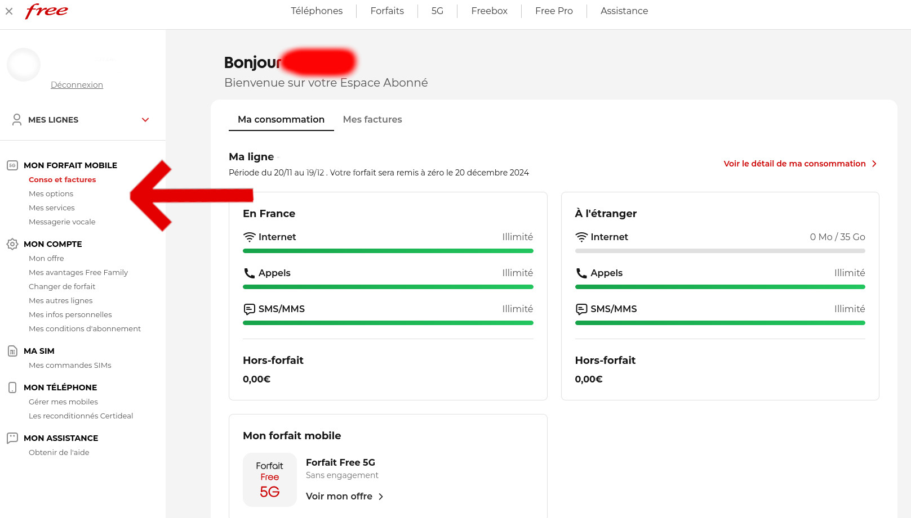

Cette intégration vous permet d'envoyer des SMS sur votre téléphone portable avec l'opérateur mobile français [Free Mobile](https://mobile.free.fr).

## **Prérequis**

Vous devez vous rendre sur la page de [Free Mobile](https://mobile.free.fr) et cliquer sur [Espace Abonné](https://mobile.free.fr/account/v2/login) 

Vous devez ensuite accéder à la page des options.

Activer l'option `Notifications par SMS`

:::note
Si vous désactivez puis réactivez l'option Notification par SMS, assurez-vous de mettre à jour votre clé API dans votre configuration.
:::

## Saisissez cette clé dans Gladys Assistant

Rendez-vous dans "Intégrations" -> "Free Mobile".

Entrez votre identifiant client et votre clé API, puis cliquez sur "Sauvegarder".

## Envoyez votre premier SMS

Vous pouvez maintenant utiliser cette intégration depuis les [Scènes](../scenes/intro.md).

