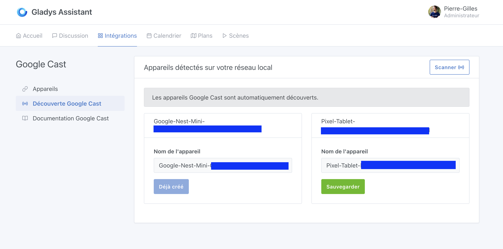
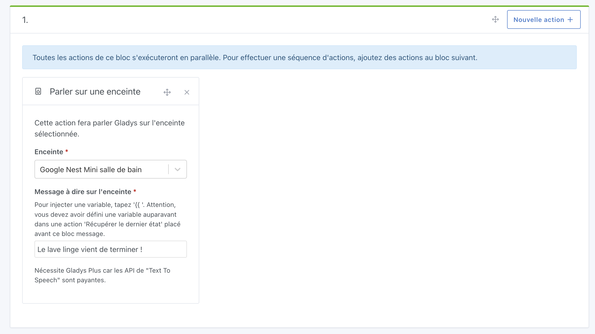

Gladys Assistant peut diffuser des messages vocaux sur une enceinte Google ou tout autre appareil compatible Google Cast.

## Ajouter une enceinte Google à Gladys Assistant

1. Accédez à l'intégration **Google Cast** dans l'interface de Gladys.
2. Ouvrez l'onglet **Découverte Google Cast** : les appareils compatibles présents sur votre réseau devraient apparaître automatiquement.

3. Sélectionnez l'appareil souhaité et cliquez sur **Sauvegarder**.
4. Rendez-vous ensuite dans l'onglet **Appareils** et assignez l'enceinte à la pièce correspondante.

## Faire parler Gladys Assistant sur une enceinte

Une fois l'enceinte ajoutée, vous pouvez l'utiliser dans une scène grâce à l'action **Parler sur une enceinte** :

### Remarque importante

:::note
Cette fonctionnalité nécessite un abonnement **Gladys Plus**, car elle repose sur une API de synthèse vocale (TTS) basée sur l'IA, qui est un service payant.

À terme, nous aimerions proposer une solution 100 % locale, mais pour l'instant, il n'existe pas d'alternative de qualité en français qui fonctionne en local.
:::
