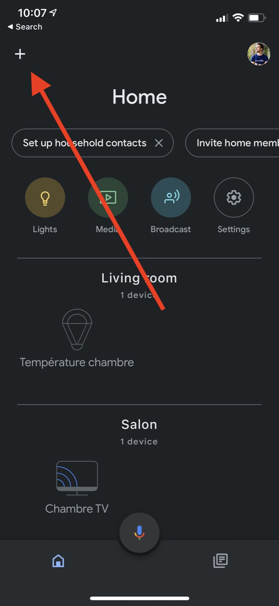
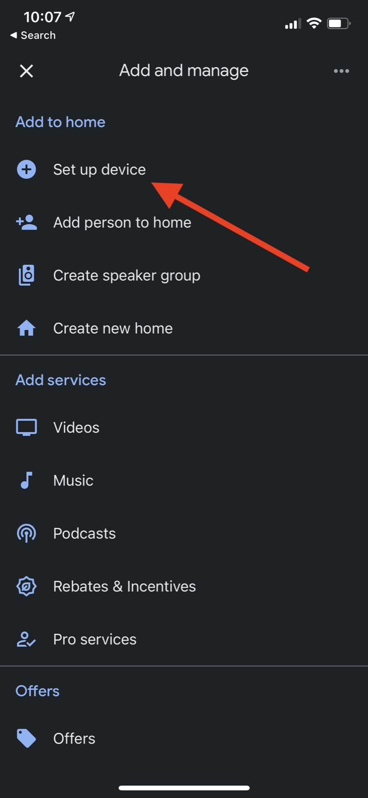
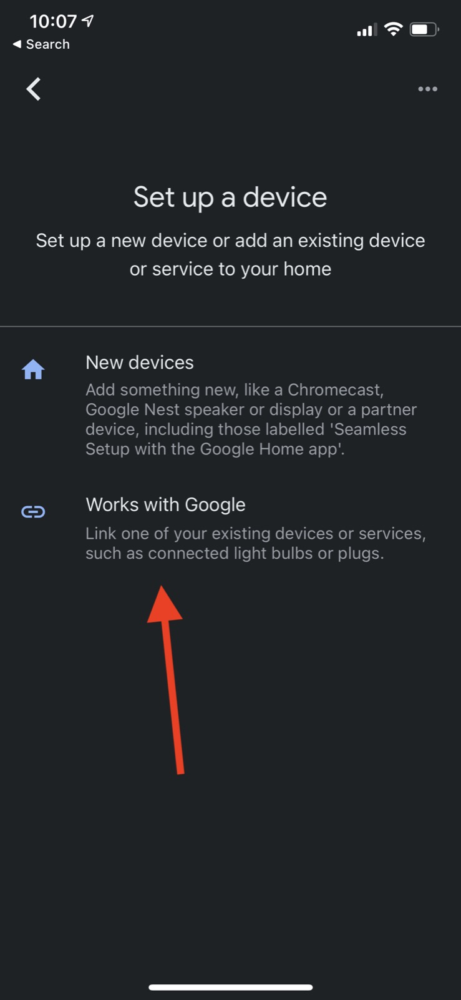
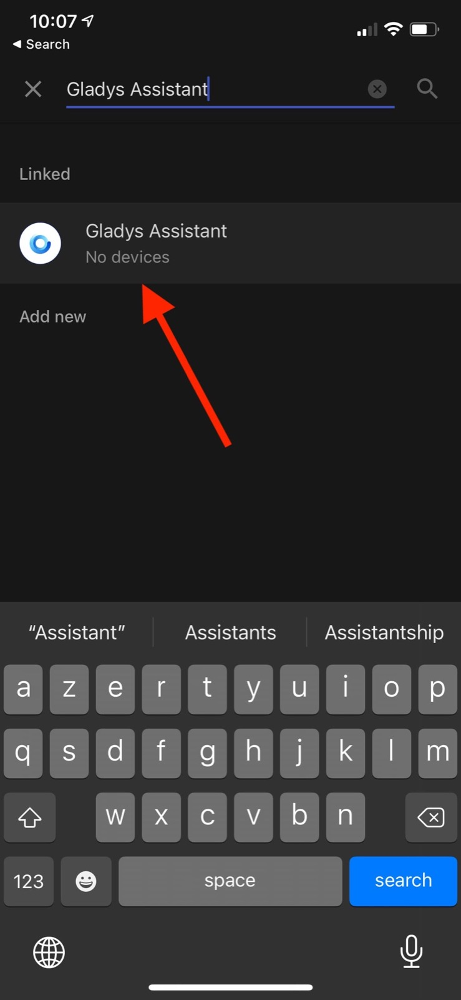
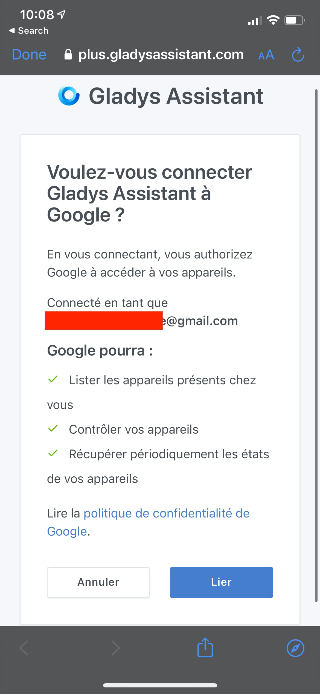

Salut à tous !

L'intégration Google Home est maintenant disponible pour tous 🥳

Ce tutoriel vous expliquera comment configurer Google Home en quelques minutes sur votre instance Gladys.

## Un petit mot avant de commencer

L'intégration Google Home est une intégration particulière.

Google Home étant un produit 100% Cloud, Google demande à ce que ses partenaires soient eux aussi hébergés dans le Cloud.

Ainsi, contrairement aux autres intégrations qui peuvent fonctionner entièrement localement, Google Home par nature ne peut fonctionner qu'en passant par une intégration approuvée par Google, et hébergée dans le cloud.

Afin de permettre à la communauté Gladys d'utiliser Google Home avec Gladys, nous avons développé notre propre intégration Google Home, via [Gladys Plus](/fr/plus), notre passerelle web.

Etre partenaire Google Home n'était pas une tâche facile, il nous a fallu:

- Passer une certification pour être partenaire Google Home
- Valider des tests automatisées
- Passer une revue manuelle avec un employé de chez Google

Tout ce process, la maintenance et les coûts d'infrastructure demandée par cette intégration justifie la participation que nous demandons pour faire fonctionner cette intégration, et j'espère que vous comprendrez.

## Créer un compte Gladys Plus

Tu peux créer un compte sur cette page de [Gladys Plus](/fr/plus).

Il y a une période d'essai de 14 jours si tu veux essayer gratuitement.

N'hésite pas à nous faire des retours (par email ou sur le forum) !

## Configurer Gladys Plus

Tu vas normalement recevoir un email qui t'expliquera comment configurer Gladys Plus.

Tu peux suivre les étapes dans le mail.

Si tu veux, j'ai aussi fais un live où je montre comment configurer Gladys Plus:

<iframe  class="video" src="https://www.youtube.com/embed/TmjrBeufjyo" title="YouTube video player" frameborder="0" allow="accelerometer; autoplay; clipboard-write; encrypted-media; gyroscope; picture-in-picture" allowfullscreen></iframe>

## Configurer Google Home

Tout d'abord, rendez-vous sur l'application Google Home disponible sur iOS et Android.

Cliquez sur le bouton "+" en haut à gauche de l'écran :

Ensuite cliquez sur le bouton "set up device" :

Puis cliquez sur "Works with Google" :

Enfin, cherchez "Gladys Assistant" :

En cliquant, Google va vous demander de vous connecter sur Gladys Plus.

Connectez-vous, et vous devriez arriver sur cette page :

Cliquez sur "Lier", et c'est bon !

## Appareils compatibles

Pour l'instant, seuls les appareils suivants sont supportés par l'intégration :

- Lampes (On/Off, Couleur et luminosité)
- Prises (On/Off)

Sur demande, nous ajouterons d'autres appareils suivant les besoins de la communauté.

Je vous invite à poster un message sur [le forum](https://community.gladysassistant.com/), ou à me contacter par email si jamais une intégration vous manque.
