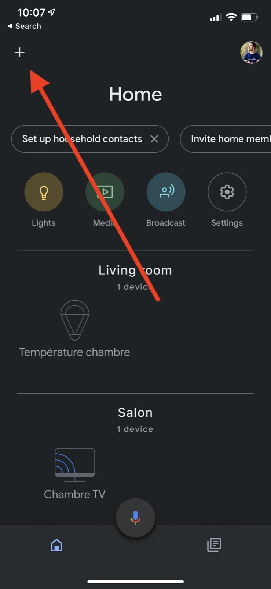
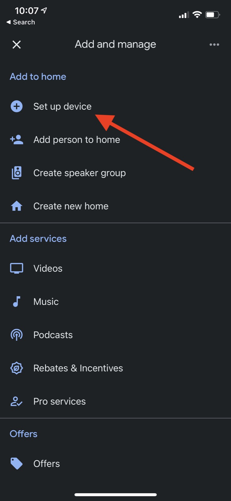
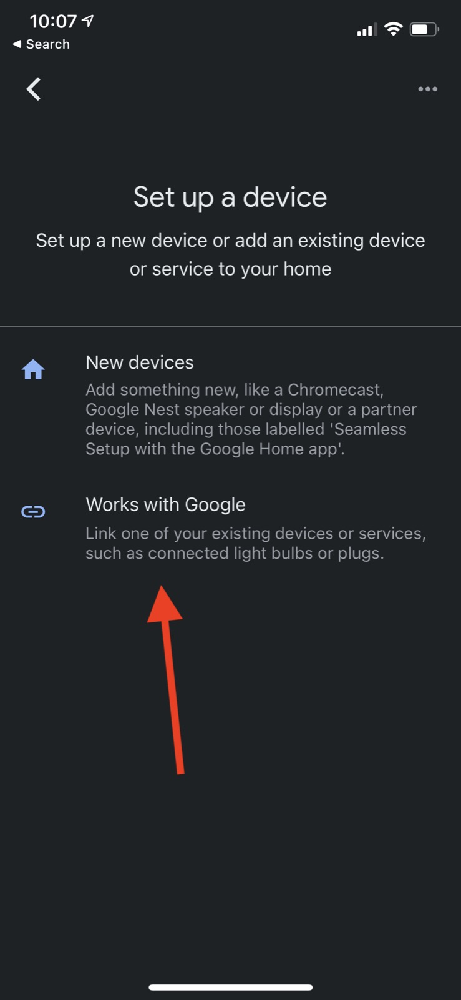
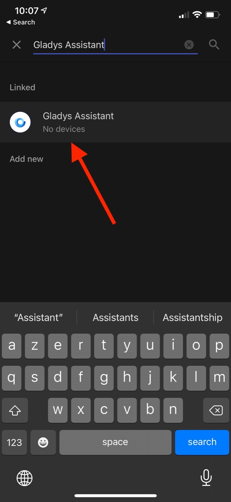
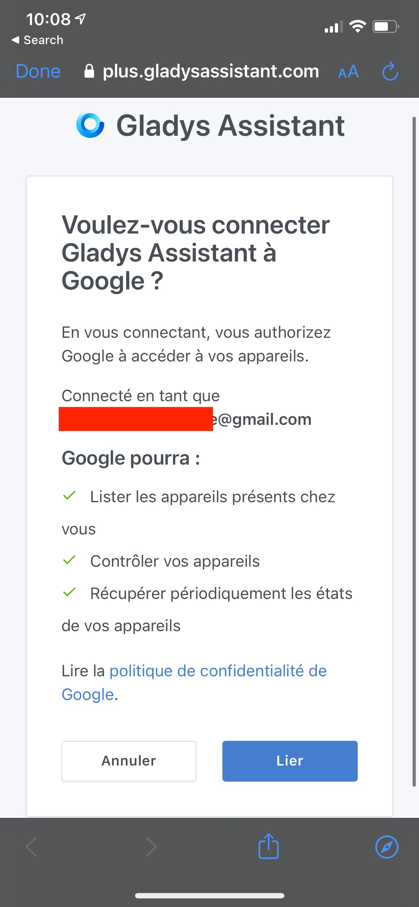

## Introduction

Ce tutoriel vous guidera dans la configuration de Google Home en quelques minutes sur votre instance Gladys.

## Un petit mot avant de commencer

L'intégration Google Home est particulière car Google Home étant un produit 100 % Cloud, Google impose que ses partenaires soient également hébergés dans le Cloud.

Ainsi, contrairement aux autres intégrations qui peuvent fonctionner entièrement localement, Google Home ne peut fonctionner qu'en passant par une intégration approuvée par Google et hébergée dans le cloud.

Pour permettre à la communauté Gladys d'utiliser Google Home, nous avons développé notre propre intégration via [Gladys Plus](/fr/plus), notre passerelle web.

### Devenir partenaire Google Home

Obtenir cette certification n'a pas été simple. Nous avons dû :

- Passer une certification pour être partenaire Google Home
- Valider des tests automatisés
- Passer une revue manuelle avec un employé de chez Google

Tout ce processus, ainsi que la maintenance et les coûts d'infrastructure associés, justifient la participation demandée pour utiliser cette intégration. Nous espérons que vous comprendrez cette nécessité.

## Créer un compte Gladys Plus

Vous pouvez créer un compte directement sur la page de [Gladys Plus](/fr/plus).

Une période d'essai de 14 jours est disponible si vous souhaitez tester le service gratuitement.

N'hésitez pas à nous faire des retours par email ou sur le forum !

## Configurer Gladys Plus

Après votre inscription, vous recevrez un email détaillant la configuration de Gladys Plus.

Vous pouvez suivre les instructions du mail ou consulter la vidéo ci-dessous :

<iframe  src="https://www.youtube.com/embed/TmjrBeufjyo" title="YouTube video player" frameborder="0" allow="accelerometer; autoplay; clipboard-write; encrypted-media; gyroscope; picture-in-picture" allowfullscreen></iframe>

## Configurer Google Home

1. **Ouvrez l'application Google Home** sur iOS ou Android.
2. **Cliquez sur le bouton "+"** en haut à gauche de l'écran.

   

3. **Sélectionnez "Configurer un appareil"**.

   

4. **Cliquez sur "Fonctionne avec Google"**.

   

5. **Recherchez "Gladys Assistant"** et sélectionnez-le.

   

6. **Connectez-vous avec votre compte Gladys Plus**.

   

7. **Cliquez sur "Lier"**, et c'est terminé ! 🎉

## Appareils compatibles

Actuellement, seuls les appareils suivants sont pris en charge par l'intégration :

- **Lampes** (On/Off, Couleur et Luminosité)
- **Prises** (On/Off)

D'autres appareils pourront être ajoutés en fonction des besoins de la communauté.

Si une intégration vous manque, n'hésitez pas à :

- **Poster un message sur [le forum](https://community.gladysassistant.com/)**
- **Nous contacter par email**

Bonne configuration ! 🚀
