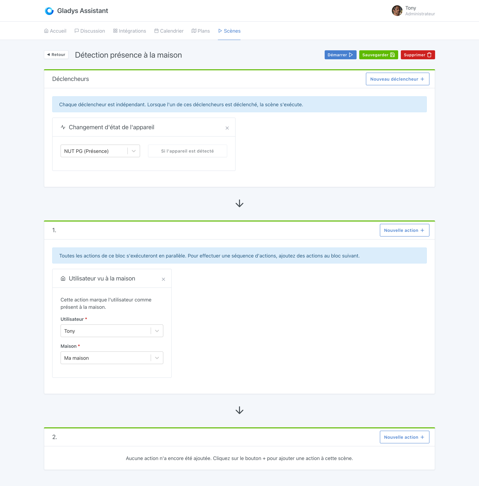
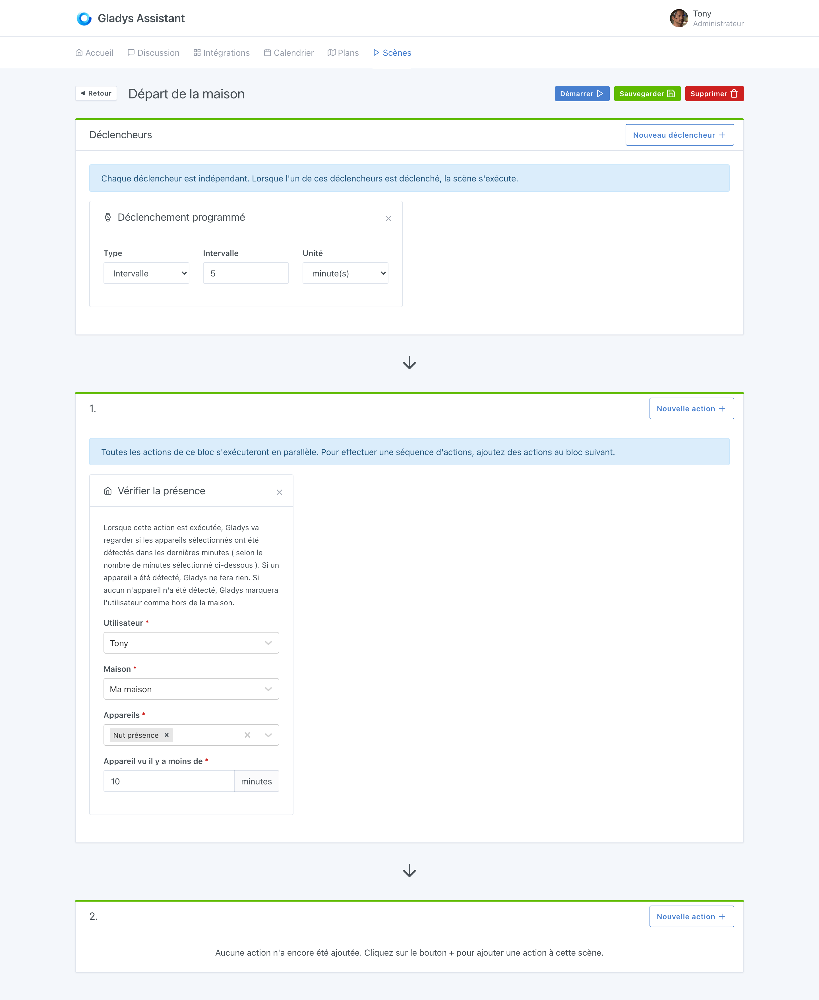
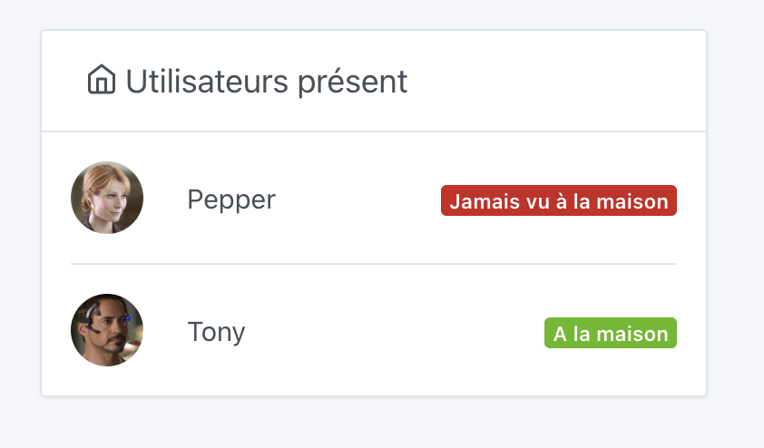

L'intégration LAN Manager vous permet de scanner votre réseau à interval régulier, afin de déterminer si vous êtes à la maison où si vous n'êtes pas là, grâce à la présence de votre téléphone/tablette/ordinateur.

:::note
Cette méthode peut avoir des faux négatifs, si votre téléphone n'est pas tout le temps connecté au Wi-Fi (passe en veille par exemple).
Ce n'est pas une méthode très fiable.
:::

:::warning
Cette méthode ne fonctionne pas sur iPhone.

Sur iPhone, je vous conseille d'utiliser l'application "Raccourci" et d'envoyer une requête à Gladys quand vous quittez la maison.
:::

## Ajouter votre téléphone Android

Rendez-vous dans l'intégration "LAN Manager", puis cliquez sur "Découverte LAN" puis "Recherche sur le réseau".

Puis créer l'appareil en cliquant sur "Sauvegarder".

Si cette recherche ne donne rien, vérifiez:

- Que votre installation Gladys est bien sur le bon réseau
- Que votre container Gladys tourne bien en "network=host", ce qui est le cas si tu as lancé Gladys avec le docker run officiel.
- Que le CIDR à scanner est bien le bon (à modifier dans les paramètres de cette intégration)

## Gérer la présence dans les scènes

### Une scène "retour à la maison"

Maintenant, nous allons créer une scène qui va vous marquer comme "présent à la maison" quand ce téléphone est détecté.

Rendez-vous dans l'onglet "Scènes", et créez une scène comme celle-ci:

La scène est très simple.

QUAND "Le téléphone est détecté" ALORS "mettre l'utilisateur Tony comme présent à la maison".

### Une scène "départ de la maison"

Pour gérer le départ de la maison, je vous recommande de faire une scène exécutée périodiquement qui va vérifier si votre téléphone a été détecté récemment à la maison, ou pas.

Si oui, Gladys ne fera rien. Si non, Gladys marquera l'utilisateur comme absent.

La scène doit ressembler à ça :

Vous pouvez jouer avec les réglages en fonction de votre maison. Si vous estimez que 10 minutes c'est trop court pour être mis comme absent, vous pouvez rallonger à 20 minutes pour éviter les "faux-départs" :)

## Afficher la présence sur le tableau de bord

Maintenant, si vous voulez afficher la présence des différents utilisateurs à la maison, vous pouvez utiliser la box "Utilisateurs présents":

