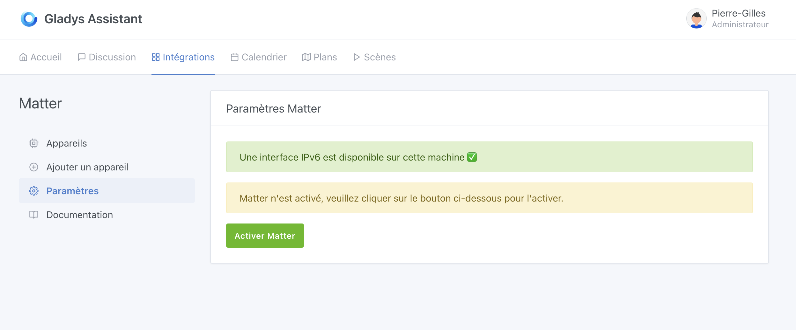
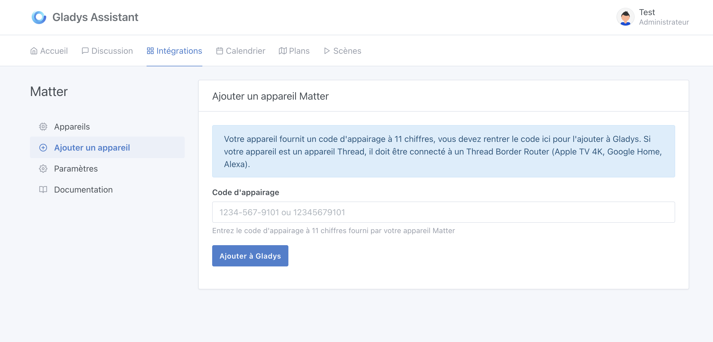
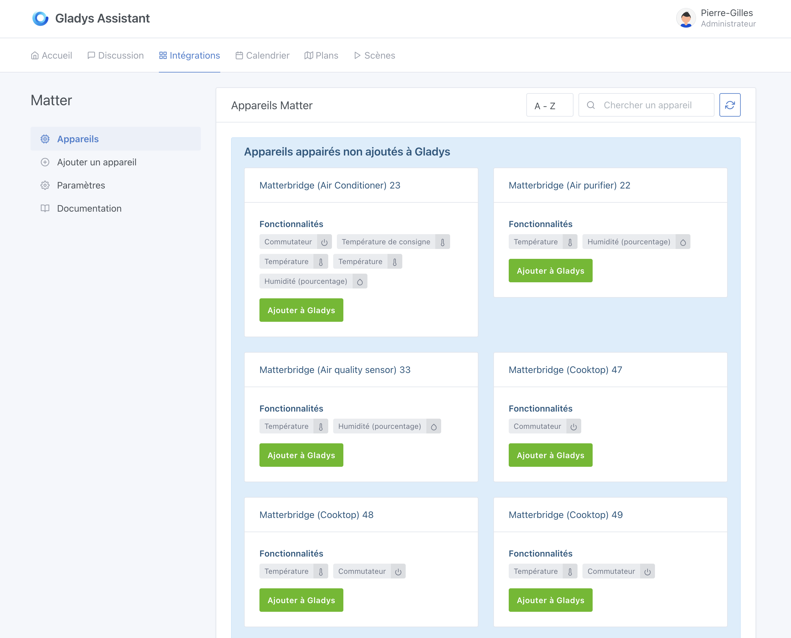
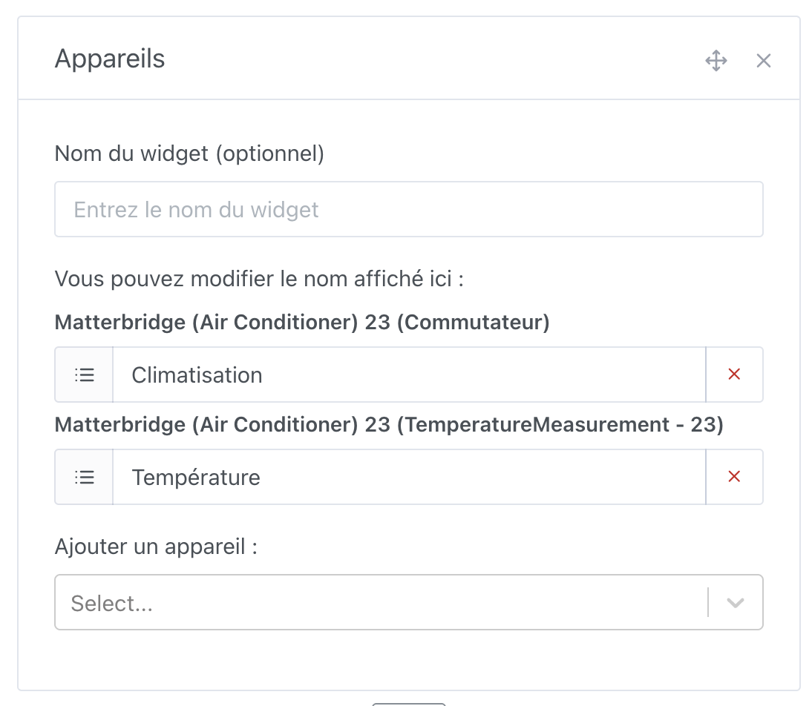
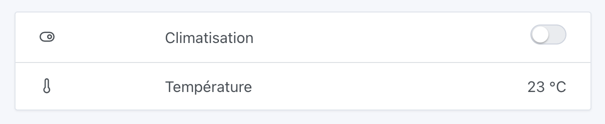

Le protocole Matter est une petite révolution dans le monde de la maison connectée : il permet enfin d'unifier la communication entre les appareils intelligents de différents fabricants.

Gladys Assistant est compatible avec Matter, et vous pouvez donc intégrer des appareils Matter dans votre installation.

## Compatibilités

Gladys supporte les fonctionnalités suivantes :

- **On/Off** : prises, lumières, climatisation, chauffage, ventilateurs, etc.
- **Lumières** : gestion de la luminosité et des couleurs.
- **Volets roulants / rideaux** : Monter, descendre, pause + réglage de la position.
- **Thermostats** : réglage de la température cible.
- **Climatisations** : réglage de la température cible.
- **Capteurs de mouvement**
- **Capteurs de luminosité**
- **Capteurs de température**
- **Capteurs d’humidité**

Si vous avez un appareil qui n'est pas encore géré, n'hésitez pas à venir en parler sur le [forum](https://community.gladysassistant.com/) et nous ajouterons la compatibilité.

## Matter vs Thread

Matter est un **protocole applicatif**, c’est-à-dire qu’il définit comment les appareils communiquent entre eux au niveau des messages échangés : quels types de commandes sont possibles (par exemple, allumer une lumière, relever la température), dans quel format ces messages sont envoyés, et comment les appareils gèrent leur état, l’appairage, ou encore la sécurité.

En résumé, Matter se concentre sur le “quoi” et le “comment” des interactions entre appareils connectés.

Thread, de son côté, est un **protocole de réseau maillé bas niveau**, conçu pour les communications entre appareils à faible consommation d’énergie, sans fil. Il fonctionne comme une alternative au Zigbee ou au Wi-Fi, mais contrairement à ces derniers, il repose sur des standards IP (IPv6), ce qui le rend nativement compatible avec Internet.

Thread gère le “comment ça circule”, c’est-à-dire le transport des messages à travers un réseau sans fil fiable, rapide et sécurisé.

Il existe des appareils Matter utilisant Thread comme protocole réseau, mais pas que ! Il existe aussi des appareils Matter utilisant Wi-Fi, Ethernet, ou même Bluetooth comme protocole réseau.

### Si votre appareil est déjà sur votre réseau

Si votre appareil est compatible Matter et utilise le Wi-Fi/Ethernet, il est déjà sur votre réseau et peut-être utilisé directement dans Gladys !

C'est par exemple le cas de tous les bridges Matter proposés par des fabricants comme Philips Hue, IKEA via leur passerelle DIRIGERA, etc.

C'est aussi le cas de tous les appareils Wi-Fi comme des prises connectées, ampoules directement connectées au Wi-Fi.

### Matterbridge

[Matterbridge](https://github.com/Luligu/matterbridge) est un projet open-source qui a pour objectif d'importer dans un réseau Matter des appareils qui ne sont pas compatibles Matter à la base.

A ce jour, Matterbridge supporte :

- [Shelly](https://github.com/Luligu/matterbridge-shelly)
- [Somfy Tahoma](https://github.com/Luligu/matterbridge-somfy-tahoma)
- [Zigbee2mqtt](https://github.com/Luligu/matterbridge-zigbee2mqtt)
- [Home Assistant](https://github.com/Luligu/matterbridge-homeassistant)
- [Webhooks](https://github.com/Luligu/matterbridge-webhooks)
- [BTHome](https://github.com/Luligu/matterbridge-bthome)
- [Loxone](https://github.com/andrasg/matterbridge-loxone)

### Si votre appareil utilise Thread uniquement

Si votre appareil utilise Thread, il faudra le connecter à un routeur Thread avant de pouvoir l'utiliser dans Gladys.

Le routeur Thread (ou "Thread Border Router" en anglais) fait le pont entre vos appareils Threads et votre réseau local à la maison.

Beaucoup d'appareils du commerce sont des routeurs Thread :

- Apple TV 4K Ethernet 128 Go
- Apple HomePod
- Google Nest Hub Max
- Google Nest Hub (2ème génération)
- Google Nest Wi-Fi Pro
- Google TV Streamer 4K
- Amazon Echo (4ème génération)
- Amazon Echo Hub
- Amazon Echo Studio
- Amazon Echo Show (21, 15, 10 et 8)

Il est aussi possible de mettre en place un routeur Thread soit même avec un dongle USB Thread et OpenThread.

## Configuration dans Gladys Assistant

Rendez-vous dans l'onglet "Intégrations" puis "Matter".

Vous devez tout d'abord activer Matter dans les paramètres :

:::note
Matter fonctionne avec IPv6, il faut donc qu'IPv6 soit activé sur votre routeur et sur votre machine.
Gladys liste les interfaces présentes sur la machine, et si aucune interface n'est trouvée, elle vous affichera un message d'erreur.
:::

Ensuite, rendez-vous dans l'onglet "Ajouter un appareil" pour appairer un nouvel appareil Matter :

Pour ajouter un appareil Matter, vous aurez besoin d'un code d'appairage à 11 chiffres.

:::note
Si votre appareil est déjà connecté à un autre contrôleur Matter, vous devrez utiliser un code d'appairage fourni par ce contrôleur, et non le code de l'appareil. **Exemple :** J'ai une prise Eve connectée à mon Apple TV 4K Ethernet. Le code d'appairage se trouve dans l'application "Maison" sur iOS.
:::

Une fois que l'appareil est appairé, rendez-vous dans l'onglet "Appareils" pour l'ajouter à Gladys.

Sur cet onglet, vous retrouvez tous les appareils Matter apparairés, et ceux que vous avez déjà ajoutés à Gladys :

Une fois l'appareil ajouté, vous pouvez l'utiliser sur votre tableau de bord et dans les scènes.

## Exemple : Contrôler votre climatisation sur le tableau de bord

Sur le tableau de bord, vous pouvez maintenant ajouter un widget "Appareils" et sélectionner votre climatisation Matter :

Une fois que vous enregistrez le tableau de bord, votre climatisation devient compatible Matter :

