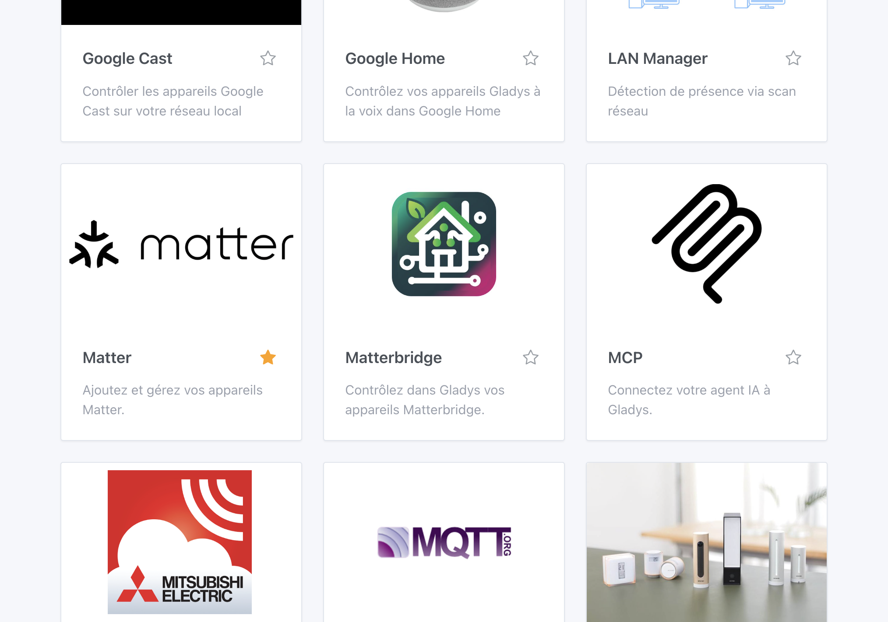
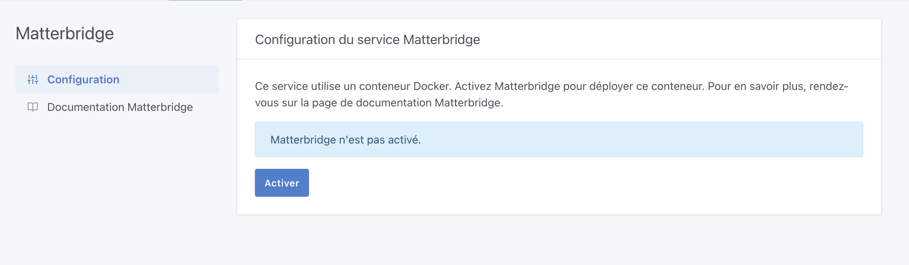

[Matterbridge](https://github.com/Luligu/matterbridge) est un pont Matter qui permet de connecter des appareils non-Matter à un écosystème Matter. Grâce à ses nombreux plugins, Matterbridge peut exposer des appareils de différents fabricants (Shelly, Somfy, etc.) vers Gladys via le protocole Matter.

## Activer Matterbridge

Dans Gladys, rendez-vous dans `Intégrations / Matterbridge`.

Gladys a besoin d'installer un container Docker pour faire fonctionner Matterbridge. Ne vous inquiétez pas, tout cela a été automatisé.

Cliquez sur le bouton **Activer** pour lancer le container Matterbridge.

Après quelques instants (le temps dépend de votre matériel et de votre bande passante), Matterbridge sera opérationnel.

## Utilisation

Une fois Matterbridge lancé, vous pouvez accéder à son interface web pour :

- Installer des plugins (Shelly, Somfy Tahoma, etc.)
- Configurer vos appareils
- Obtenir le code d'appairage Matter

Consultez la [documentation officielle de Matterbridge](https://github.com/Luligu/matterbridge) pour plus de détails sur la configuration des plugins.
