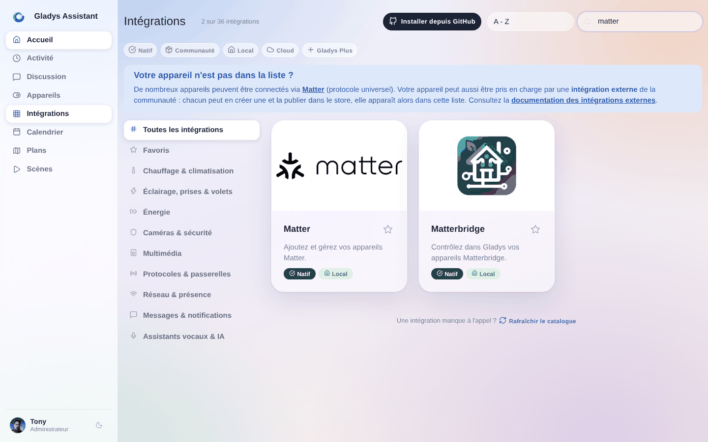
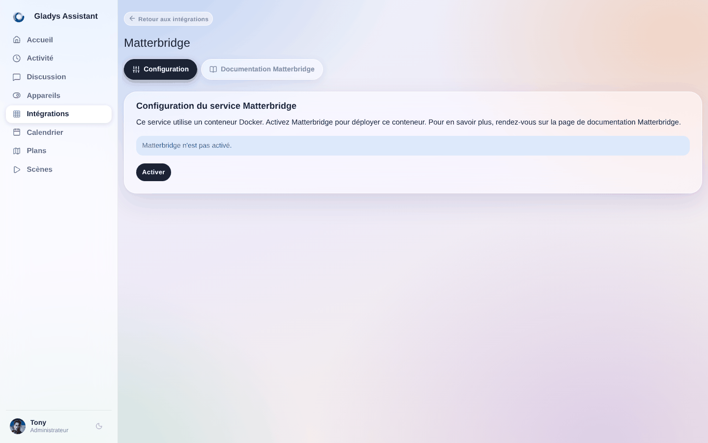

:::tip
Pour ajouter un appareil ou un service qui n'a pas d'intégration native, les [intégrations externes](/fr/docs/integrations/external/) sont la voie recommandée : vous les installez en un clic depuis Gladys, et n'importe qui peut [en créer une](/fr/docs/dev/external-integrations/).

La plupart des appareils pour lesquels Matterbridge était recommandé ont aujourd'hui une intégration externe qui leur parle directement, sans pont Matter intermédiaire : [Overkiz](/fr/docs/integrations/external/overkiz/) pour les box Somfy TaHoma, TaHoma Switch et Connexoon, [Shelly](/fr/docs/integrations/external/shelly/) pour les appareils Shelly. Commencez par [parcourir le catalogue](/fr/docs/integrations/external/) : Matterbridge est la solution de repli quand rien ne couvre votre appareil.
:::

[Matterbridge](https://github.com/Luligu/matterbridge) est un pont Matter qui permet de connecter des appareils non-Matter à un écosystème Matter. Grâce à ses nombreux plugins, Matterbridge peut exposer des appareils de différents fabricants vers Gladys via le protocole Matter.

## Activer Matterbridge

Dans Gladys, rendez-vous dans `Intégrations / Matterbridge`.

Gladys a besoin d'installer un container Docker pour faire fonctionner Matterbridge. Ne vous inquiétez pas, tout cela a été automatisé.

Cliquez sur le bouton **Activer** pour lancer le container Matterbridge.

Après quelques instants (le temps dépend de votre matériel et de votre bande passante), Matterbridge sera opérationnel.

## Utilisation

Une fois Matterbridge lancé, vous pouvez accéder à son interface web pour :

- Installer des plugins
- Configurer vos appareils
- Obtenir le code d'appairage Matter

Consultez la [documentation officielle de Matterbridge](https://github.com/Luligu/matterbridge) pour plus de détails sur la configuration des plugins et pour la liste des plugins disponibles.

Une fois qu'un plugin expose vos appareils, appairez le pont dans Gladys depuis l'[intégration Matter](/fr/docs/integrations/matter/) : copiez le code d'appairage affiché par Matterbridge, puis ajoutez-le dans `Intégrations / Matter`.
