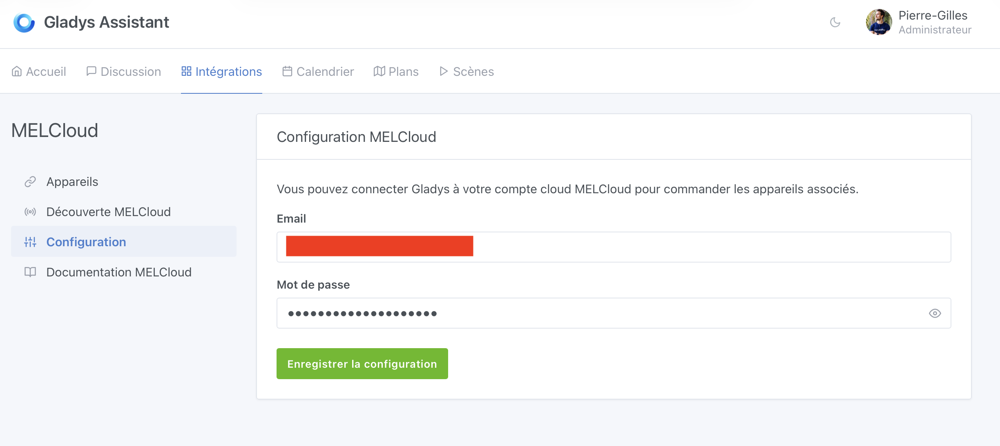
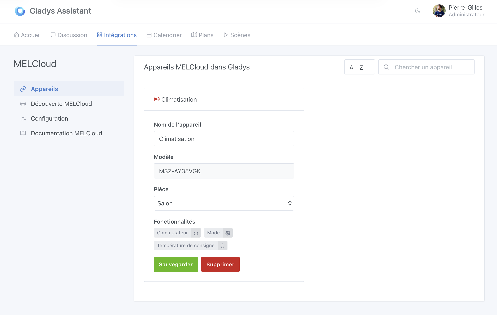
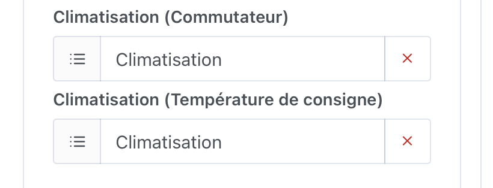
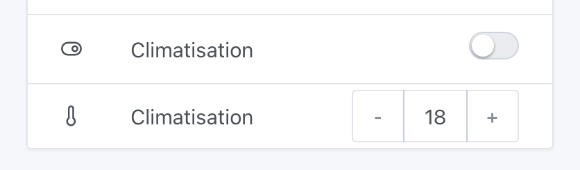

MELCloud est le service cloud de Mitsubishi Electric qui permet de contrôler vos climatiseurs Mitsubishi à distance. Avec cette intégration, vous pouvez contrôler votre climatisation Mitsubishi directement depuis Gladys Assistant.

## Prérequis

- Un climatiseur Mitsubishi compatible avec MELCloud
- Un compte MELCloud (créez-en un sur [app.melcloud.com](https://app.melcloud.com))
- Votre climatiseur doit être configuré et fonctionnel dans l'application MELCloud

## Connecter MELCloud à Gladys

Rendez-vous dans `Intégrations -> MELCloud` dans Gladys.

### Étape 1 : Configurer votre compte MELCloud

Dans l'onglet `Configuration`, entrez vos identifiants MELCloud :

- **Email** : L'email de votre compte MELCloud
- **Mot de passe** : Le mot de passe de votre compte MELCloud

Cliquez sur `Sauvegarder la configuration` pour connecter Gladys à votre compte MELCloud.

### Étape 2 : Découvrir et ajouter vos appareils

Une fois connecté, allez dans l'onglet `Découverte MELCloud` pour voir tous vos appareils disponibles.

Pour chaque appareil que vous souhaitez ajouter à Gladys :

1. Sélectionnez la pièce où se trouve l'appareil
2. Cliquez sur `Sauvegarder` pour ajouter l'appareil à Gladys

L'appareil apparaîtra dans l'onglet `Appareils` avec ses fonctionnalités :

- **Interrupteur (On/Off)** : Allumer ou éteindre la climatisation
- **Mode** : Changer le mode de fonctionnement (refroidissement, chauffage, etc.)
- **Température cible** : Définir la température souhaitée

### Étape 3 : Ajouter au tableau de bord

Pour contrôler votre climatisation depuis le tableau de bord, allez dans `Tableau de bord` et modifiez votre tableau de bord pour ajouter les fonctionnalités de l'appareil que vous souhaitez afficher.

### Étape 4 : Contrôler votre climatisation

Vous pouvez maintenant contrôler votre climatisation Mitsubishi directement depuis le tableau de bord Gladys :

- Allumer/éteindre la climatisation
- Ajuster la température cible

## Utilisation dans les scènes

Vous pouvez également utiliser vos appareils MELCloud dans les scènes Gladys pour automatiser votre climatisation. Par exemple :

- Allumer la climatisation quand la température dépasse un certain seuil
- Éteindre la climatisation quand vous quittez la maison
- Définir une température spécifique à une heure programmée

## FAQ

### Mes appareils n'apparaissent pas

Assurez-vous que vos appareils sont correctement configurés dans l'application MELCloud et que vous pouvez les contrôler depuis celle-ci. Ensuite, essayez de rafraîchir la découverte dans Gladys.

### Problèmes de connexion

Si vous avez des problèmes de connexion, vérifiez que :

- Vos identifiants MELCloud sont corrects
- Votre compte MELCloud est actif
- Vous avez une connexion internet

Si vous avez des questions, posez-les sur [le forum](https://community.gladysassistant.com/).
