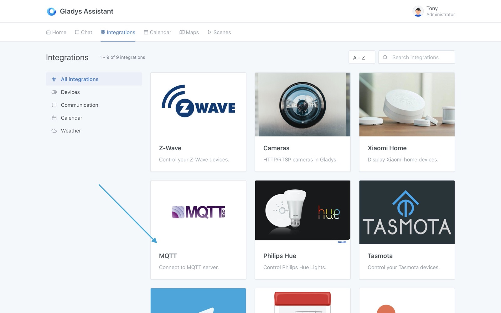
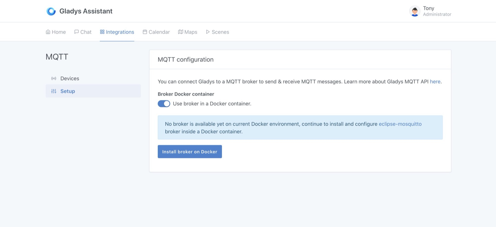
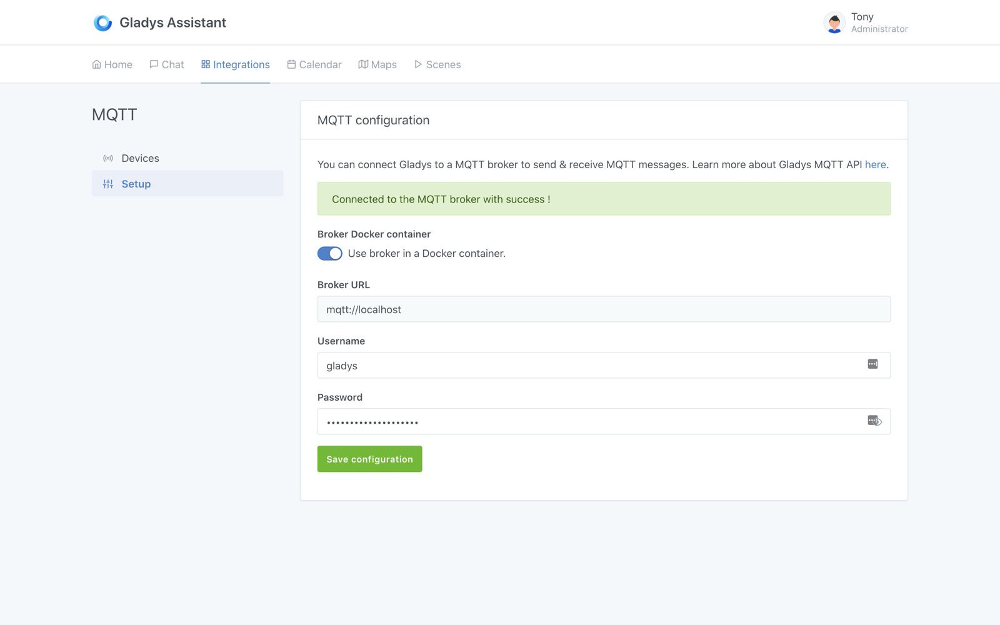
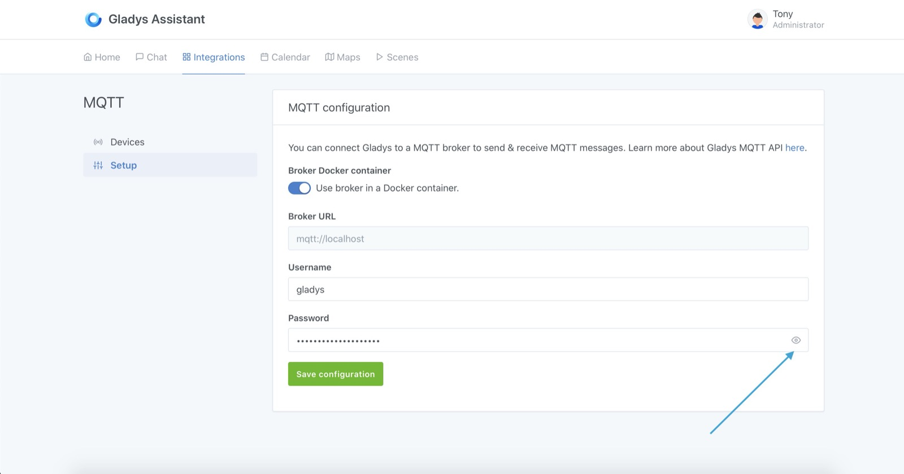
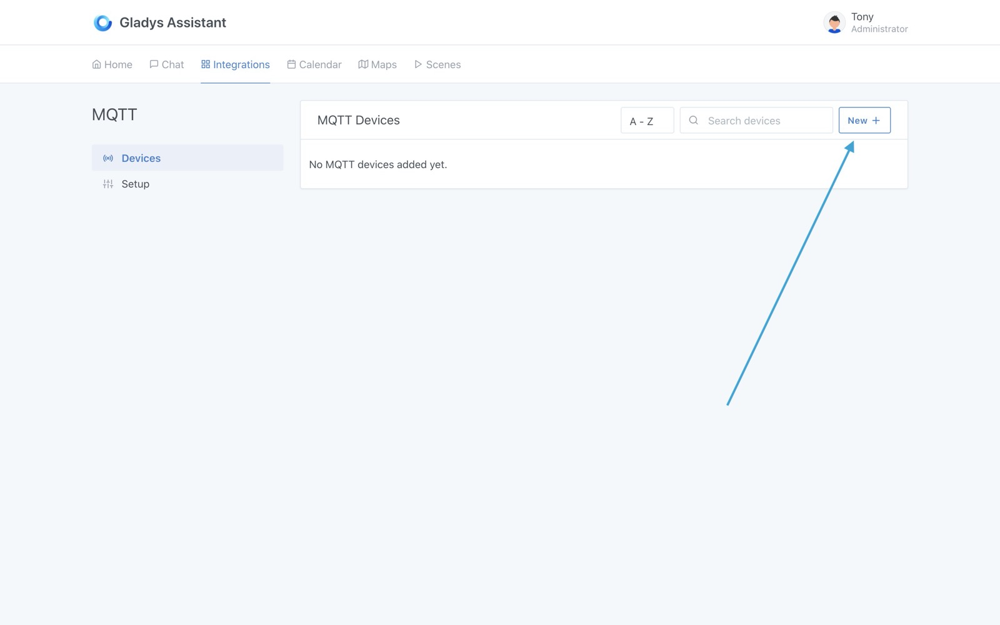
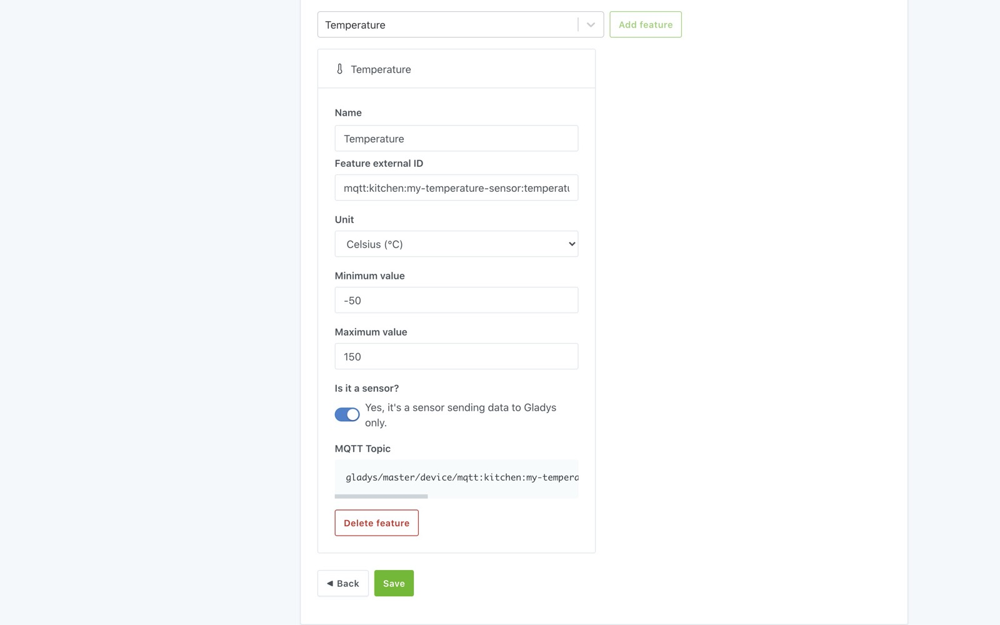
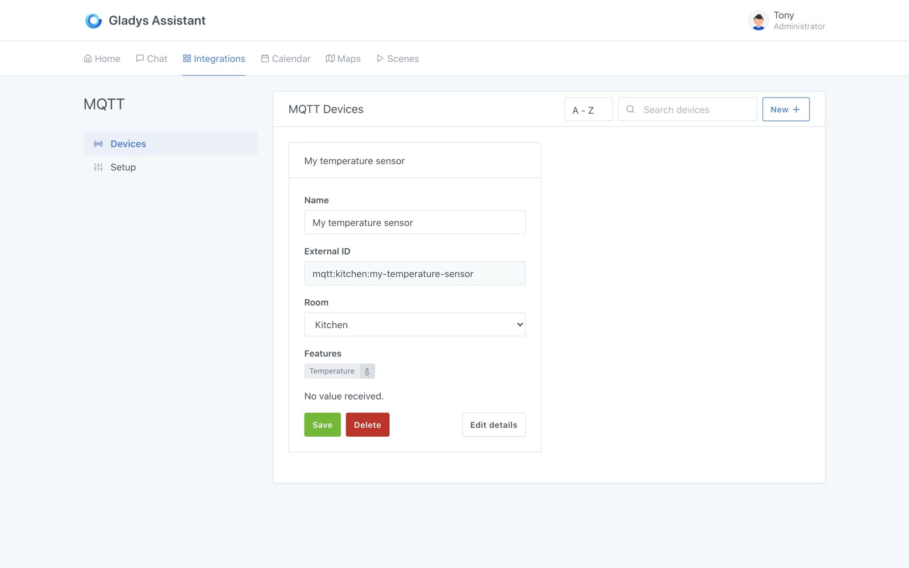
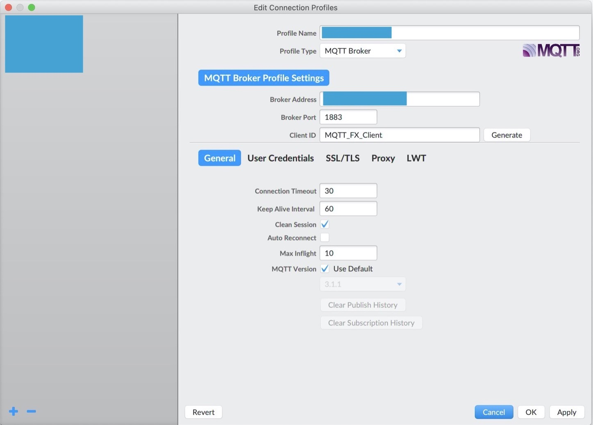
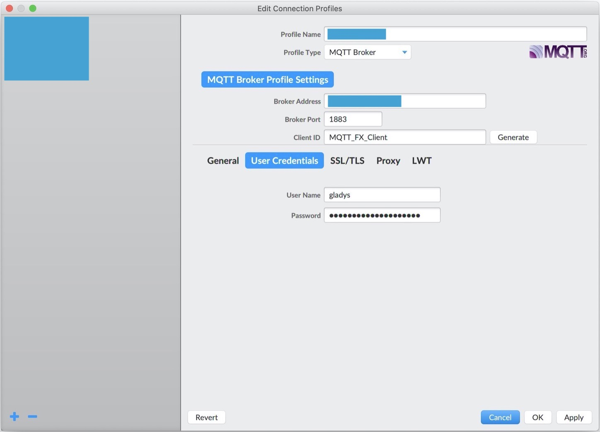
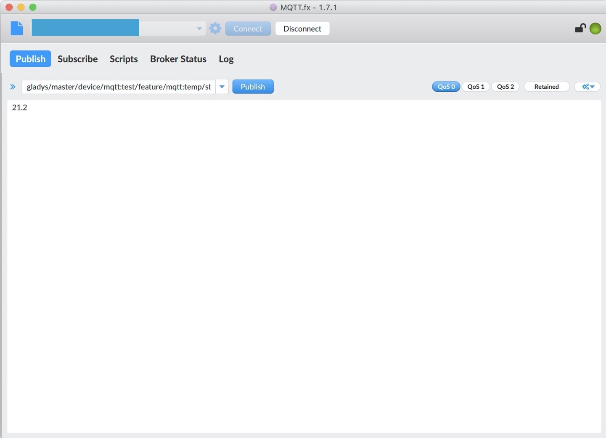

Ce tutoriel a pour objectif de vous expliquer comment fonctionne le MQTT dans Gladys Assistant.

Le MQTT est un protocole "publish/subscribe" ("publier/s'abonner") qui est beaucoup utilisé en domotique car il est très léger et est implémenté sur de nombreuses plateformes de DIY (Arduino, ESP8266 NodeMCU) et dans la plupart des langages de programmations (Javascript/Node.js, Python, PHP, C/C++, Java, et j'en passe).

Concrètement, le MQTT vous permet d'envoyer une valeur d'un périphérique connecté (ex: un capteur de température faisant des relevés de température toutes les 10 minutes) vers Gladys, ou au contraire, d'envoyer depuis Gladys une commande domotique a un actionneur (Ex: envoyer l'ordre à un volant roulant de s'ouvrir).

Gladys implémente donc une API MQTT dans les deux sens:

- "Périphérique -> Gladys"
- "Gladys -> Périphérique"

L'API MQTT est décrite dans [la documentation MQTT](/fr/docs/api/mqtt-api).

## Configurer un broker MQTT dans Gladys Assistant

Le tutoriel qui va suivre implique que vous ayez installé Gladys Assistant 4 avec l'image Rasbian officielle tel que [décrit ici](/fr/docs/), ou que vous ayez Gladys installé via Docker.

Première étape, rendez-vous dans Gladys, rubrique `Intégrations`, et ouvrez l'intégration MQTT:

Ensuite, rendez-vous dans l'onglet "Configuration" afin de configurer votre broker MQTT.

Il y a 2 possibilités à cette étape:

- Soit vous laissez Gladys lancer toute seule un broker MQTT (via Docker). Cette option est recommandée, c'est la façon la plus simple d'utiliser le MQTT dans Gladys.
- Soit vous configurez vous même un broker MQTT (en local, ou distant). Cette option peut-être utile si vous avez déjà un broker MQTT qui tourne sur un serveur à vous, ou que vous voulez utiliser un broker MQTT en ligne.

Dans ce tutoriel, nous allons prendre l'option n°1.

Vous pouvez donc lancer la création du broker MQTT automatiquement par Gladys.

Suivant votre connexion internet, et la puissance de votre machine, cela peut prendre en quelques secondes et quelques minutes.

Vous pouvez cliquer sur le petit oeil afin de voir le mot de passe que Gladys a généré pour votre broker MQTT.

Je vous recommande de noter ce mot de passe quelque part.

Nous avons donc un broker MQTT qui tourne, et qui est connecté à Gladys !

## Déclarer un périphérique MQTT dans Gladys

Dans ce tutoriel, nous allons prendre l'exemple d'un capteur de température placé dans la cuisine qui renvoie des valeurs de température toutes les 10 minutes à Gladys.

Tout d'abord, rendez-vous dans l'onglet "Appareils" de l'intégration MQTT, puis cliquez sur le bouton "Nouveau +" :

Remplissez le formulaire avec les informations de votre périphérique.

Remplissons le par exemple avec les informations suivantes:

- Nom: "Capteur de température"
- ID externe: `mqtt:cuisine:capteur-temperature`. Celui-ci ne doit pas avoir d'espace et doit commencer par `mqtt:`. Je vous recommande de garder une convention à travers votre installation Gladys, comme par exemple `mqtt:piece_de_la_maison:nom_du_peripherique`.
- Pièce: "Cuisine".

Ensuite, nous allons ajouter une fonctionnalité à ce périphérique.

En effet, dans Gladys, un périphérique "physique" peut avoir plusieurs "fonctionnalités". Certains constructeurs proposent des périphériques "multi-capteurs" (température/humidité/luminosité est un classique).

Dans la barre de recherche, cherchez "température" et sélectionnez "Capteur température/température". Cliquez sur "Ajouter fonctionnalité".

Vous pouvez ensuite remplir le formulaire avec les informations suivantes:

- Nom: "Température". C'est ce nom qui va s'afficher sur le dashboard.
- ID externe de la fonctionnalité: `mqtt:cuisine:capteur-temperature:temperature`. Je vous conseille ici aussi de garder une convention comme par exemple `mqtt:piece_de_la_maison:nom_du_peripherique:nom_de_la_fonctionnalite`.
- Unité: "°C"
- Valeur minimum: -50 (Disons que votre capteur de température va jusqu'à -50°C)
- Valeur maximum: 200 (Disons que votre capteur de température monte haut!)
- Est-ce un capteur?: Cette case sert à indiquer si votre périphérique fonctionne dans le sens "Périphérique -> Gladys" ou "Gladys -> Périphérique". Si vous mettez "Oui", alors ce périphérique est en "lecture seule", il ne fait que renvoyer des valeurs à Gladys. C'est le cas de notre capteur de température. Si vous mettez "non", ce périphérique est un actionneur qui peut être controlé par Gladys.
- Topic MQTT: C'est le topic dans lequel Gladys va "écouter" les nouvelles valeurs pour ce périphérique. Je vous conseille de le copier/coller quelque par pour plus tard.

Cliquez sur "Enregistrer", vous devriez sur un écran comme celui-ci:

## Tester le périphérique MQTT

Je vous propose d'utiliser un client MQTT afin de tester ce périphérique MQTT.

Vous pouvez utiliser le client MQTT [MQTT.fx](https://mqttfx.jensd.de/).

Après avoir installé et lancé MQTT.fx, cliquez sur la petite roue dentée afin d'ajouter les informations de connexion à votre broker MQTT.

Remplissez le formulaire avec les informations suivantes:

- Name: "Gladys MQTT". Ce nom n'est utile que pour l'affichage dans le logiciel.
- Broker Adress: L'adresse IP de votre Rasperry Pi sur le réseau. Vous devez être sur le même réseau que votre Raspberry Pi pour ce tutoriel.
- Broker Port: 1883

Ensuite, rendez-vous dans l'onglet "User Credentials", puis remplissez avec les informations de connnexion.

- User Name: `gladys`
- Password: Le mot de passe que Gladys a généré dans la première partie de ce tutoriel. Si vous n'aviez pas gardé le mot de passe, vous pouvez toujours le retrouver en retournant dans la configuration du module MQTT et en cliquant sur le petit oeil sur le champs mot de passe.

Enregistrer la configuration en cliquant sur "Ok", puis cliquez sur "Connect" en haut de l'écran pour vous connecter au broker MQTT.

Dans la bar en haut, mettez le topic MQTT que vous aviez copié-collé lors de la création de la fonctionnalité plus tôt.

Dans le champs du milieu, entrez une température, dans mon cas "21.2", puis cliquez sur "Publish":

Sur le dashboard, ajoutez une nouvelle box "Température de la pièce".

Vous devriez voir votre périphérique avec la température que nous venons d'envoyer:

Bravo !

## Pour allez plus loin

Si vous souhaitez écrire un programme qui envoie des données sur votre broker MQTT, il y a des librairies MQTT dans tous les languages.

Par exemple, en Node.js, vous pouvez utiliser le [package npm mqtt](https://www.npmjs.com/package/mqtt).

Il y a plein de tutoriels sur internet pour toutes les plateformes :)

J'ai enregistré un petit tutoriel en mode live coding pour Node.js par exemple:

<iframe class="video" src="https://www.youtube.com/embed/o5yn_FnYtkc" title="YouTube video player" frameborder="0" allow="accelerometer; autoplay; clipboard-write; encrypted-media; gyroscope; picture-in-picture" allowfullscreen></iframe>

