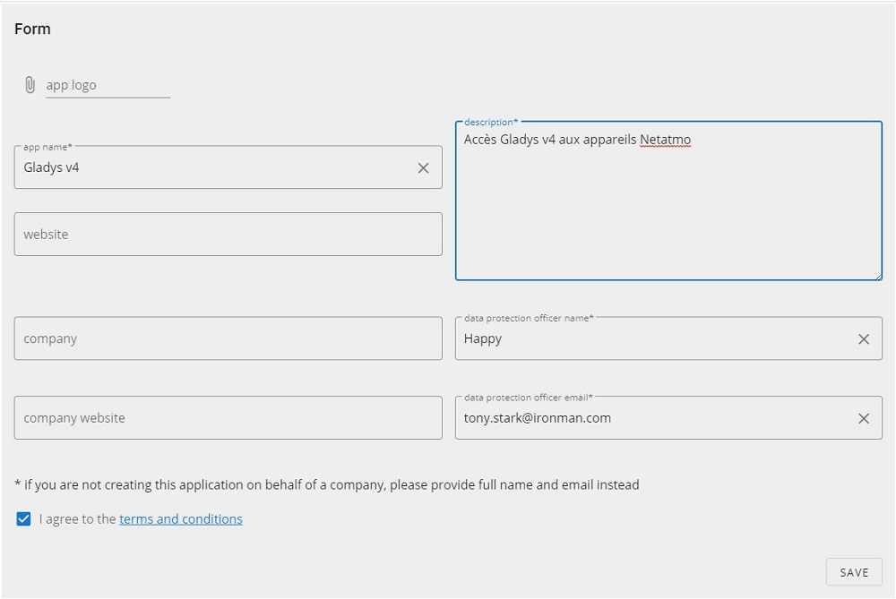
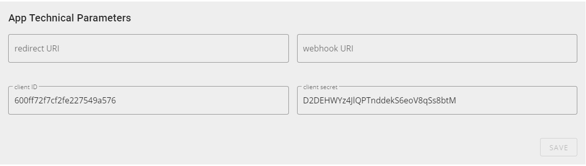
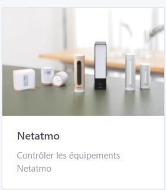
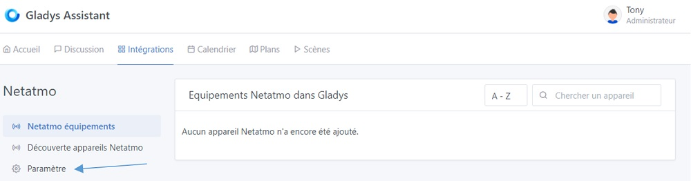
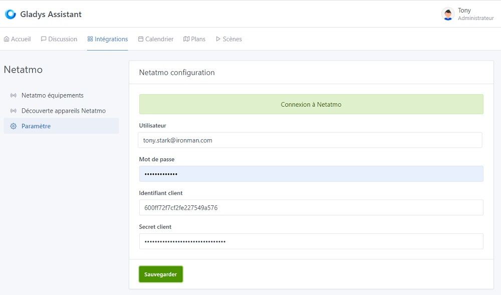
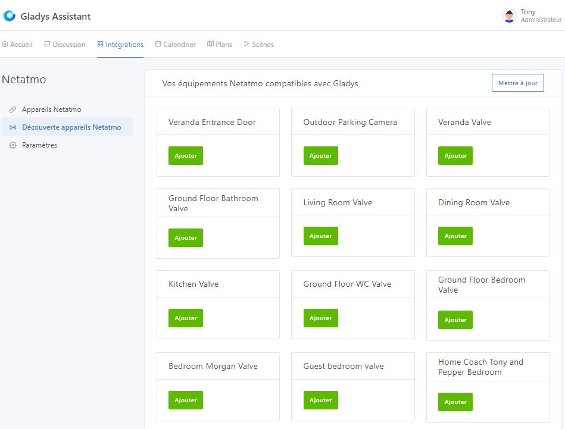
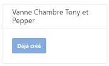
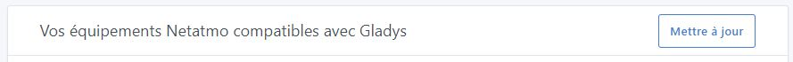
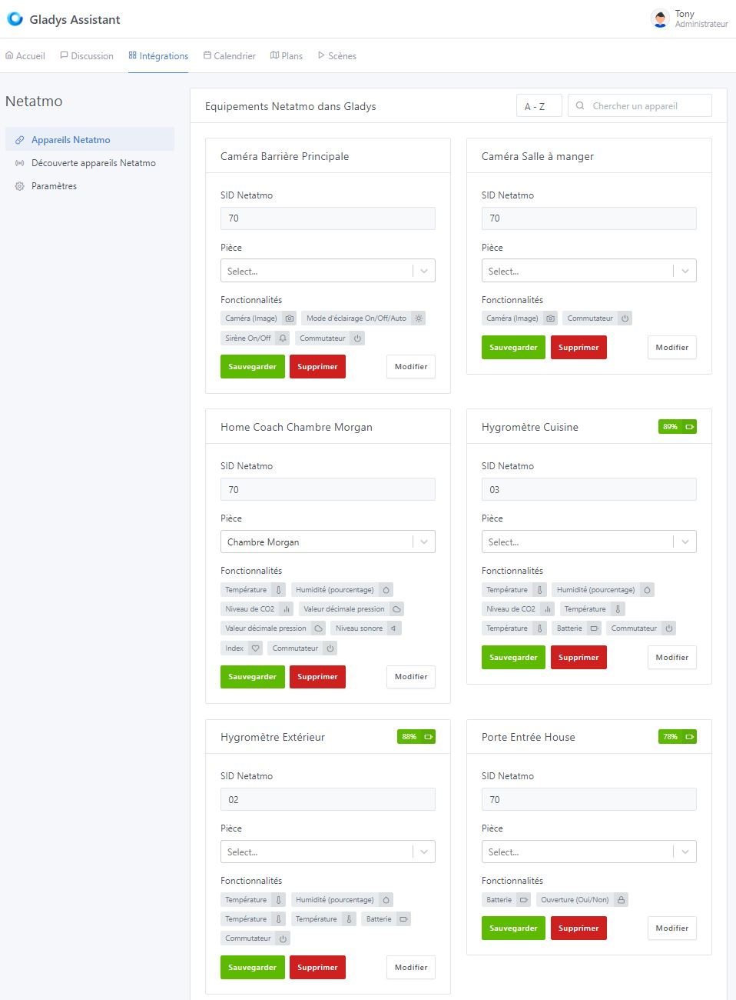
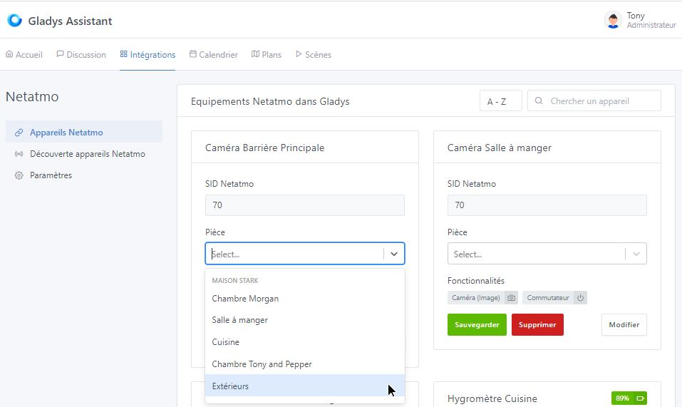

## Prérequis

### Etape 1 - Appareils compatibles et applications mobiles Netatmo

Pour pouvoir ajouter vos appareils Netatmo dans Gladys, ceux-ci doivent au préalable être ajoutés dans leurs applications respectives que vous devrez télécharger sur le play store ou l'apple store.
Ci-dessous ne sont référencés que les appareils compatibles avec Gladys :

#### Application "Energie" : 

- Les thermostats "NATherm1"

### Etape 2 - Netatmo connect

Vous devez ensuite vous rendre sur la page [Netatmo connect](https://dev.netatmo.com/) et cliquer sur le lien "LOG IN" pour créer un compte avec votre adresse mail et un mot de passe.

#### Création d'une "app"

Rendez vous ensuite sur votre page [My app](https://dev.netatmo.com/apps/) et cliquer sur le bouton "Create" pour créer un lien vers votre compte Gladys. Entrez les informations nécessaires (champs avec une \*) comme l'exemple ci-dessous :

#### Récupération des identifiants clients de connection

En cliquant sur "Save", vous aurez ensuite accès aux informations nécessaires dans le cadre en-dessous (voir [Etape 1 du tutoriel](/fr/docs/integrations/netatmo#etape-1--connexion-api-netatmo))

## Tutoriel

Pour ajouter vos appareils Netatmo dans Gladys, allez dans `Intégrations / Netatmo`.

### Etape 1 : Connexion API Netatmo

Depuis l'onglet `Paramètre`,

Entrez les informations récupérées lors de [l'étape précédente](/fr/docs/netatmo#integrations/etape-2---netatmo-connect) :

- Entrez votre adresse mail de connection à votre compte "Netatmo connect"
- Le mot de passe de ce même compte
- Le client ID,
- Le client secret,

Enfin cliquez sur "Sauvegarder".
Après quelques secondes, vous devriez maintenant être connecté avec l'API Netatmo.

### Etape 2 : Découverte des appareils Netatmo

Dans l'onglet `Découverte appareils Netatmo`,

Vous retrouvez tous les appareils que vous aviez précédemment configurés sur les différentes applications [de l'étape 1 des prérequis](/fr/docs/integrations/netatmo#etape-1---appareils-compatibles-et-applications-mobiles-netatmo). Ils sont référencés par leur nom défini dans leur application respective. Vous pouvez intégrer ceux-ci d'un simple clique sur le bouton "Ajouter". Le bouton passent alors en "Déjà créé".

Sur cette page vous retrouvé également un bouton "Mettre à jour" pour effectuer un rafraichissement des noms des appareils en cas de changement de ces derniers dans les applications Netatmo.

### Etape 3 : Définir une pièce aux appareils et modification des fonctionnalités

Dans l'onglet `Appareils Netatmo`, vous retrouvez cette fois les appareils ajoutés avec leurs caractéristiques.

#### 1) Définir une pièce

Pour pouvoir afficher un appareil sur le dashboard, il faut en premier lieu lui associer une pièce. Sélectionner celle-ci dans le menu déroulant suivant :

Puis cliquer sur le bouton "Sauvegarder".

#### 2) Modifier les fonctionnalités

Vous pouvez modifier le nom d'affichage des fonctionnalités qui apparaitront sur la page d'accueil. De plus certaines fonctionnalités peuvent être affichées de différentes manière. Cliquer sur le bouton "Modifier" d'une fiche d'appareil :

  N'oubliez pas de sauvegarder vos modifications avant de quitter la page !!

## Avancement et prévision d'évolution du service

### Janvier 2023

A ce jour, les appareils suivants :
- Détecteur de fumée "NSD",
- Sonnette "NDB"

Ne peuvent être remontés vers Gladys car l'API ne propose pas de retour d'état. Toutefois, les "webhooks" sont en cours de développement via Gladys Plus. Pour tout ceux qui disposent d'un abonnement, il serait prochainement possible de récupérer les retours d'états de ces appareils.

Les retours d'états de tous les appareils vue à [l'étape 1 des prérequis](/fr/docs/integrations/netatmo#etape-1---appareils-compatibles-et-applications-mobiles-netatmo) sont fonctionnels. Les commandes sont en cours de programmation.

Et voilà ! Vous pouvez maintenant ajouter les appareils et fonctionnalités dont vous souhaitez profiter sur votre page d'accueil ou encore créer vos scènes d'alertes.
