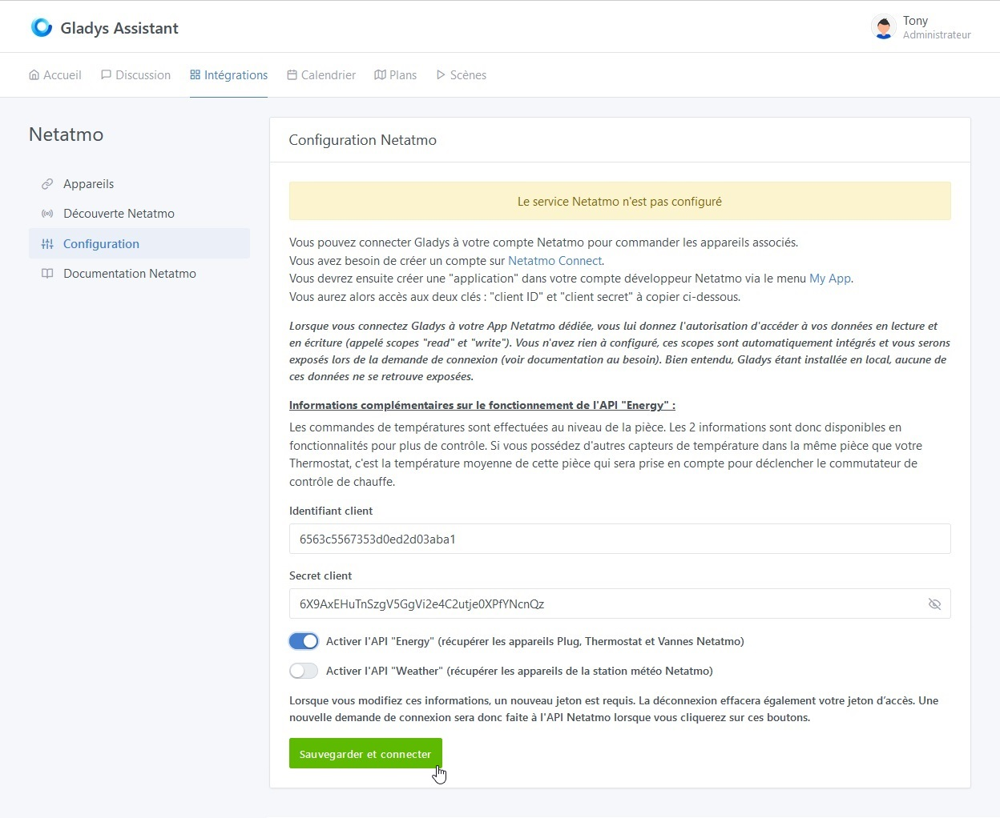
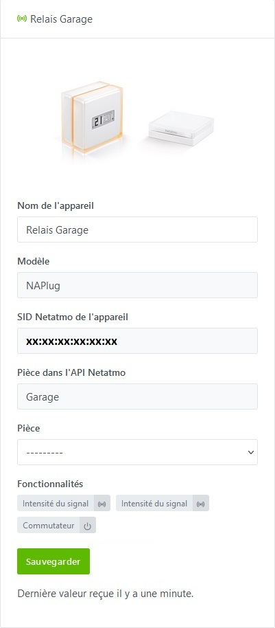
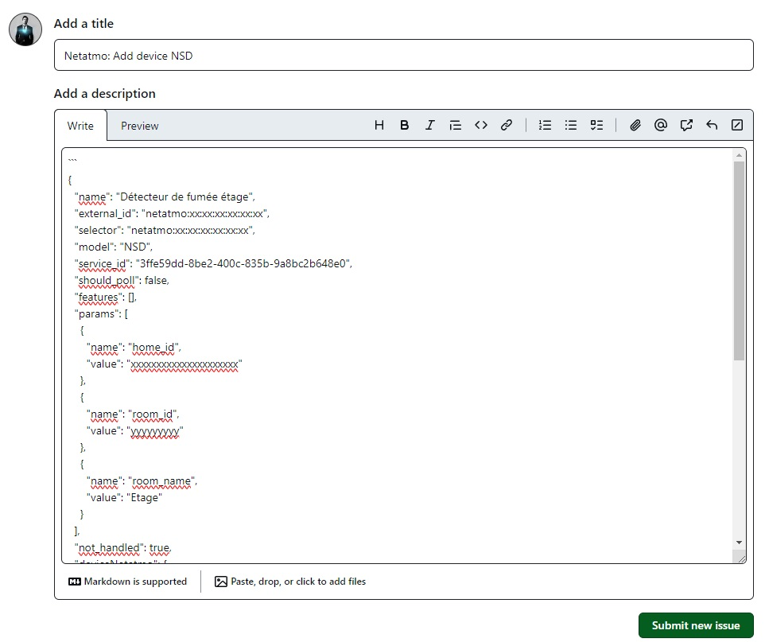
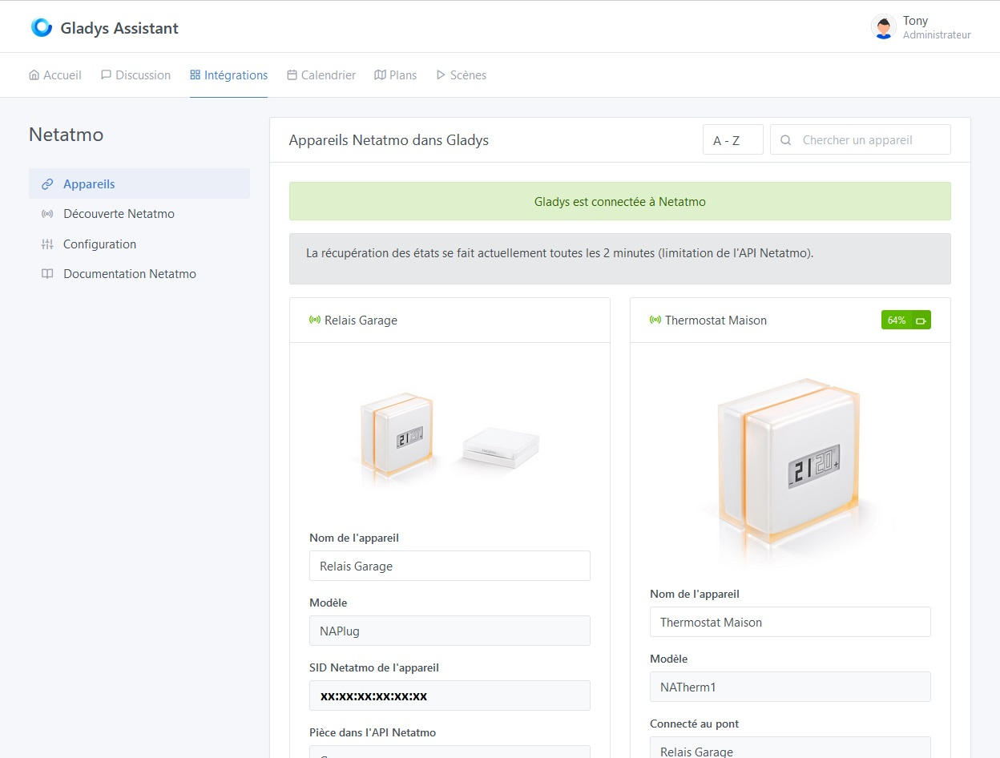

## **Prérequis**

### **Etape 1 - Appareils compatibles et applications mobiles Netatmo**

Pour pouvoir ajouter vos appareils Netatmo dans Gladys, ceux-ci doivent au préalable être ajoutés dans leurs applications respectives que vous devrez télécharger sur le play store ou l'apple store.
Ci-dessous ne sont référencés que les appareils compatibles avec Gladys :

#### - Les thermostats "NATherm1" et les vannes "NRV"
  - [Netatmo Energy sur Play Store](https://play.google.com/store/apps/details?id=com.netatmo.thermostat) 
  - [Netatmo Energy sur Apple Store](https://apps.apple.com/fr/app/netatmo-energy/id730893725)

#### - Les stations météo "NAMain" et les modules associables
  - [Netatmo Weather sur Play Store](https://play.google.com/store/apps/details?id=com.netatmo.netatmo) 
  - [Netatmo Weather sur Apple Store](https://apps.apple.com/fr/app/netatmo-weather/id532538499)

### **Etape 2 - Netatmo connect**

Vous devez ensuite vous rendre sur la page [Netatmo connect](https://dev.netatmo.com/) et cliquer sur le lien `LOG IN` pour créer un compte avec votre adresse mail et un mot de passe.

#### - Création d'une "app"

Rendez vous sur votre page [My app](https://dev.netatmo.com/apps/) et cliquer sur le bouton `Create` pour créer un lien vers votre compte Gladys. 

Entrez les informations nécessaires (champs avec une \*) comme dans l'exemple ci-dessous :

#### - Récupération de l'identifiant et du secret client de connexion

En cliquant sur `Save`, vous aurez ensuite accès aux informations nécessaires dans le cadre en-dessous (voir [Etape 1 du tutoriel](/fr/docs/integrations/netatmo#etape-11--configuration-de-la-connexion-%C3%A0-lapi-netatmo))

## **Tutoriel**

Pour ajouter vos appareils Netatmo dans Gladys, allez dans `Intégrations -> Netatmo`.

Puis cliquer sur l'onglet `Configuration` pour accéder à la page de connexion à l'API Netatmo.

### **Etape 1.1 : Configuration de la connexion à l'API Netatmo**

Depuis l'onglet `Configuration`, entrez les informations récupérées lors de [l'étape précédente](/fr/docs/integrations/netatmo#etape-2---netatmo-connect) :
- **Le client ID**,
- **Le client secret**
- **Activer l'API "Energy"** si vous avez au moins un thermostat, une vanne ou un plug ainsi que l'application Netatmo Energy sur Play Store ou Apple Store fonctionnelle
- **Activer l'API "Weather"** si vous avez au moins la station météo de base ainsi que l'application Netatmo Weather sur Play Store ou Apple Store fonctionnelle

Enfin cliquez sur le bouton `Sauvegarder la configuration et connexion à Netatmo`.
[Vous serez alors redirigé vers le site de Netatmo pour pouvoir accepter la connexion depuis Gladys.](/fr/docs/integrations/netatmo/#etape-12--autorisation-de-connexion-de-lapplication-gladys-%C3%A0-votre-compte-netatmo)

### **Etape 1.2 : Autorisation de connexion de l'application Gladys à votre compte Netatmo**
Il est important de noter qu'en cliquant sur `OUI, J'ACCEPTE` vous autorisez Gladys à accéder en lecture et en écriture pour tous les appareils actuellement supportés ainsi qu'en lecture à l'intégralité de vos appareils même s'il ne sont pas encore supportés, ceci dans le but de faciliter leur intégration future. Aucune donnée ni aucun accès n'est partagé à l'extérieur de votre instance Gladys locale.

Pour toute nouvelle intégration d'appareils non encore pris en charge, vous devrez à nouveau passer par cette étape pour accepter l'écriture (commandes) sur ces nouveaux appareils.

### **Etape 1.3 : Validation et connexion de l'application**
Après acceptation, vous serez redirigé sur votre précédente page de Gladys, vous devriez maintenant être connecté avec l'API Netatmo. 

### **Step 1.4 : Se déconnecter de l'application**
Vous pouvez vous déconnecter complètement de l'application Netatmo en cliquant sur le bouton `Déconnecter`. Cela effacera les informations d'identification et les autorisations associées.

### **Etape 2.1 : Découverte des appareils Netatmo compatibles**

Dans l'onglet `Découverte Netatmo`, vous retrouvez tous les appareils compatibles que vous aurez précédemment configurés sur l'application dédiée [de l'étape 1 des prérequis](/fr/docs/integrations/netatmo#etape-1---appareils-compatibles-et-applications-mobiles-netatmo).

Les appareils actuellement compatibles sont (**vous pouvez passer à l'étape suivante en cliquant [ici](/fr/docs/integrations/netatmo#etape-22--découverte-des-appareils-netatmo-non-compatibles)**) :

#### ***La gestion du chauffage - "Energy"***

##### - *Le concentrateur (NAPlug)*
**Description :**
Vous y trouverez le nom de l'appareil configuré dans l'application Netatmo (modifiable pour Gladys seulement), le modèle, son ID Netatmo et la pièce dans laquelle l'appareil est rattaché dans l'application.

**Les fonctionnalités actuellement supportées :**
- l'intensité du signal wifi,
- l'intensité du signal radio global,
- l'état de connexion du pont à une chaudière.

##### - *Le thermostat (NATherm1)*
**Description :**
Vous y trouverez le nom de l'appareil configuré dans l'application Netatmo (modifiable pour Gladys seulement), le modèle, le pont auquel il est connecté, son ID Netatmo et la pièce dans laquelle l'appareil est rattaché dans l'application.

**Les fonctionnalités actuellement supportées :**
- l'état de la batterie exacte (en %),
- la température mesurée du thermostat,
- la température de la pièce (moyenne des températures des divers appareils Netatmo se trouvant dans cette pièce),
- la température de consigne du thermostat sur lequel vous pouvez également agir en commande soit depuis le tableau de bord, soit depuis une scène,
- la détection d'une fenêtre ouverte par tout appareil Netatmo se situant dans la même pièce,
- l'intensité du signal radio avec le pont NAPlug,
- l'état de demande de chauffage à la chaudière (activé si la température de consigne est supérieure à la température de la pièce).

##### - *La vanne (NRV)*
**Description :**
Vous y trouverez le nom de l'appareil configuré dans l'application Netatmo (modifiable pour Gladys seulement), le modèle, le pont auquel il est connecté, son ID Netatmo, la pièce dans laquelle l'appareil est rattaché dans l'application.

**Les fonctionnalités actuellement supportées :**
- l'état de la batterie divisé en 6 états et converti en % :
  - max: 100%
  - pleine: 90%
  - haute: 75%
  - moyenne: 50%
  - basse: 25%
  - très basse: 10%
- la température de la pièce (moyenne des températures des divers appareils Netatmo se trouvant dans cette pièce),
- la température de consigne de la pièce sur laquelle vous pouvez également agir en commande soit depuis le tableau de bord, soit depuis une scène,
- la détection d'une fenêtre ouverte par tout appareil Netatmo se situant dans la même pièce,
- l'intensité du signal radio avec le pont NAPlug,
- l'état de demande de chauffage à la chaudière (activé si la température de consigne est supérieure à la température de la pièce).

#### ***La station météo - "Weather"***

##### - *Station Hygromètre intérieur (NAMain)*
**Description :**
Elle joue également le rôle de concentrateur pour vos autres modules liés à la station météo.
Vous y trouverez le nom de l'appareil configuré dans l'application Netatmo (modifiable pour Gladys seulement), le modèle, son ID Netatmo et la pièce dans laquelle l'appareil est rattaché dans l'application.

**Les fonctionnalités actuellement supportées :**
- la température mesurée par l'hygromètre,
- si vous avez au moins un appareil de la catégorie "Energy" (plug, thermostat ou vanne), la température de la pièce calculée sera accessible (moyenne des températures des divers appareils Netatmo se trouvant dans cette pièce),
- la température minimum mesurée sur les dernières 24h,
- la température maximum mesurée sur les dernières 24h,
- l'humidité mesurée par l'hygromètre (en %),
- le CO2 mesuré par l'hygromètre (en particules par million - ppm),
- le volume sonore mesuré par l'hygromètre (en décibels - dB),
- la pression atmosphérique mesurée par l'hygromètre,
- la pression absolue calculée par l'hygromètre,
- l'intensité du signal wifi.
Toutes ces mesures reflètent la qualité de l'air de votre intérieur.

##### - *Module extérieur (NAModule1)*
**Description :**
Vous y trouverez le nom de l'appareil configuré dans l'application Netatmo (modifiable pour Gladys seulement), le modèle, le pont auquel il est connecté, son ID Netatmo et la pièce dans laquelle l'appareil est rattaché dans l'application (si disponible).

**Les fonctionnalités actuellement supportées :**
- l'état de la batterie exacte (en %),
- la température mesurée par le module,
- la température minimum mesurée sur les dernières 24h,
- la température maximum mesurée sur les dernières 24h,
- l'humidité mesurée par le module (en %),
- l'intensité du signal radio avec le pont NAMain.

##### - *Module Anémomètre (NAModule2)*
**Description :**
Vous y trouverez le nom de l'appareil configuré dans l'application Netatmo (modifiable pour Gladys seulement), le modèle, le pont auquel il est connecté, son ID Netatmo et la pièce dans laquelle l'appareil est rattaché dans l'application (si disponible).

**Les fonctionnalités actuellement supportées :**
- l'état de la batterie exacte (en %),
- la vitesse du vent actuelle mesurée par le module (moyenné sur 5 minutes - en km/h),
- la vitesse des rafales mesurée par le module (vitesse max sur 5 minutes - en km/h),
- la vitesse maximum du jour du vent mesurée par le module (max des moyennes sur 5 minutes de la journée - en km/h),
- l'angle du vent actuel mesuré par le module (moyenné sur 5 minutes - en degré d'angle),
- l'angle des rafales mesuré par le module (en degré d'angle),
- l'angle de la vitesse maximum du jour mesuré par le module (en degré d'angle),
- l'intensité du signal radio avec le pont NAMain.

##### - *Module Pluviomètre (NAModule3)*
**Description :**
Vous y trouverez le nom de l'appareil configuré dans l'application Netatmo (modifiable pour Gladys seulement), le modèle, le pont auquel il est connecté, son ID Netatmo et la pièce dans laquelle l'appareil est rattaché dans l'application (si disponible).

**Les fonctionnalités actuellement supportées :**
- l'état de la batterie exacte (en %),
- les précipitations actuelles mesurées par le module (cumulées sur 5 minutes - en mm),
- les précipitations sur 1h mesurées par le module (cumulées sur 1 heure - en mm/h),
- les précipitations sur 24h mesurées par le module (cumulées sur 24 heures - en mm/j),
- l'intensité du signal radio avec le pont NAMain.

##### - *Module additionnel Hygromètre intérieur (NAModule4)*
**Description :**
Vous y trouverez le nom de l'appareil configuré dans l'application Netatmo (modifiable pour Gladys seulement), le modèle, le pont auquel il est connecté, son ID Netatmo et la pièce dans laquelle l'appareil est rattaché dans l'application (si disponible).

**Les fonctionnalités actuellement supportées :**
- l'état de la batterie exacte (en %),
- la température mesurée par l'hygromètre,
- si vous avez au moins un appareil de la catégorie "Energy" (plug, thermostat ou vanne), la température de la pièce calculée sera accessible (moyenne des températures des divers appareils Netatmo se trouvant dans cette pièce),
- la température minimum mesurée sur les dernières 24h,
- la température maximum mesurée sur les dernières 24h,
- l'humidité mesurée par l'hygromètre (en %),
- le CO2 mesuré par l'hygromètre (en particules par million - ppm),
- l'intensité du signal radio avec le pont NAMain.
Toutes ces mesures reflètent la qualité de l'air de votre intérieur.

Vous pouvez sélectionner la pièce Gladys dans laquelle ils sont installés puis intégrer ceux-ci d'un simple clique sur le bouton `Sauvegarder`. Le bouton passent alors en `Déjà créé`.

Sur cette page vous retrouvez également en haut un bouton `Rafraichir` pour effectuer un rafraichissement des fonctionnalités des appareils en cas de changement de ces derniers dans les applications Netatmo ou en cas de nouvelle prise en charge dans Gladys.

### Etape 2.2 : Découverte des appareils Netatmo non compatibles

Vous pourrez également retrouver les appareils en votre possession qui ne sont pas encore compatibles avec Gladys.

Vous pourrez effectuer une demande de prise en charge pour ces appreils par l'intermédiaire du bouton `Proposer ce périphérique` qui vous amenera sur la page Github pour créer directement une issue de demande d'ajout avec les propriétés du nouvel appareil.
:::warning
N'oubliez pas de remplacer les données 'sensible' comme l'id de l'appareil, de la maison, de la pièce ou du concentrateur.
:::

### Etape 3 : Onglet `Appareils`

Dans l'onglet `Appareils`, vous retrouvez les appareils ajoutés avec leurs caractéristiques, notamment leur état de connexion  ou  et le niveau de batterie.

#### 1) Définir une pièce

Pour pouvoir afficher un appareil sur le dashboard, il faut en premier lieu lui associer une pièce. Sélectionner celle-ci dans le menu déroulant suivant, puis cliquer sur le bouton `Sauvegarder` :

#### 2) Modifier les fonctionnalités

Pour le moment vous ne pourrez modifier que le nom d'affichage de l'appareil. Prochainement vous aurez également accès à un bouton `Modifier`, vous pourrez alors modifier le nom d'affichage des fonctionnalités qui apparaitront sur la page d'accueil. 
De plus certaines fonctionnalités pourront être affichées de différentes manière.

## Road Map - Prévision d'évolution du service

- #### ~~Pull request 1 - Netatmo "Energy" : Vannes (NRV)~~
  - **Statut : Implémenté en février 2024** - Cette fonctionnalité a été ajoutée pour permettre la gestion des vannes NRV dans le cadre du service Netatmo "Energy". Pour plus de détails, voir la PR [#2014](https://github.com/GladysAssistant/Gladys/pull/2014).

- #### Pull request 2 - Netatmo "Weather" : Station météo principale (NAMain)
  - **Statut : En cours de développement** - Cette fonctionnalité est en cours de développement. Pour plus de détails, voir la PR [#2015](https://github.com/GladysAssistant/Gladys/pull/2015).

- #### Pull request 3 - Netatmo "Weather" : Modules intérieurs complémentaires (NAModule4)
  - **Statut : En cours de développement** - Cette fonctionnalité est en cours de développement. Pour plus de détails, voir la PR [#2016](https://github.com/GladysAssistant/Gladys/pull/2016).

- #### Pull request 4 - Netatmo "Weather" : Module extérieur (NAModule1)
  - **Statut : En cours de développement** - Cette fonctionnalité est en cours de développement. Pour plus de détails, voir la PR [#2017](https://github.com/GladysAssistant/Gladys/pull/2017).

- #### Pull request 5 - Netatmo "Weather" : Anémomètre (NAModule2)
  - **Statut : En cours de développement** - Cette fonctionnalité est en cours de développement. Pour plus de détails, voir la PR [#2018](https://github.com/GladysAssistant/Gladys/pull/2018).

- #### Pull request 6 - Netatmo "Weather" : Pluviomètre (NAModule3)
  - **Statut : En cours de développement** - Cette fonctionnalité est en cours de développement. Pour plus de détails, voir la PR [#2019](https://github.com/GladysAssistant/Gladys/pull/2019).

- #### Pull request 7 - Netatmo "Aircare" - Homecoach : Capteur de qualité de l'air (NHC)
- #### Pull request 8 - Netatmo "Home + Security" : Caméra intérieure (NACamera)
- #### Pull request 9 - Netatmo "Home + Security" : Capteur d'ouverture de porte et fenêtre (NACamDoorTag)
- #### Pull request 10 - Netatmo "Home + Security" : Sirène (NIS)
- #### Pull request 11 - Netatmo "Home + Security" : Caméra extérieure (NOC) avec ou sans sirène
- #### Pull request 12 - Netatmo "Home + Security" : Détecteur de fumée (NSD)
- #### Pull request 13 - Ajout du bouton "Modifier" : Pouvoir modifier les noms des fonctionnalités des appareils Netatmo
- #### Pull request 14 - Ajout des webhooks ([Pour les utilisateurs Gladys Plus](/fr/plus/))
Cette fonctionnalité permettra de recevoir les alertes et changements d'états de certains appareils en temps réel (Consignes de température, détection caméra, détection d'ouverture de porte, alerte de connexion/déconnexion d'un appareil, etc.) pour tout ceux qui disposent d'un abonnement Gladys Plus.
#### ... Au gré des demandes d'ajouts de fonctionnalités ...

## Conclusion
Les retours d'états de tous les appareils décrits à [l'étape 1 des prérequis](/fr/docs/integrations/netatmo#etape-1---appareils-compatibles-et-applications-mobiles-netatmo) sont maintenant fonctionnels.

Et voilà ! Vous pouvez maintenant ajouter les appareils et fonctionnalités dont vous souhaitez profiter sur votre page d'accueil ou encore créer vos scènes d'alertes ou de commandes en suivant la partie de la documentation consacrée au [Tableau de bord](/fr/docs/dashboard/intro) ou aux [Scènes](/fr/docs/scenes/intro).

Je vous invite à poster un message sur [le forum](https://community.gladysassistant.com/), si jamais vous avez besoin d’aide.