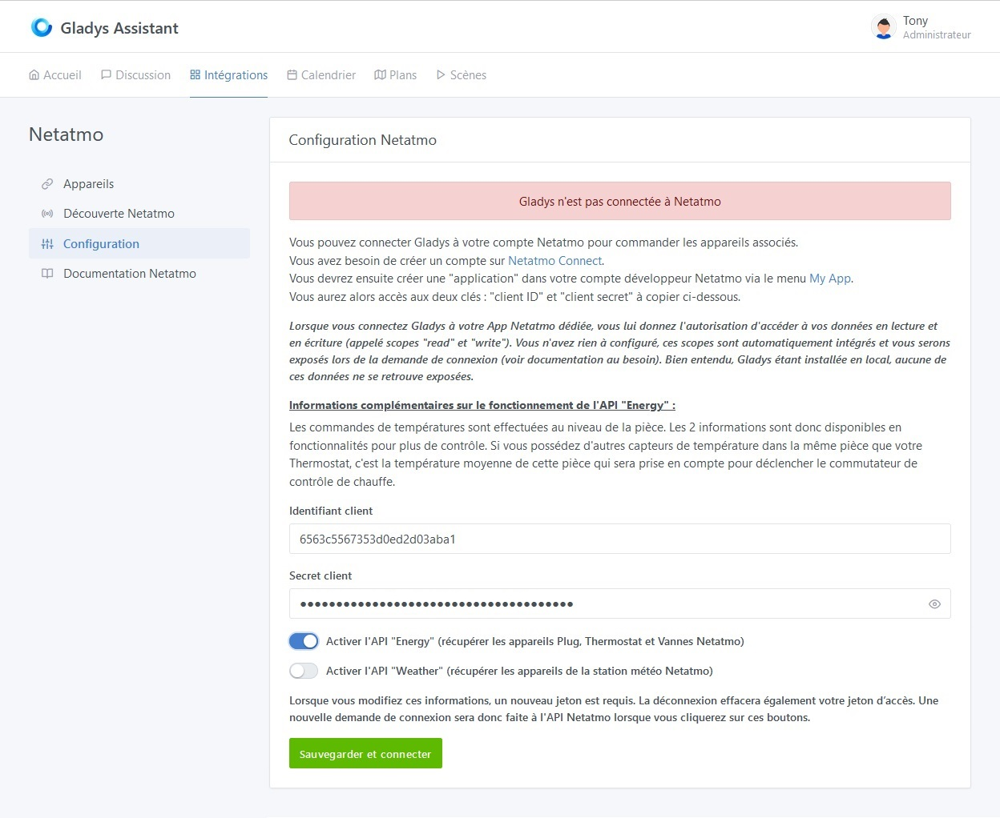
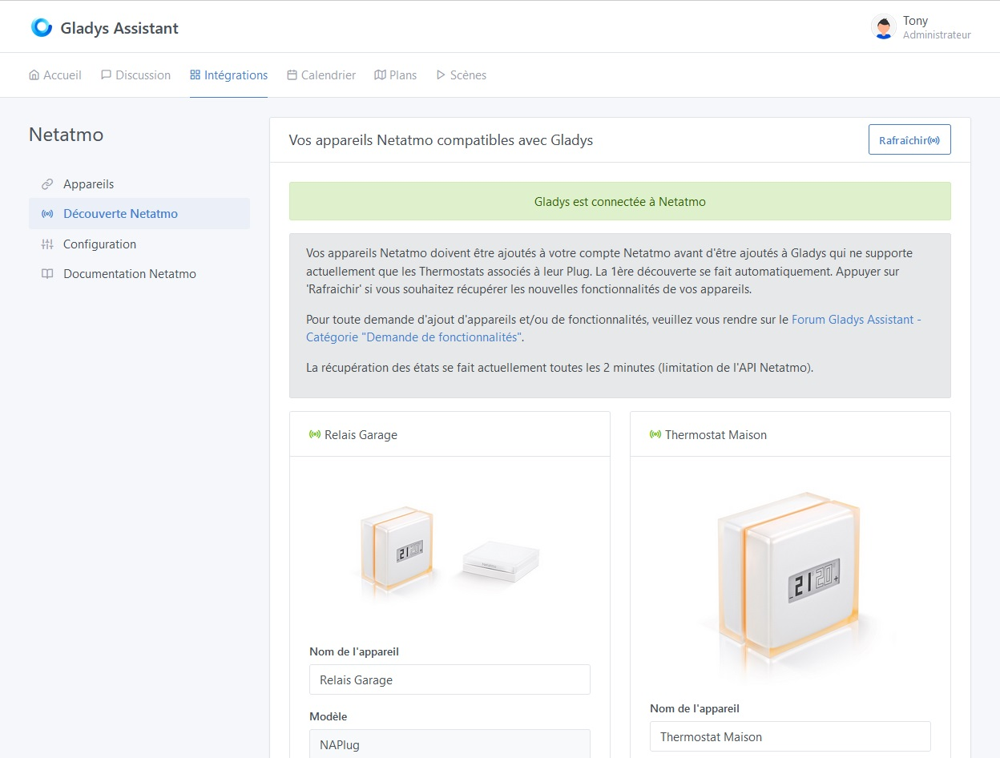
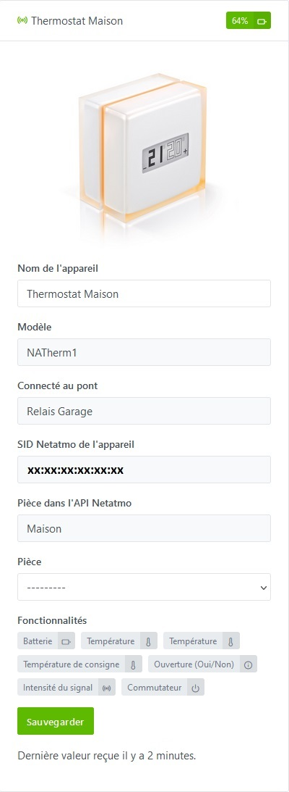

## Prérequis

### Etape 1 - Appareils compatibles et applications mobiles Netatmo

Pour pouvoir ajouter vos appareils Netatmo dans Gladys, ceux-ci doivent au préalable être ajoutés dans leurs applications respectives que vous devrez télécharger sur le play store ou l'apple store.
Ci-dessous ne sont référencés que les appareils compatibles avec Gladys :

#### Application "Energie" [Play Store](https://play.google.com/store/apps/details?id=com.netatmo.thermostat) : 

- Les thermostats "NATherm1"

### Etape 2 - Netatmo connect

Vous devez ensuite vous rendre sur la page [Netatmo connect](https://dev.netatmo.com/) et cliquer sur le lien `LOG IN` pour créer un compte avec votre adresse mail et un mot de passe.

#### Création d'une "app"

Rendez vous sur votre page [My app](https://dev.netatmo.com/apps/) et cliquer sur le bouton `Create` pour créer un lien vers votre compte Gladys. 

Entrez les informations nécessaires (champs avec une \*) comme dans l'exemple ci-dessous :

#### Récupération de l'identifiant et du secret client de connexion

En cliquant sur `Save`, vous aurez ensuite accès aux informations nécessaires dans le cadre en-dessous (voir [Etape 1 du tutoriel](/fr/docs/integrations/netatmo#etape-11--configuration-de-la-connexion-%C3%A0-lapi-netatmo))

## Tutoriel

Pour ajouter vos appareils Netatmo dans Gladys, allez dans `Intégrations -> Netatmo`.

Puis cliquer sur l'onglet `Configuration` pour accéder à la page de connexion à l'API Netatmo.

### Etape 1.1 : Configuration de la connexion à l'API Netatmo

Depuis l'onglet `Configuration`, entrez les informations récupérées lors de [l'étape précédente](/fr/docs/integrations/netatmo#etape-2---netatmo-connect) :
- Le client ID,
- Le client secret

Enfin cliquez sur le bouton `Sauvegarder la configuration et connexion à Netatmo`.
[Vous serez alors redirigé vers le site de Netatmo pour pouvoir accepter la connexion depuis Gladys.](/fr/docs/integrations/netatmo/#etape-12--autorisation-de-connexion-de-lapplication-gladys-%C3%A0-votre-compte-netatmo)

### Etape 1.2 : Autorisation de connexion de l'application Gladys à votre compte Netatmo
Il est important de noter qu'en cliquant sur `OUI, J'ACCEPTE` vous autorisez Gladys à accéder en lecture et en écriture pour tous les appareils actuellement supportés ainsi qu'en lecture à tous les appareils qui ne sont pas encore supportés dans le but de faciliter leur intégration future. Aucune donnée ni aucun accès n'est partagé à l'extérieur de votre instance Gladys locale.

Pour toute nouvelle intégration d'appareils non encore pris en charge, vous devrez à nouveau passer par cette étape pour accepter l'écriture (commandes) sur ces nouveaux appareils.

### Etape 1.3 : Validation et connexion de l'application
Après acceptation, vous serez redirigé sur votre précédente page de Gladys, vous devriez maintenant être connecté avec l'API Netatmo. 

### Etape 2.1 : Découverte des appareils Netatmo compatibles

Dans l'onglet `Découverte Netatmo`, vous retrouvez tous les appareils compatibles que vous aurez précédemment configurés sur l'application dédiée [de l'étape 1 des prérequis](/fr/docs/integrations/netatmo#etape-1---appareils-compatibles-et-applications-mobiles-netatmo).

Les appareils actuellement compatibles sont [(Passer à l'étape suivante)](/fr/docs/integrations/netatmo#etape-22--découverte-des-appareils-netatmo-non-compatibles) :
- **Le concentrateur (NAPlug)**, vous y trouverez le nom de l'appareil configuré dans l'application Netatmo, le modèle, son ID Netatmo, la pièce dans laquelle l'appareil est rattaché dans l'application et les fonctionnalités actuellement supportées.

- **Le thermostat (NATherm1)**, vous y trouverez le nom de l'appareil configuré dans l'application Netatmo, le modèle, le pont auquel il est connecté, son ID Netatmo, la pièce dans laquelle l'appareil est rattaché dans l'application et les fonctionnalités actuellement supportées.

Vous pouvez sélectionner la pièce Gladys dans laquelle ils sont installés puis intégrer ceux-ci d'un simple clique sur le bouton `Sauvegarder`. Le bouton passent alors en `Déjà créé`.

Sur cette page vous retrouvé également en haut un bouton `Rafraichir` pour effectuer un rafraichissement des fonctionnalités des appareils en cas de changement de ces derniers dans les applications Netatmo ou en cas de nouvelle prise en charge dans Gladys.

### Etape 2.2 : Découverte des appareils Netatmo non compatibles

Vous pourrez également retrouver les appareils en votre possession qui ne sont pas encore compatibles avec Gladys.

Vous pourrez effectuer une demande de prise en charge pour ces appreils par l'intermédiaire du bouton `Proposer ce périphérique` qui vous amenera sur la page Github pour créer directement une issue de demande d'ajout avec les propriétés du nouvel appareil.
:::warning
N'oubliez pas de remplacer les données 'sensible' comme l'id de l'appareil, de la maison, de la pièce ou du concentrateur.
:::

### Etape 3 : Onglet `Appareils`

Dans l'onglet `Appareils`, vous retrouvez les appareils ajoutés avec leurs caractéristiques, notamment leur état de connexion  ou  et le niveau de batterie.

#### 1) Définir une pièce

Pour pouvoir afficher un appareil sur le dashboard, il faut en premier lieu lui associer une pièce. Sélectionner celle-ci dans le menu déroulant suivant, puis cliquer sur le bouton `Sauvegarder` :

#### 2) Modifier les fonctionnalités

Pour le moment vous ne pourrez modifier que le nom d'affichage de l'appareil. Prochainement vous aurez également accès à un bouton `Modifier`, vous pourrez alors modifier le nom d'affichage des fonctionnalités qui apparaitront sur la page d'accueil. 
De plus certaines fonctionnalités pourront être affichées de différentes manière.

## Road Map - Prévision d'évolution du service

### Pull request 1 - Suite des appareils "Energy"
- Vannes (NRV)
### Pull request 2 - Ajout du bouton "Modifier"
Pouvoir modifier les noms des fonctionnalités des appareils Netatmo
### Pull request 3 - Ajout de la station météo "Weather"
- Station météo principale (NAMain),
- Module extérieur (NAModule1).
### Pull request 4 - Suite des appareils "Weather"
- Anémomètre (NAModule2),
- Pluviomètre (NAModule3),
- Modules intérieurs complémentaires (NAModule4).
### Pull request 5 - Ajout de la sécurité Netatmo "Home + Security"
- Caméra intérieure (NACamera),
- Capteur d'ouverture de porte et fenêtre (NACamDoorTag),
- Sirène (NIS).
### Pull request 6 - Suite des appareils "Home + Security"
- Caméra extérieure (NOC) avec ou sans sirène,
- Détecteur de fumée (NSD).
### Pull request 7 - Ajout du Homecoach "Aircare"
- Capteur de qualité de l'air (NHC).
### Pull request 8 - Ajout des webhooks ([Pour les utilisateurs Gladys Plus](/fr/plus/))
Cette fonctionnalité permettra de recevoir les alertes et changements d'états de certains appareils en temps réel (Consignes de température, détection caméra, détection d'ouverture de porte, alerte de connexion/déconnexion d'un appareil, etc.) pour tout ceux qui disposent d'un abonnement Gladys Plus.
#### ... Au gré des demandes d'ajouts de fonctionnalités ...

## Conclusion
Les retours d'états de tous les appareils décrits à [l'étape 1 des prérequis](/fr/docs/integrations/netatmo#etape-1---appareils-compatibles-et-applications-mobiles-netatmo) sont maintenant fonctionnels.

Et voilà ! Vous pouvez maintenant ajouter les appareils et fonctionnalités dont vous souhaitez profiter sur votre page d'accueil ou encore créer vos scènes d'alertes ou de commandes en suivant la partie de la documentation consacrée au [Tableau de bord](/fr/docs/dashboard/intro) ou aux [Scènes](/fr/docs/scenes/intro).

Je vous invite à poster un message sur [le forum](https://community.gladysassistant.com/), si jamais vous avez besoin d’aide.