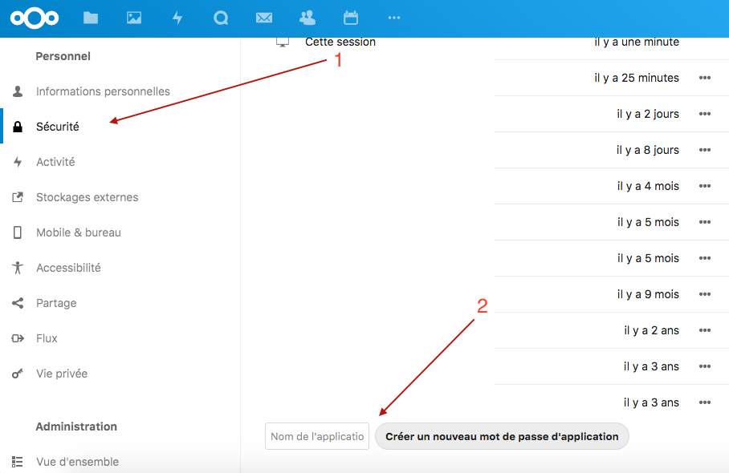

Cette intégration vous permet d'utiliser l'app [Talk](https://nextcloud.com/talk/) de Nextcloud pour communiquer avec Gladys.

Disponible sur Android, iOS et web, elle vous permettra de communiquer avec Gladys Assistant en lui donnant des instructions, en recevant des informations ou des questions...

## Compte Nextcloud pour votre bot

Les bots n'étant pas gérés nativement par Nextcloud Talk, il est nécessaire en plus de votre compte personnel, de créer un compte Nextcloud dédié à votre bot (lors de cette création, vous ou l'administrateur de votre instance Nextcloud devrez attribuer un petit peu d'espace disque pour gérer l'upload des photos par Gladys, 1Go devrait être suffisant).

Sur votre instance Nextcloud, connectez vous avec le compte de votre bot puis :
1. Rejoignez la page de configuration, puis l'onglet sécurité
2. En bas entrez par exemple "Gladys" et cliquez sur "Créer un nouveau mot de passe d'application"

Notez le mot de passe créé

## Récupérer le token de conversation

Pour indiquer la conversation de Nextcloud Talk que Gladys doit écouter :

1. Depuis un **navigateur**, accédez à votre **compte personnel** Nextcloud
2. Rendez vous dans l'application Talk
3. Démarrer une conversation avec le compte de votre bot

4. Notez le token qui se trouve dans l'url de la conversation

## Entrez la configuration de votre bot dans Gladys Assistant

Allez dans "Intégrations" -> "Nextcloud Talk".

1. Entrez l'url de base de votre instance Nextcloud
2. Entrez ici le nom d'utilisateur du compte Nextcloud de votre bot
3. Collez ici le mot de passe précédement généré 
4. Collez le token récupéré dans l'url de la conversation

Puis cliquez sur "Sauvegarder".

## Première communication entre Nextcloud Talk et Gladys Assistant

Sur Nextcloud web ou l'application mobile, saisissez votre première question dans la conversation avec votre Assistant Gladys, par exemple : quel temps fait-il ?

Patientez un peu et ......... magie !!!

Votre assistant vous répond ! C'est cool, non ?
