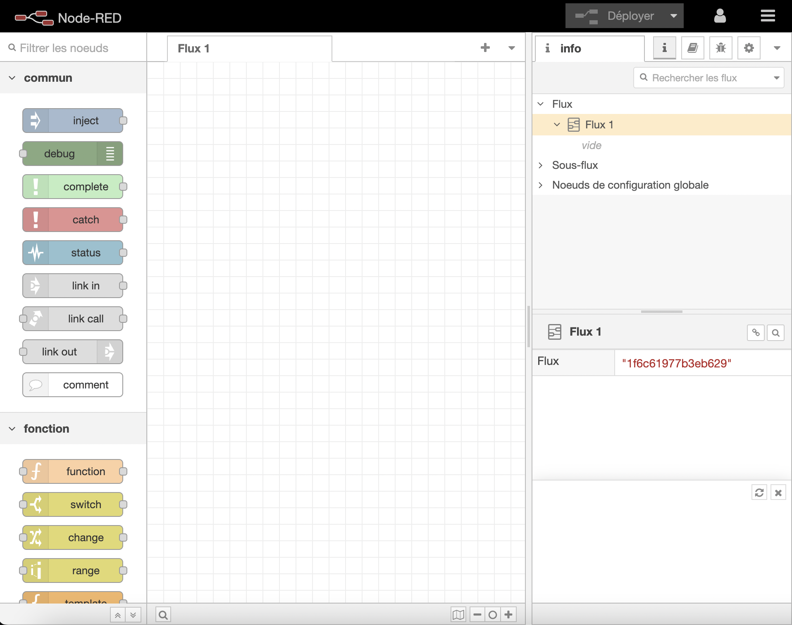

Dans ce tutoriel, nous allons vous expliquer qu'il est possible d'intégrer [Node-RED](https://nodered.org/) à Gladys Assistant.

Vous pourrez ainsi connecter des périphériques matériels, des API et des services en ligne.

## Activez Node-RED
Dans Gladys, Rendez-vous dans `Intégrations / Node-RED`.

Gladys a besoin d'installer un container. Ne vous inquiétez pas, tout cela a été automatisé.

Rendez-vous dans la partie `Configuration` et cliquez sur le bouton **Activer**. Après quelques instants (le temps dépend de votre modèle de Raspberry Pi et de votre bande passante), vous devriez visualiser tous les éléments démarrés et les liens entre chacun au vert.

## Se connecter à Node-RED

Vous pouvez ouvrir l'interface de Node-Red en cliquant sur le lien
:warning: Attention, le lien n'est pas accessible depuis Gladys Plus

Vous arrivez sur votre instance locale de Node-RED. 

Pour vous connecter, il faut utiliser les informations de connection fourni dans la partie `Configuration` 

## Utilisation

Vous pouvez maintenant créer vos flux Node-RED

