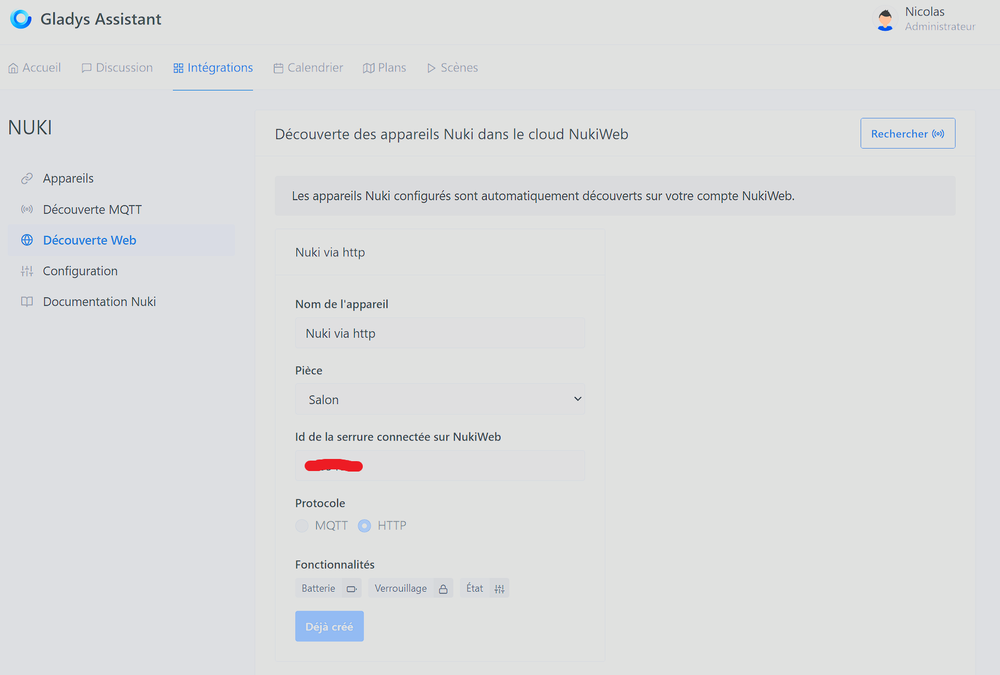
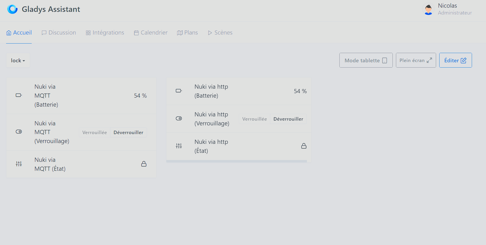

# Intégration de votre serrure connectée Nuki à Gladys
Cette intégration ajoute la possibilité de :
-   contrôler les serrures connectées de marque Nuki : verrouiller, déverouiller
-   remonter certaines informations dans Gladys (niveau de batterie, état de la serrure)  

Allez dans  `Intégrations / Nuki`  dans Gladys
Il y a deux types d'intégration possible. Il est conseillé de n'en choisir qu'une seule des deux.

## Clé API NukiWeb

_Prérequis : Gladys doit avoir accès à internet à tout moment_

1. Activer et configurer votre accompte Nuki Web [Configuration Nuki Web](https://help.nuki.io/hc/fr/articles/360016485718-Activer-et-d%C3%A9sactiver-un-compte-Nuki-Web#:~:text=Activez%20Nuki%20Web%20dans%20l,dans%20l'App%20de%20Nuki.)
  

  

2. Configurer le service Nuki dans Gladys en y ajoutant la clé API 

3. Faire un scan HTTP

  

## MQTT
_Prérequis : Le MQTT de Gladys est configuré et fonctionnel_

1. Configurer le mqtt dans l'application Nuki (utiliser l'IP local du mqtt, pas le nom de domaine) [Configuration Nuki avec MQTT](https://help.nuki.io/hc/fr/articles/14052016143249-Activation-et-configuration-via-l-App-Nuki)

2. Aller directement dans la découverte MQTT du service Nuki dans Gladys pour y voir vos appareils

Il n'y a plus qu'à configurer le dashboard :

