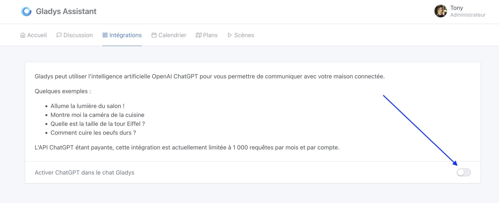

   

OpenAI a définitivement révolutionné le monde de l’intelligence artificielle en lançant ChatGPT l’année dernière.

Et si tu pouvais utiliser ChatGPT pour contrôler ta maison connectée ?

On serait pas loin d’avoir notre Jarvis à la maison, accessible en un petit message !

## Pré-requis

L’API d’OpenAI étant payante, cette intégration fait partie de Gladys Plus. Commence par créer ton compte pour avoir accès à ChatGPT 🙂

## Configuration

C’est tout simple, il suffit d’activer ChatGPT dans l’intégration OpenAI ChatGPT dans “Intégrations” :

Ensuite, tu peux discuter avec ChatGPT dans l’onglet discussion ou via notre intégration Telegram.

## Les commandes disponibles

Il y a actuellement 7 commandes disponibles :

| Action                                | Exemple                                             |
| ------------------------------------- | --------------------------------------------------- |
| Affichage caméra dans une pièce       | Montre moi la caméra du salon                       |
| Allumage de la lumière                | Allume la lumière dans la cuisine                   |
| Eteindre la lumière                   | Eteins la lumière de la cuisine                     |
| Récupérer la température              | Quelle température fait-il dans le jardin ?         |
| Récupérer l’humidité                  | Quel est le taux d’humidité dans la salle de bain ? |
| Lancer une scène                      | Lance la scène “Mode cinéma”                        |
| Récupérer des informations génériques | Qui est Jules Verne ?                               |
