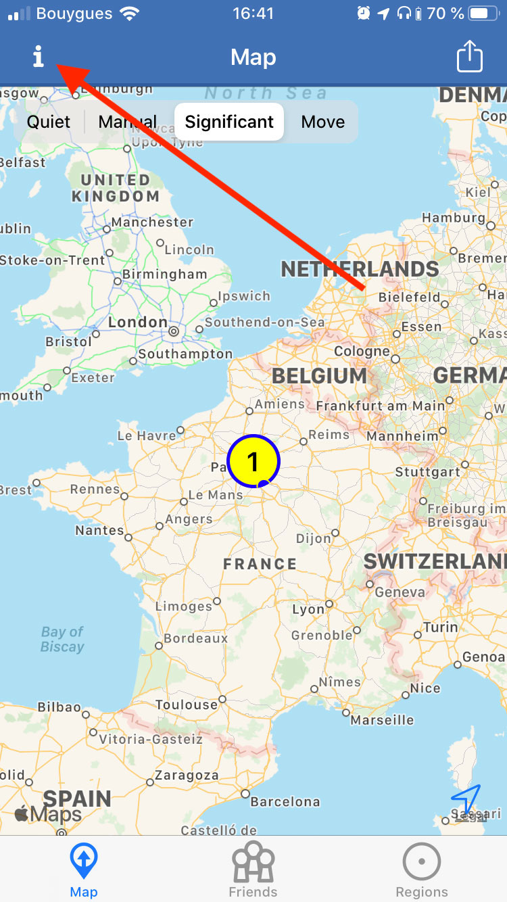
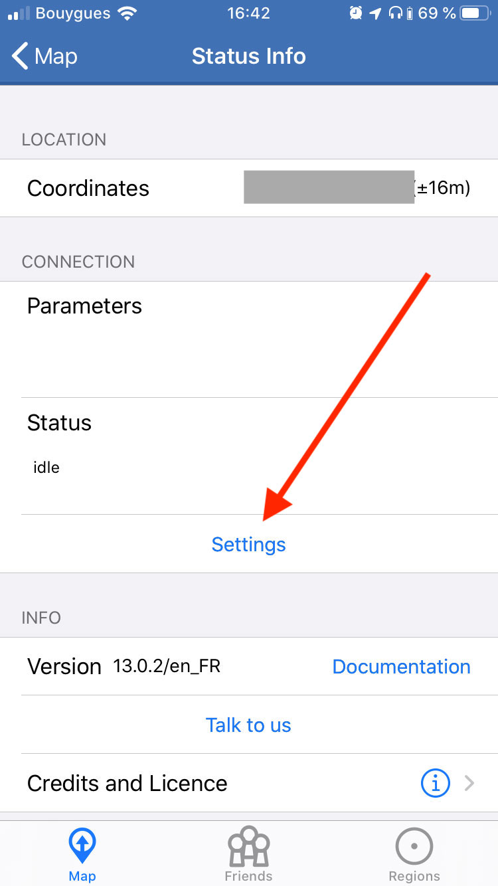
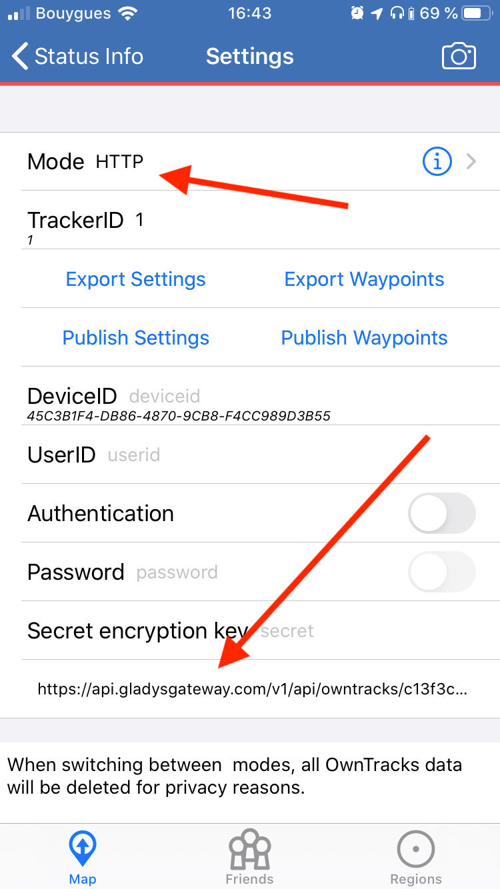

# Owntracks

[Owntracks](https://owntracks.org/) est une application mobile open-source qui permet d'envoyer sa géolocalisation périodiquement à un serveur.

**[Gladys Plus](https://gladysassistant.com/fr/plus/)** vous permet de recevoir ces localisations dans Gladys.

### Télécharger Owntracks

Tout d'abord, téléchargez Owntracks.

- [Owntracks pour Android](https://play.google.com/store/apps/details?id=org.owntracks.android&hl=fr&gl=US)
- [Owntracks pour OS](https://apps.apple.com/fr/app/owntracks/id692424691)

### Créez une clé d'API dans Gladys Plus

Allez à [plus.gladysassistant.com](https://plus.gladysassistant.com/), connectez vous.

Puis allez dans`Intégration -> Open API`, et créez une clé.

### Allez dans Owntracks

Cliquez sur le bouton en haut à gauche de l'app:



Cliquez sur `Paramètres`:



Sélectionnez `HTTP`, puis dans l'input `URL` entrez:

```
https://api.gladysgateway.com/v1/api/owntracks/[YOUR-API-KEY]

```

Dans `DeviceID` et `UserID`, mettez ce que vous voulez, ce n'est pas utile pour Gladys mais les champs sont obligatoires.

J'ai mis personnellement "iphone" dans `DeviceID` et "Pierre-Gilles" dans `UserID`.

Gladys utilise la clé d'API pour identifier votre compte.



### Vérifiez que l'intégration fonctionne

Dans Gladys, vous devriez voir votre position sur l'onglet `Plans`.

Je vous invite à poster un message sur [le forum](https://community.gladysassistant.com/), si jamais vous avez besoin d’aide.