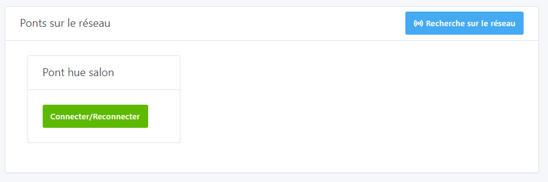
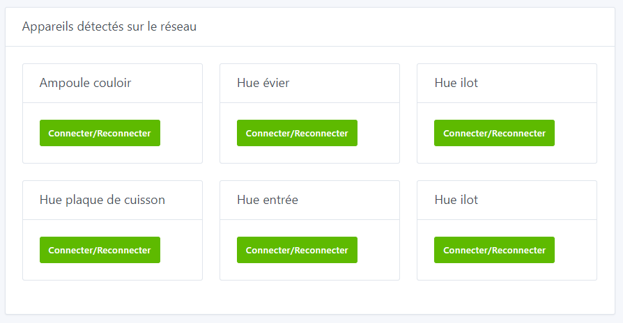
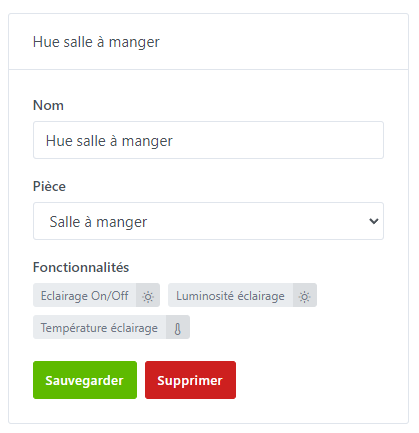
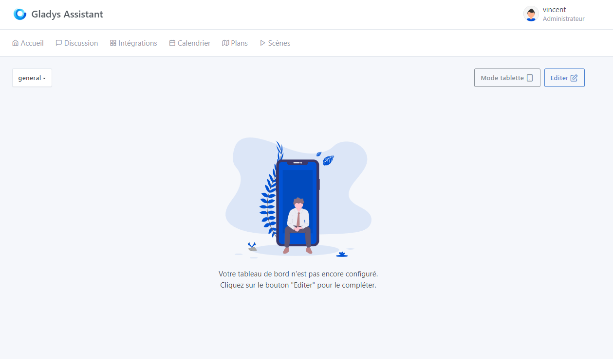
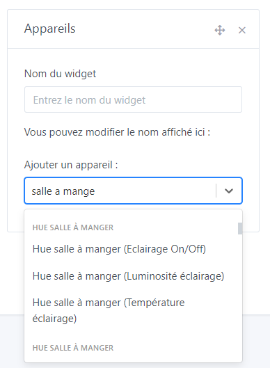
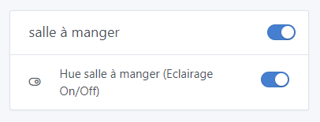

# Connecter ses Philips Hue dans Gladys Assistant

Car c'est toujours mieux en vidéo, voilà une petite démonstration de l'intégration Philips Hue dans Gladys 🙂

[Contrôler ses Philips Hue dans Gladys Assistant 4](https://youtu.be/PjLx7TYZdRM)

## Tutoriel

Pour connecter vos ampoules Philips Hue, allez dans `Intégrations -> Philips Hue` dans Gladys.

## Appuyez sur le bouton sur votre pont Philips Hue

Sur votre pont Philips Hue connecté à votre box internet, cliquez sur le bouton central.

## Connectez un pont à Gladys

Dans `Configuration des ponts`, cliquez sur `Connecter/Reconnecter` sur votre pont.

Si vous ne voyez pas votre pont, vérifiez que Gladys est bien sur le même réseau que le pont Hue.

Une autre box vas s’afficher avec le pont que vous venez de connecter.

REMARQUE

Assurez vous d'avoir le Pont Philips Hue v2 (le carré). L'intégration ne fonctionnera pas avec le Pont v1 (rond).

## Ajoutez une ampoule dans Gladys

Dans `Appareils`, cliquez sur `Connecter/Reconnecter` sur chaque ampoule que vous voulez ajouter à Gladys.

## Contrôler vos lumières sur le tableau de bord

Vous pouvez maintenant rajouter un **widget appareils** sur votre tableau de bord et contrôler vos lampes.

Rendez-vous sur le dashboard de Gladys et cliquez sur le bouton `Editer`.

Cliquez sur `ajouter +` puis sélectionnez le widget `appareils`, vous pouvez le déplacer dans une colonne. Sélectionnez vos lampes en fonctions de vos fonctionnalités, et donnez un nom à votre widget et cliquez sur `Enregistrer`.

Vous pouvez ajouter plusieurs lampes dans le même widget.

Voilà ! Votre widget est visible sur le dashboard.

Je vous invite à poster un message sur [le forum](https://community.gladysassistant.com/), si jamais vous avez besoin d’aide.