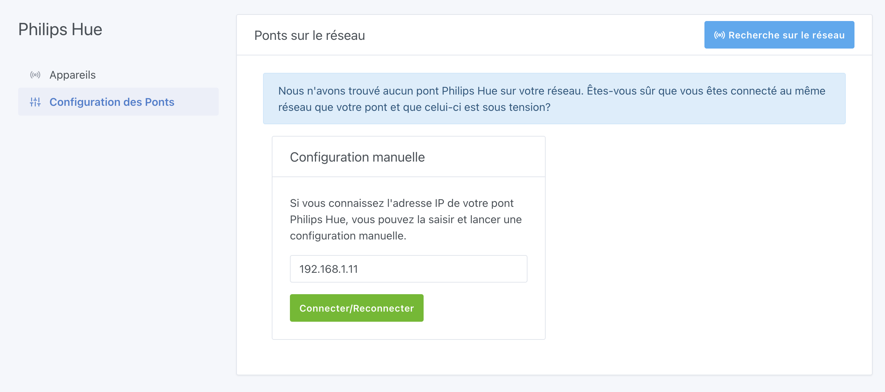

Car c'est toujours mieux en vidéo, voilà une petite démonstration de l'intégration Philips Hue dans Gladys 🙂

<iframe  src="https://www.youtube.com/embed/PjLx7TYZdRM" frameborder="0" allow="accelerometer; autoplay; clipboard-write; encrypted-media; gyroscope; picture-in-picture" allowfullscreen></iframe>

## Tutoriel

Pour connecter vos ampoules Philips Hue, allez dans `Intégrations / Philips Hue` dans Gladys.

## Appuyez sur le bouton sur votre pont Philips Hue

Sur votre pont Philips Hue connecté à votre box internet, cliquez sur le bouton central.

## Connectez un pont à Gladys

Dans `Configurer bridge`, cliquez sur `Connecter` sur votre pont.

Si vous ne voyez pas votre pont, vérifiez que Gladys est bien sur le même réseau que le pont Hue.

Si vous ne voyez toujours pas votre pont, vous pouvez l'ajouter manuellement grâce à son adresse IP.

:::note
Assurez-vous d'avoir le Pont Philips Hue v2 (le carré). L'intégration ne fonctionnera pas avec le Pont v1 (rond).
:::

## Ajoutez une ampoule dans Gladys

Dans `Périphériques`, cliquez sur `Connecter` sur chaque ampoule que vous voulez ajouter à Gladys.

Et voilà !
