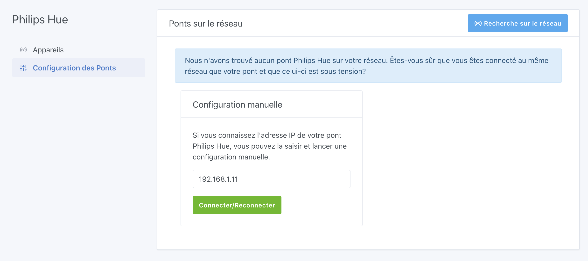

import JsonLd from '@site/src/components/seo/JsonLd';

L'intégration Philips Hue connecte votre pont et vos ampoules Hue directement à Gladys Assistant. Gladys communique avec votre pont **en local**, sur votre propre réseau : vos lumières continuent donc de fonctionner même sans connexion internet, et aucune donnée ne sort de chez vous.

Une fois vos ampoules connectées, vous pouvez les allumer, les éteindre, régler leur intensité, changer leur couleur, les regrouper par pièce et les utiliser dans vos [scènes](/docs/scenes/intro) : allumer l'entrée au coucher du soleil, faire clignoter le salon quand une porte s'ouvre, ou simuler un lever de soleil le matin. Vous pouvez aussi les piloter à la voix ou depuis l'[application mobile](/docs/installation/phone).

Gladys se connecte au pont, qui parle en Zigbee à vos ampoules : toute ampoule, prise ou accessoire appairé à votre pont Hue apparaît donc dans Gladys. Si vous préférez vous passer de pont, vous pouvez aussi appairer vos ampoules Hue directement via l'[intégration Zigbee2mqtt](/docs/integrations/zigbee2mqtt).

Car c'est toujours mieux en vidéo, voilà une petite démonstration de l'intégration Philips Hue dans Gladys 🙂

<iframe  src="https://www.youtube.com/embed/PjLx7TYZdRM" frameborder="0" allow="accelerometer; autoplay; clipboard-write; encrypted-media; gyroscope; picture-in-picture" allowfullscreen></iframe>

## Tutoriel

Pour connecter vos ampoules Philips Hue, allez dans `Intégrations / Philips Hue` dans Gladys.

## Appuyez sur le bouton sur votre pont Philips Hue

Sur votre pont Philips Hue connecté à votre box internet, cliquez sur le bouton central.

## Connectez un pont à Gladys

Dans `Configurer bridge`, cliquez sur `Connecter` sur votre pont.

Si vous ne voyez pas votre pont, vérifiez que Gladys est bien sur le même réseau que le pont Hue.

Si vous ne voyez toujours pas votre pont, vous pouvez l'ajouter manuellement grâce à son adresse IP.

:::note
Assurez-vous d'avoir le Pont Philips Hue v2 (le carré). L'intégration ne fonctionnera pas avec le Pont v1 (rond).
:::

## Ajoutez une ampoule dans Gladys

Dans `Périphériques`, cliquez sur `Connecter` sur chaque ampoule que vous voulez ajouter à Gladys.

Et voilà !

## Questions fréquentes

### L'intégration Philips Hue fonctionne-t-elle en local, sans le cloud ?

Oui. Gladys communique directement avec votre pont Hue sur votre réseau local : vos lumières restent pilotables même sans connexion internet et aucune donnée n'est envoyée sur un serveur tiers. C'est l'une des principales raisons d'utiliser Gladys, une solution de domotique locale et open source, plutôt qu'une application uniquement dans le cloud.

### Ai-je besoin d'un pont Philips Hue ?

Pour l'intégration Philips Hue officielle, oui : Gladys se connecte au pont Hue v2, qui pilote ensuite vos ampoules en Zigbee. Si vous préférez ne pas acheter de pont, vous pouvez appairer vos ampoules Hue directement avec une clé Zigbee via l'[intégration Zigbee2mqtt](/docs/integrations/zigbee2mqtt).

### Quel pont Philips Hue est compatible ?

Il vous faut le pont Hue v2, le modèle carré. Le pont Hue d'origine (v1, rond) n'est pas compatible avec l'intégration.

### Puis-je utiliser mes ampoules Philips Hue dans des scènes ?

Oui. Une fois connectées, vos ampoules sont disponibles dans l'éditeur de [scènes](/docs/scenes/intro). Vous pouvez les allumer, les éteindre, régler leur intensité et leur couleur, et les combiner avec n'importe quel autre appareil, capteur ou horaire, par exemple allumer les lumières automatiquement au coucher du soleil ou lors d'une détection de mouvement.

<JsonLd
  data={{
    "@context": "https://schema.org",
    "@type": "FAQPage",
    mainEntity: [
      {
        "@type": "Question",
        name: "L'intégration Philips Hue fonctionne-t-elle en local, sans le cloud ?",
        acceptedAnswer: {
          "@type": "Answer",
          text: "Oui. Gladys communique directement avec votre pont Hue sur votre réseau local : vos lumières restent pilotables même sans connexion internet et aucune donnée n'est envoyée sur un serveur tiers.",
        },
      },
      {
        "@type": "Question",
        name: "Ai-je besoin d'un pont Philips Hue ?",
        acceptedAnswer: {
          "@type": "Answer",
          text: "Pour l'intégration Philips Hue officielle, oui : Gladys se connecte au pont Hue v2, qui pilote ensuite vos ampoules en Zigbee. Si vous préférez ne pas acheter de pont, vous pouvez appairer vos ampoules Hue directement avec une clé Zigbee via l'intégration Zigbee2mqtt.",
        },
      },
      {
        "@type": "Question",
        name: "Quel pont Philips Hue est compatible avec Gladys ?",
        acceptedAnswer: {
          "@type": "Answer",
          text: "Il vous faut le pont Hue v2, le modèle carré. Le pont Hue d'origine (v1, rond) n'est pas compatible avec l'intégration.",
        },
      },
      {
        "@type": "Question",
        name: "Puis-je utiliser mes ampoules Philips Hue dans des scènes ?",
        acceptedAnswer: {
          "@type": "Answer",
          text: "Oui. Une fois connectées, vos ampoules sont disponibles dans l'éditeur de scènes. Vous pouvez les allumer, les éteindre, régler leur intensité et leur couleur, et les combiner avec n'importe quel autre appareil, capteur ou horaire.",
        },
      },
    ],
  }}
/>
