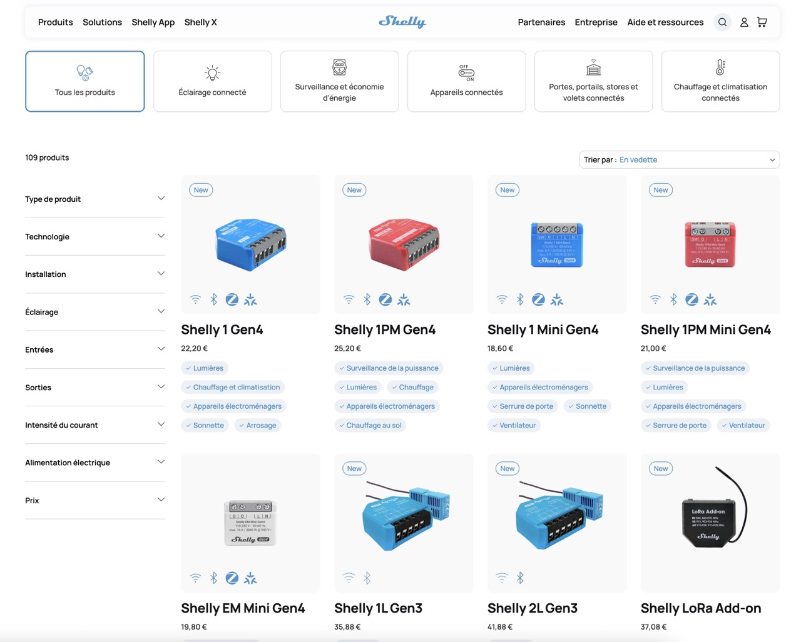
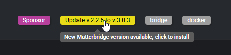
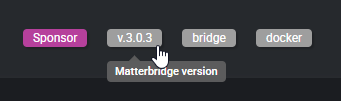
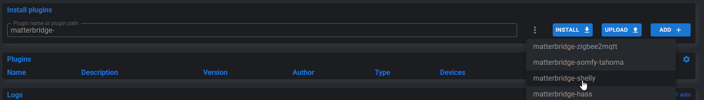
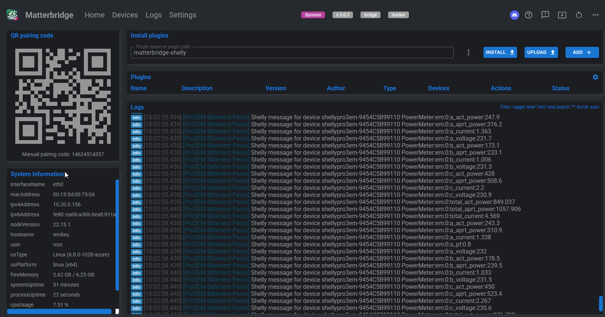
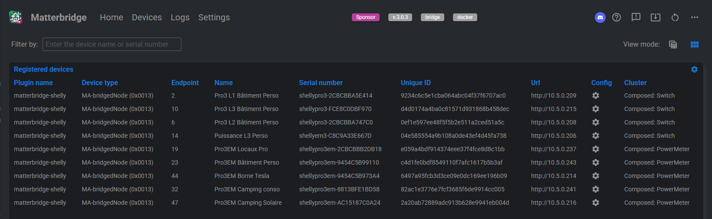
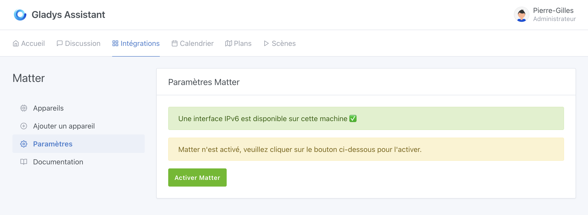
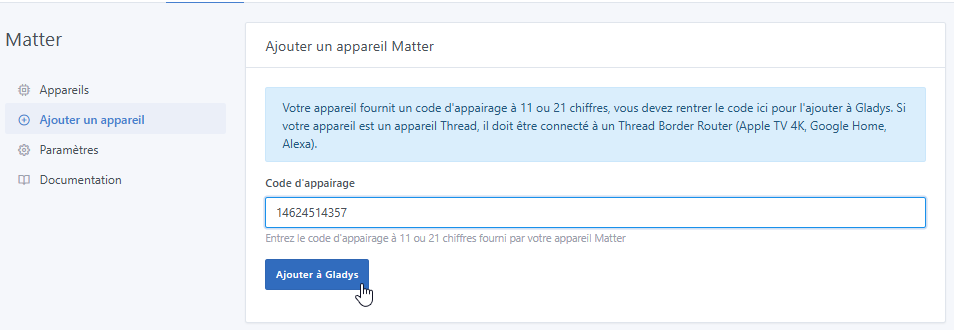
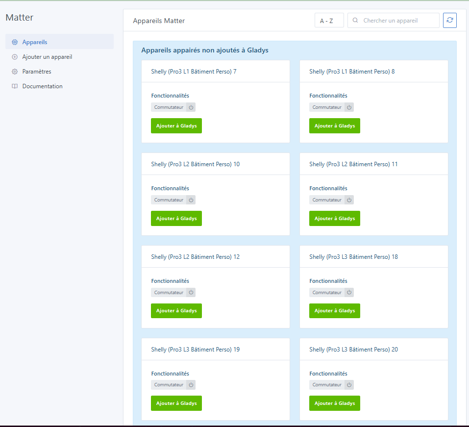
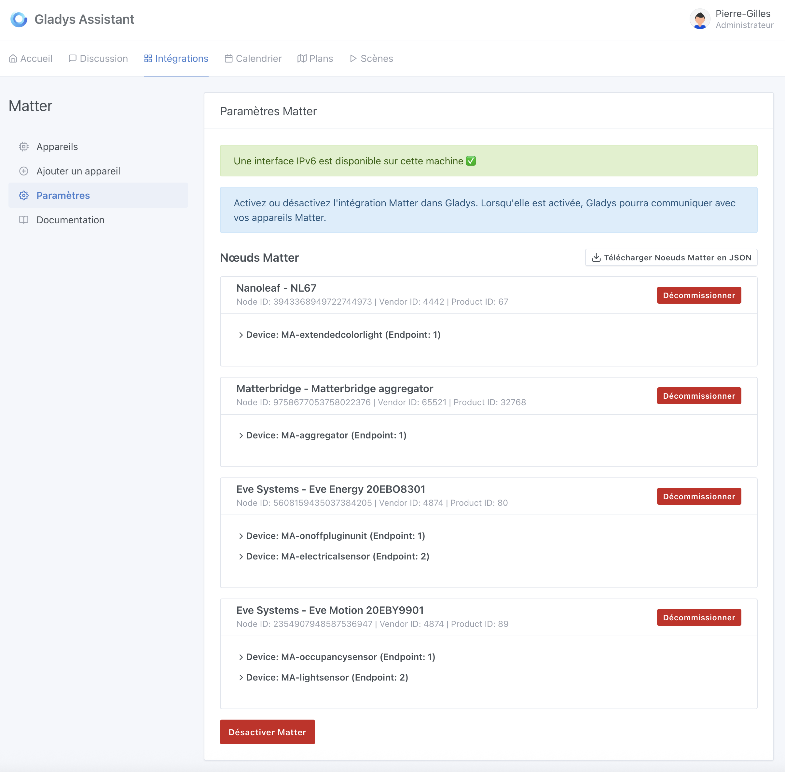

Shelly est une marque populaire dans le domaine de la domotique, connue pour ses modules Wi-Fi compacts, abordables et faciles à intégrer. Ils permettent d'automatiser l’éclairage, les prises ou les volets roulants, sans nécessiter de hub central.



La version 4.58 de **Gladys Assistant** introduit le support officiel du standard **Matter**. Si la génération 4 des appareils Shelly est entièrement compatible avec Matter, les versions précédentes ne le sont malheureusement pas toutes.

Heureusement, grâce au projet open‑source [Matterbridge](https://github.com/luligu/matterbridge), vous pouvez rendre compatibles avec Matter des appareils qui ne le sont pas nativement, et ainsi les contrôler dans Gladys aussi facilement que des appareils natifs.

Ce guide pas à pas vous expliquera comment :

1. Déployer Matterbridge dans un conteneur Docker.
2. Commissionner le bridge dans Gladys.
3. Exposer et piloter vos modules Shelly.

### Prérequis

- Gladys Assistant 4.58 installé et fonctionnel
- Réseau local IPv6 activé
- Au moins un module Shelly (Gen 1/2/3/Plus/BLU)
- Docker + Docker Compose disponibles sur la machine hôte
- Accès terminal/SSH & éditeur de texte

### 1. Déployer Matterbridge avec Docker

Sur votre serveur Gladys, créez un dossier `matterbridge` :

```bash
mkdir ~/matterbridge && cd ~/matterbridge
```

Copiez‑collez le `docker-compose.yml` ci‑dessous (avec nano par exemple, `nano docker-compose.yml`):

```yaml
services:
  matterbridge:
    image: luligu/matterbridge:latest
    container_name: matterbridge
    restart: unless-stopped
    network_mode: host
    environment:
      - TZ=Europe/Paris
    ports:
      - "8283:8283" # Expose l’UI Web de Matterbridge
    volumes:
      - "${HOME}/matterbridge:/root/Matterbridge" # Mounts the Matterbridge plugin directory
      - "${HOME}/.matterbridge:/root/.matterbridge" # Mounts the Matterbridge storage directory
```

Lancez le conteneur :

```bash
docker compose up -d
```

Suivez les logs pour récupérer le code QR de commissionnement :

```bash
docker compose logs -f
```


**Accédez à l’interface Web** : ouvrez `http://ADRESSE-IP-DE-VOTRE-SERVEUR:8283`.

Rendez‑vous sur la page principale de matterbridge. Vous devrez vérifier en tout premier lieu si une mise à jour est disponible. Si c'est le cas exécutez la et patientez jusqu'au redémarrage





### 2. Installation du plugin Shelly

Pour installer le plugin Shelly, cliquez sur les 3 points **matterbridge-shelly → INSTALL**,




Une fois le plugin installé, Matterbridge devrait redémarrer tout seul, si ce n'est pas le cas, vous pouvez redémarrer manuellement en cliquant sur l'icône en haut à droite de l'interface.

Vos appareils Shelly connectés au réseau seront automatiquement découverts sans intervention supplémentaire. Vous pouvez le vérifier dans les logs de l'interface et sous l'onglet **Devices**





### 3. Commissionner le bridge dans Gladys

Récupérez tout d'abord le **Manual pairing code** de la page principale **Home**


Dans Gladys, ouvrez l'intégration "Matter" depuis le menu **Intégrations → Matter**.

Si ce n'est pas déjà fait, activez "Matter" depuis le menu **Paramètres**



Cliquez sur l'onglet **Ajouter un appareil**, puis collez ou renseignez le **Code d'appairage** affiché précédemment par Matterbridge. Cliquez sur **Ajouter à Gladys**



Patientez quelques secondes : Vous pouvez maintenant intégrer vos équipements **Shelly** compatibles dans **Gladys Assistant**.



Vous pouvez ajouter ces équipements en cliquant sur "Ajouter à Gladys".

Le bridge apparaît maintenant dans l'onglet **Paramètres**.



### 4. Aller plus loin

- Activer d’autres plugins Matterbridge : Zigbee2MQTT, Somfy Tahoma, Home Assistant, etc.
- Ajouter ces équipements sur votre tableau de bord
- Créer des scènes Gladys (ex. : couper toutes les lumières la nuit).

### Conclusion

En quelques minutes, vous avez transformé vos modules **Shelly** en appareils compatibles **Matter** pleinement intégrés à **Gladys Assistant**.

Merci au standard Matter et au projet **Matterbridge** qui rendent l’écosystème encore plus ouvert !

### Ressources utiles

- [Intégrer des appareils Matter dans Gladys Assistant](/fr/docs/integrations/matter/)
- [Repository GitHub Matterbridge](https://github.com/luligu/matterbridge)
