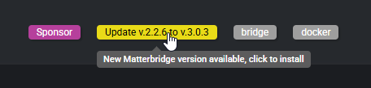
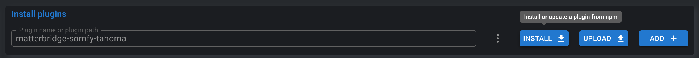
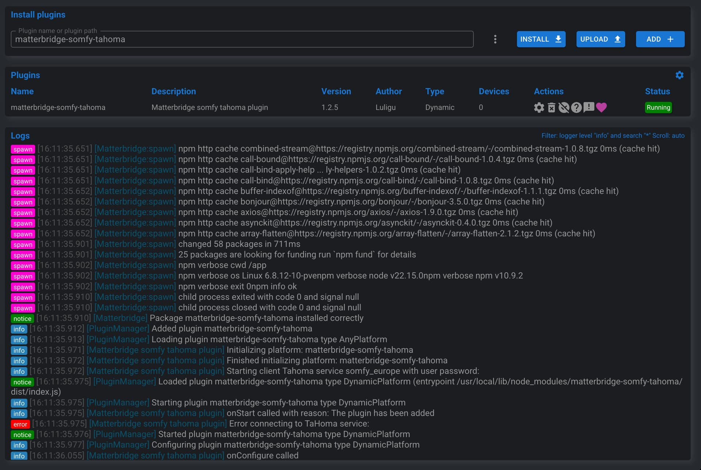
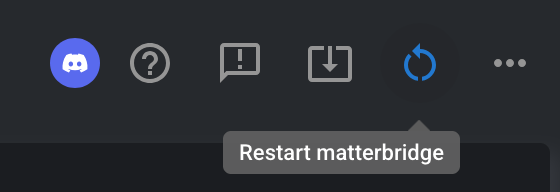
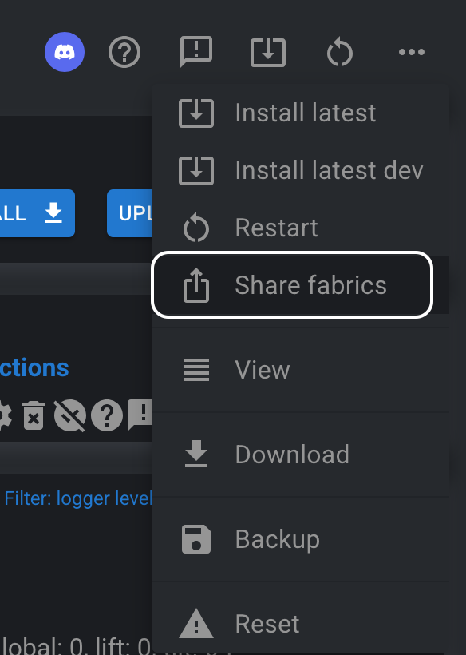
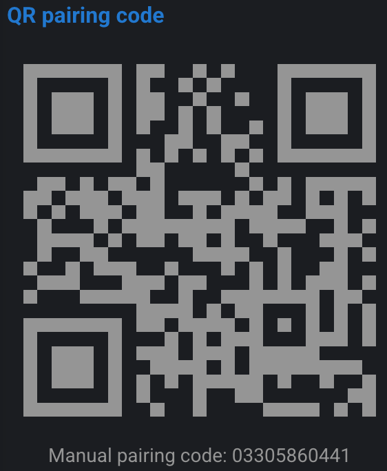
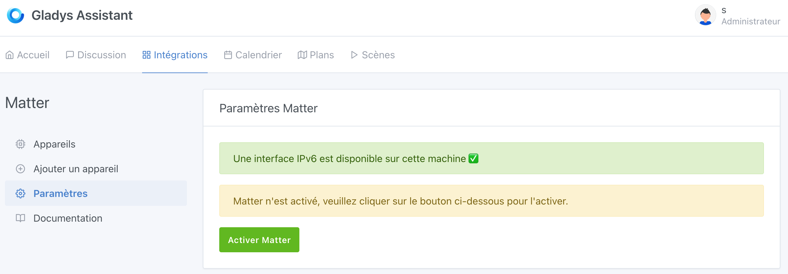
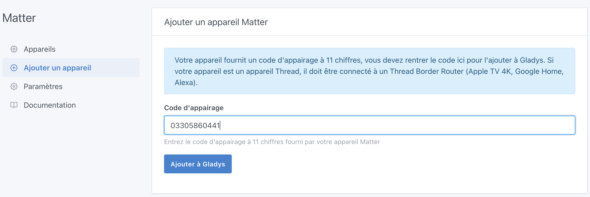
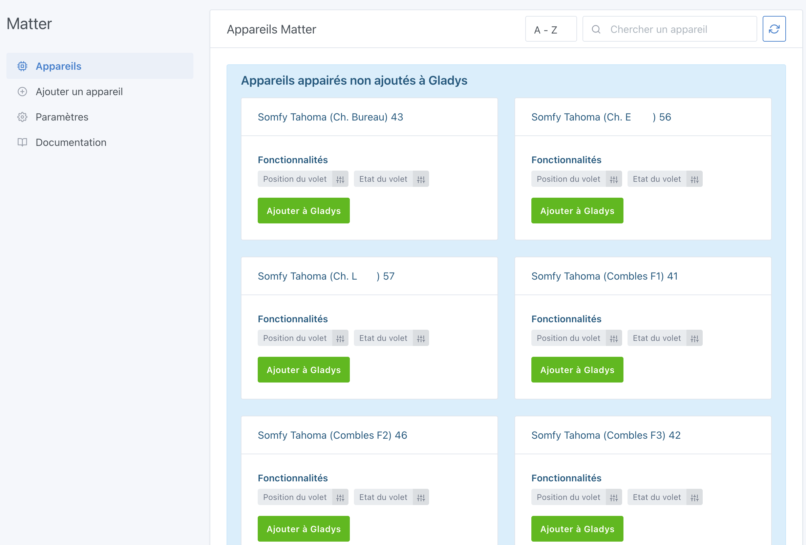
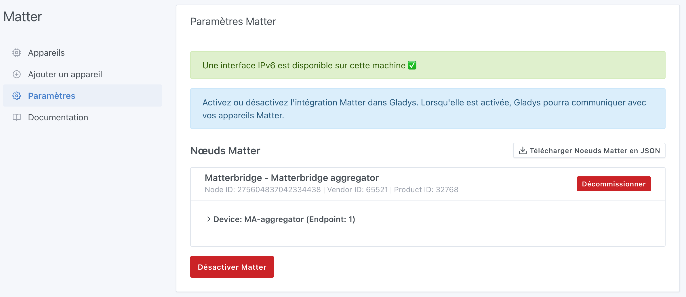

import JsonLd from '@site/src/components/seo/JsonLd';

Somfy est un groupe industriel français, spécialisé dans la motorisation, l'automatisation des ouvertures de l'habitat et du bâtiment, ainsi que dans la maison connectée.

Grâce à l'application TaHoma® by Somfy et une box domotique, il est possible de gérer à distance des volets, stores, portes de garage, portails, systèmes de sécurité, caméras, et autres interphones connectés.

Actuellement, la gestion complète de la maison se limite à cette application et une connexion au cloud Somfy.

Alors pour aller plus loin dans les interactions, Gladys va permettre une gestion plus étendue grâce à ses diverses intégrations.

La version 4.58 de **Gladys Assistant** introduit le support officiel du standard **Matter**.
Grâce au projet open‑source [Matterbridge](https://github.com/luligu/matterbridge), vous pouvez rendre compatibles avec Matter des appareils qui ne le sont pas nativement, et ainsi les contrôler dans Gladys aussi facilement que des appareils natifs.
C'est ce que nous allons faire pour les appareils Somfy.

Ce guide pas à pas vous expliquera comment exposer et piloter vos volets roulants, stores, et autres ouvrants Somfy.

## Somfy est-il compatible Matter ?

Les appareils Somfy (io-homecontrol® et RTS) **ne sont pas exposés nativement en Matter** vers des contrôleurs tiers : il n'existe pas de pont Matter intégré dans les box **TaHoma**, **TaHoma Switch** ou **Connexoon** aujourd'hui, et le pilotage passe toujours par le cloud Somfy.

La bonne nouvelle, c'est que vous n'avez pas à attendre Somfy. Grâce au projet open-source [Matterbridge](https://github.com/luligu/matterbridge), Gladys transforme vos appareils Somfy **TaHoma**, **TaHoma Switch** et **Connexoon** en appareils Matter, pour piloter vos volets roulants, stores, bannes et autres ouvrants directement depuis Gladys Assistant. La suite de ce guide vous montre comment, étape par étape.

### Prérequis

- Gladys Assistant 4.58 installé et fonctionnel
- Réseau local IPv6 activé
- Accès terminal/SSH & éditeur de texte
- Une box Somfy : **Connexoon** (protocole io-homecontrol®), **TaHoma** (io, RTS), **TaHoma Switch** (io, RTS, Zigbee)
- Un compte Somfy valide et actif

### 1. Déployer Matterbridge

Tout d'abord, vous devez déployer Matterbridge dans Gladys. Suivez le [guide d'intégration Matterbridge](/fr/docs/integrations/matterbridge/) pour activer et démarrer Matterbridge.

Une fois Matterbridge lancé, accédez à son interface web à l'adresse `http://ADRESSE-IP-DE-VOTRE-SERVEUR:8283`.

Rendez-vous sur la page principale de Matterbridge. Vous devrez vérifier en tout premier lieu si une mise à jour est disponible. Si c'est le cas, exécutez-la et patientez jusqu'au redémarrage.

### 2. Installation du plugin Somfy/TaHoma

Pour installer le plugin Somfy/TaHoma, cliquez sur les 3 points, sélectionnez **matterbridge-somfy-tahoma** puis cliquer sur **INSTALL**,

Une fois le plugin installé, Matterbridge devrait redémarrer automatiquement au besoin. Si ce n'est pas le cas, vous pouvez redémarrer manuellement en cliquant sur l'icône en haut à droite de l'interface.

Le plugin est installé et un message d'erreur dans les logs nous indique qu'il faut configurer le plugin :

Pour cela, cliquez sur l'icône **Plugin config** :

Remplissez **mail** et **mot de passe** de votre compte Somfy, sélectionnez le serveur **Somfy Europe**, et validez sur **Confirm** :

Un redémarrage manuel de Matterbridge est nécessaire pour activer la configuration du plugin :

Une fois redémarré, vos appareils (devices) apparaissent dans Matterbridge sous **Devices** dans la ligne du plugin et dans l'onglet **Devices** :

### 3. Commissionner le bridge dans Gladys

Récupérez tout d'abord le **Manual pairing code** de la page principale **Home**

Si celui-ci n'apparaît pas, vous pouvez forcer son affichage en cliquant sur **Share fabrics** dans le menu en haut à droite `...` :

Dans Gladys, ouvrez l'intégration "Matter" depuis le menu **Intégrations** → **Matter**.
Si ce n'est pas déjà fait, activez "Matter" depuis le menu **Paramètres** :

Cliquez sur l'onglet **Ajouter un appareil**, puis collez ou renseignez le **Code d'appairage** affiché précédemment par Matterbridge. Cliquez sur **Ajouter à Gladys**

Patientez quelques secondes : vous pouvez maintenant intégrer vos équipements **Somfy** compatibles dans **Gladys Assistant** :

Vous pouvez ajouter ces équipements en cliquant sur **Ajouter à Gladys**.

Le bridge apparaît maintenant dans l'onglet **Paramètres** :

### 4. Aller plus loin

- Activer d’autres plugins Matterbridge : Zigbee2MQTT, Shelly, Home Assistant, etc.
- Ajouter ces équipements sur votre tableau de bord
- Créer des scènes Gladys (ex. : fermer tous les volets de l'étage quand il commence à faire nuit puis ceux du rez-de-chaussée 30mn plus tard).

### 5. Développements futurs :

- **API locale**
  Actuellement tout passe par le Cloud Somfy : il faut donc avoir une connexion Internet fonctionnelle pour pouvoir piloter ses ouvrants.
  Le développement pour pouvoir utiliser l'API locale de la box Somfy a commencé mais n'est pas encore opérationnel. Des mises à jours du plugin permettront à terme de tout faire en local.

- **Position (%) des volets**
  Matterbridge gère les ouvrants de manière autonome, c'est-à-dire qu'il n'y a pas d'interrogation des serveurs Somfy pour connaître la position actuelle des ouvrants si ceux-ci sont pilotés par leurs télécommandes ou l'application mobile Tahoma :
  
  Une réflexion est en cours pour pouvoir récupérer les différentes positions.

### Conclusion

En quelques minutes, vous avez transformé vos ouvrants **Somfy** en appareils compatibles **Matter** pleinement intégrés à **Gladys Assistant**.

Merci au standard **Matter** et au projet **Matterbridge** qui rendent l’écosystème encore plus ouvert !

### Ressources utiles

- [Intégrer des appareils Matter dans Gladys Assistant](/fr/docs/integrations/matter/)
- [Repository GitHub Matterbridge](https://github.com/luligu/matterbridge)

## Questions fréquentes

### Somfy est-il compatible Matter ?

Les box Somfy n'exposent pas nativement vos appareils io-homecontrol® et RTS en Matter vers des contrôleurs tiers. Il n'y a pas de pont Matter intégré dans la TaHoma, la TaHoma Switch ou la Connexoon. Vous pouvez toutefois les rendre compatibles Matter grâce au projet open-source Matterbridge et les piloter dans Gladys Assistant.

### La TaHoma Switch de Somfy est-elle compatible Matter ?

La TaHoma Switch ne joue pas le rôle de pont Matter natif pour vos appareils io et RTS. En utilisant Matterbridge et le plugin `matterbridge-somfy-tahoma`, Gladys peut tout de même exposer vos appareils TaHoma Switch en Matter et les piloter.

### Faut-il le cloud Somfy et une connexion internet ?

Oui, pour l'instant. Le plugin Matterbridge Somfy/TaHoma communique avec le cloud Somfy : une connexion internet active et un compte Somfy valide sont donc nécessaires. Le support de l'API locale de la box Somfy est en cours de développement et permettra à terme un pilotage entièrement local.

### Quels appareils Somfy puis-je piloter dans Gladys ?

Une fois exposés en Matter, vous pouvez piloter vos volets roulants, stores, bannes et autres ouvrants gérés par votre box Somfy (Connexoon, TaHoma ou TaHoma Switch) via les protocoles io-homecontrol® et RTS.

### Puis-je voir la position (%) de mes volets ?

Matterbridge gère les ouvrants de manière autonome et n'interroge pas les serveurs Somfy pour connaître la position actuelle lorsque les appareils sont pilotés depuis leurs télécommandes ou l'application mobile TaHoma. La récupération des positions en temps réel est à l'étude.

<JsonLd
  data={{
    "@context": "https://schema.org",
    "@type": "FAQPage",
    mainEntity: [
      {
        "@type": "Question",
        name: "Somfy est-il compatible Matter ?",
        acceptedAnswer: {
          "@type": "Answer",
          text: "Les box Somfy n'exposent pas nativement vos appareils io-homecontrol et RTS en Matter vers des contrôleurs tiers : il n'y a pas de pont Matter intégré dans la TaHoma, la TaHoma Switch ou la Connexoon. Vous pouvez toutefois les rendre compatibles Matter grâce au projet open-source Matterbridge et les piloter dans Gladys Assistant.",
        },
      },
      {
        "@type": "Question",
        name: "La TaHoma Switch de Somfy est-elle compatible Matter ?",
        acceptedAnswer: {
          "@type": "Answer",
          text: "La TaHoma Switch ne joue pas le rôle de pont Matter natif pour vos appareils io et RTS. En utilisant Matterbridge et le plugin matterbridge-somfy-tahoma, Gladys peut tout de même exposer vos appareils TaHoma Switch en Matter et les piloter.",
        },
      },
      {
        "@type": "Question",
        name: "Faut-il le cloud Somfy et une connexion internet ?",
        acceptedAnswer: {
          "@type": "Answer",
          text: "Oui, pour l'instant. Le plugin Matterbridge Somfy/TaHoma communique avec le cloud Somfy : une connexion internet active et un compte Somfy valide sont donc nécessaires. Le support de l'API locale de la box Somfy est en cours de développement et permettra à terme un pilotage entièrement local.",
        },
      },
      {
        "@type": "Question",
        name: "Quels appareils Somfy puis-je piloter dans Gladys ?",
        acceptedAnswer: {
          "@type": "Answer",
          text: "Une fois exposés en Matter, vous pouvez piloter vos volets roulants, stores, bannes et autres ouvrants gérés par votre box Somfy (Connexoon, TaHoma ou TaHoma Switch) via les protocoles io-homecontrol et RTS.",
        },
      },
      {
        "@type": "Question",
        name: "Puis-je voir la position (%) de mes volets Somfy dans Gladys ?",
        acceptedAnswer: {
          "@type": "Answer",
          text: "Matterbridge gère les ouvrants de manière autonome et n'interroge pas les serveurs Somfy pour connaître la position actuelle lorsque les appareils sont pilotés depuis leurs télécommandes ou l'application mobile TaHoma. La récupération des positions en temps réel est à l'étude.",
        },
      },
    ],
  }}
/>
